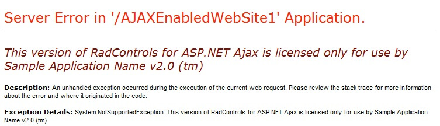

# Protecting the Telerik ASP.NET AJAX Assemblies

**Technical guidelines for protecting Telerik UI for ASP.NET AJAX binaries when redistributed with other applications**

We are providing the following suggestions to protect our IP (Intellectual Property) when redistribute our assemblies as a part of shrink-wrapped software (packaged products).

**Prerequisites**

Protecting *Telerik UI for ASP.NET Ajax* requires the *Telerik.Web.UI* assembly to be built from source code (due to modifications applied to the source files). The source code of Telerik UI for ASP.NET AJAX is distributed separately and is bundled with build instructions. Please read the source code building instructions beforehand.

For brevity this document assumes that the source distribution ZIP file is extracted in C:\Telerik_UI_for_ASP.NET_AJAX_Source.

**Instructions**

1. Open *C:\Telerik_UI_for_ASP.NET_AJAX_Source\Telerik.Web.UI\Common\AssemblyProtection.cs* in a text editor (notepad, Visual Studio etc)

1. Uncomment the following line:

	**Before**

		public static void Validate()
		{
		   //Uncomment the following line
		   //ValidatePassPhrase();
		} 

	**After**

		public static void Validate()
		{
		   //Uncomment the following line
		   ValidatePassPhrase();
		} 

1. Change the value of the ***ApplicationName*** constant to match the name of your application:

	**Before**

		//Modify to match your application name
		private const string ApplicationName = "MyApp"; 

	**After**

		//Modify to match your application name
		private const string ApplicationName = "Sample Application Name v2.0 (tm)"; 

1. Save *AssemblyProtection.cs* and rebuild Telerik UI for ASP.NET Ajax (described separately in the source code build instructions document).

1. In your application replace the existing reference to Telerik.Web.UI.dll with the one built from source code.

1. If you run your application now you should see the following error message (“Sample Application Name v2.0 (tm)” will be replaced with the name of your application set in step 3):

	

1. Add the following code in the Page_Load method of your page code-behind class.

	**C#**

		Application["Telerik.Web.UI.Key"] = "Sample Application Name v2.0 (tm)";

	>important Instead of “Sample Application Name v2.0 (tm)” use the value of the ApplicationName constant from step 3.

## Protecting the Document Processing Libraries

The UI for ASP.NET AJAX suite comes with a number of assemblies that provide document processing capabilities. You can read more about them in the [Inculded Assemblies]() article. These assemblies must also be protected as they do not depend on the Telerik.Web.UI assembly.

1. Open C:\DPL\Documents\Core\Core\Licensing\AssemblyProtection.cs in a text editor (notepad, Visual Studio, etc.). This path assumes you have downloaded and extracted Telerik Document Processing Libraries Source Code to C:\DPL.

1. Uncomment the following line:

	**Before**
		
		public static bool IsValid()
		{
		    // Uncomment the following line
		    // return ValidatePassPhrase();
		    return true;
		}

	**After**
	
		public static bool IsValid()
		{
		    // Uncomment the following line
		    return ValidatePassPhrase();
		}

1. Execute steps 3-7 from the previous section.

## See Also

* [Included Assemblies]()
