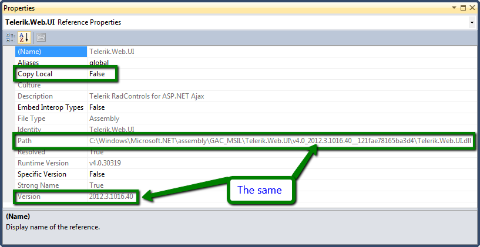
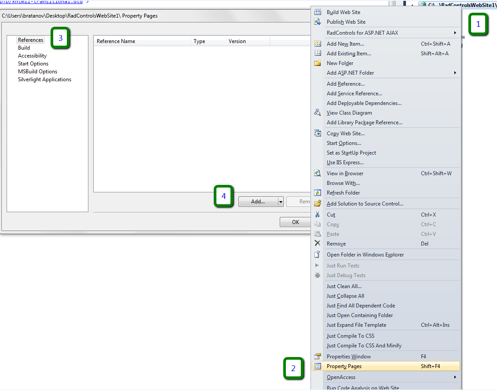
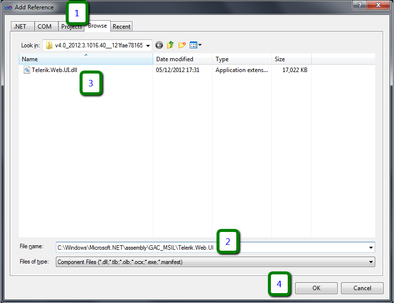

# Using the Global Assembly Cache


This article explains the basics on using the [Global Assembly Cache (GAC)](http://msdn.microsoft.com/en-us/library/yf1d93sz.aspx)	with the Telerik Controls.

While this article can be used as a tutorial on working with the GAC and referencing assemblies in your project,	the best source of information is the official MSDN site:

* [MSDN: Global Assembly Cache](http://msdn.microsoft.com/en-us/library/yf1d93sz.aspx)

* [MSDN: Working with Assemblies and the Global Assembly Cache](http://msdn.microsoft.com/en-us/library/6axd4fx6.aspx)

* [MSDN: Global Assembly Cache tool (Gacutil.exe)](http://msdn.microsoft.com/en-us/library/ex0ss12c%28v=VS.100%29.aspx)

* [MSDN: Visual Studio Command Prompt](http://msdn.microsoft.com/en-us/library/ms229859.aspx)

* [MSDN: How to Install an Assembly into the Global Assembly Cache](http://msdn.microsoft.com/en-us/library/dkkx7f79%28v=VS.100%29.aspx)

* [MSDN: How to Uninstall an Assembly from the GAC](http://msdn.microsoft.com/en-us/library/aa559881.aspx)

The [Telerik® UI for ASP.NET AJAX assemblies]() are standard .NET assemblies, so all generic rules apply to them as well.

What we advise is that you **keep the Telerik.Web.Design.dll assembly in the GAC on your development machine (it is not needed in production)**(our installation wizard will put it there) in order to have access to the design-time mode of the controls, and **reference the other assemblies (Telerik.Web.UI.dll and Telerik.Web.UI.Skins.dll) from the BIN folder**.

This article contains the following sections:

* [What is the GAC](#what-is-the-gac)

* [Where is the GAC](#where-is-the-gac)

* [Pros and Cons](#pros-and-cons)

* [Add, Remove and View Assemblies in the GAC](#add-remove-and-view-assemblies-in-the-gac)

	* [View the Assemblies in the GAC](#view-the-assemblies-in-the-gac)

	* [Add an Assembly to the GAC](#add-assembly-to-the-gac)

	* [Remove an Assembly from the GAC](#remove-an-assembly-from-the-gac)

* [Referencing Assemblies from the GAC](#referencing-assemblies-from-the-gac)

	* [How GAC References Look](#how-gac-references-look)

		* [How GAC References Look in a WebSite Type of Project](#in-a-website-type-of-project)

		* [How GAC References Look in a WebApplication Type of Project](#in-a-webapplication-type-of-project)

	* [Adding a Reference to an Assembly from the GAC](#adding-a-reference-to-an-assembly-from-the-gac)

		* [Adding a Reference to an Assembly from the GAC in a WebSite Type of Project](#in-a-website-type-of-project)

		* [Adding a Reference to an Assembly from the GAC in a WebApplication Type of Project](#in-a-webapplication-type-of-project)

	* [Troubleshooting GAC References](#troubleshooting-gac-references)

## What is the GAC

GAC is the short version of "Global Assembly Cache". It is a common place in the OS where assemblies that are going to be shared between different applications can be stored. The .NET assemblies are there, for example.

## Where is the GAC

Up **until .NET 3.5** the GAC is located in **C:\Windows\Assembly\**

**Since .NET 4.0** it is in **C:\Windows\Microsoft.Net\Assembly\GAC_MSIL\** and also the shell integration was removed, so you can no longer drag-and-drop an assembly in the folder and have it registered.

## Pros and Cons

Arguments and cases to support the GAC:

* Assemblies are shared between all applications on the machine, which is excellent for SharePoint.

* Versioning is easy because the GAC can hold multiple versions of the same dll without issues.

* A local copy in the Bin folder of the application is not needed, so you can shave off a few megabytes on the hard drive of your server.

Disadvantages of using the GAC:

* The assemblies need to be added explicitly to the GAC when the application is deployed, a simple copy-paste no longer suffices.

* Microsoft recommend that you do not use the GAC, but keep relevant assemblies in the Bin.

* To put an assembly in the GAC it has to be signed.

* Usually, elevated user privileges will be needed to modify the GAC.

And one that can go in either category:

* The GAC runs under full trust, while the Bin of a concrete application can be under Medium trust, depending on the environment.

## Add, Remove and View Assemblies in the GAC

First, you are going to need a tool from the .NET SDK that comes with Visual Studio – [gacutil.exe](http://msdn.microsoft.com/en-us/library/ex0ss12c%28v=VS.100%29.aspx). To run it go to -> All Programs -> Visual Studio <version> -> Visual Studio Tools -> run the [Visual Studio Command Prompt](http://msdn.microsoft.com/en-us/library/ms229859.aspx) (or Developer Command prompt), depending on the VS version you use.

### View the Assemblies in the GAC

To view the contents of the GAC run the following command:

`gacutil /l`

Here is an example that shows the Telerik.Web.UI.dll entries in the GAC:

`gacutil /l "Telerik.Web.UI"`

### Add Assembly to the GAC

To install an assembly called SomeAssembly in the GAC, use the command

`gacutil /i "C:\someFolder\SomeAssembly.dll"`

Here is an example that adds the R3 2017 Telerik.Web.UI.dll assembly to the GAC:

`gacutil /i "C:\Program Files\Progress\UI for ASP.NET AJAX R3 2017\Bin45\Telerik.Web.UI.dll"`

There are other ways to add an assembly to the GAC (Windows offers a shell integration for .NET 3.5 so you can just drag-and-drop it; and the Windows Installer) but since the gacutil tool is available for standalone download without Visual Studio, it is the more general way that works on all .NET versions. Note that Microsoft do not recommend using gacutil in production environment.

### Remove an Assembly from the GAC

To remove this assembly from the GAC, use the command

`gacutil /u SomeAssembly`

This will remove all versions of the assembly with this name, so versioning is usually needed. It is supplied through the fully qualified assembly name. Here is an example with random values:

`gacutil / u SomeAssembly, Version=1.1.1.1, Culture="neutral", PublicKeyToken = 36g331oiu98462wl`

Here is an example that removes the R3 2017 Telerik.Web.UI.dll assembly to the GAC:

`gacutil /u Telerik.Web.UI, Version=2017.3.913.45, Culture=neutral, PublicKeyToken=121fae165ba3d4`

You can read more on the subject in the [How to Uninstall an Assembly from the GAC](http://msdn.microsoft.com/en-us/library/aa559881.aspx) MSDN article.

>tip If an assembly has been added to the GAC by an automated installer, to remove it from the GAC, you must first uninstall the program that added it.	The Telerik® UI for ASP.NET AJAX installer adds the Telerik.Web.UI.Design.dll assembly to the GAC.
>


## Referencing Assemblies from the GAC

### How GAC References Look

### In a WebSite Type of Project

In a **Web Site type of project**, the **Property Pages** dialog can show you whether the references are from the GAC:
>caption Figure 1: GAC references to Telerik assemblies in a WebSite project


You can also see the references in the **web.config**. They will have fully qualified assembly names. For example:

````XML
<compilation debug="true" targetframework="4.0"> 
	<assemblies> 
		<add assembly="Telerik.Web.UI, Version=2017.3.913.40, Culture=neutral, PublicKeyToken=121fae78165ba3d4" /> 
		<add assembly="Telerik.Web.UI.Skins, Version=2017.3.913.40, Culture=neutral, PublicKeyToken=121fae78165ba3d4" /> 
	</assemblies> 
</compilation>
````


### In a WebApplication Type of Project

In a **WebApplication type of project**, you have to examine the **reference Properties** under the **References** node in the **Project** tree. You will see how it is not a local copy of the assembly and that the path points to the GAC:
>caption Figure 2: GAC references to Telerik assemblies in a WebApplication project



### Adding a Reference to an Assembly from the GAC

### In a WebSite Type of Project

An alternative to the GUI approach below, you can simply add a few lines to theweb.config, as shown in the [How GAC References Look](#how-gac-references-look) section.

1. Open the **Property Pages** dialog, go to the **References** tab and click **Add**:
>caption Figure 3: Open the Property Pages and add a reference.


1. Browse to the GAC to select assembly:
>caption Figure 4: Browse to the GAC and select an assembly to reference.


1. Confirm the reference properties when you make sure they are correct:
>caption Figure 5: Examine the references and close the Property Pages dialog.


### In a WebApplication Type of Project

1. Open the **Add Reference** dialog:
>caption Figure 6: Open the Add Reference dialog.


1. Browse to the GAC to select assembly:
>caption Figure 7: Browse to the GAC and select an assembly to reference.


1. Confirm the reference properties and you make sure they are correct:
>caption Figure 8: Examine the references.


### Troubleshooting GAC References

The first problem you may encounter is that the .NET tab of the Add Reference dialog box in VS will not show custom assemblies you have added to the GAC, you either need a third party plugin for your IDE, or a registry key so that it can know about this third-party assembly. Manually browsing to the desired folder is an easy resolution.

Make sure to always **reference the same versions of all Telerik assemblies** used in the project.

If you get the **"Could not load file or assembly…"** error. It means the reference is typed in wrongly or the assembly is not actually in the GAC of the machine. This can also be caused by wrong version numbers (e.g. Register directives left over in old user controls). You can consider using a *bindingRedirect* element to redirect all old references to the current one you need. This is useful for SharePoint and Sitefinity scenarios.

**"CS0433: The type `<RadControl class>` exists in both `<assembly in the GAC>` and `<Temporary ASP.NET Files for the site>`"** —this means there is a duplicate reference to our assembly – one that points to the GAC and one that points to a file somewhere else on the machine. To fix this, makes sure the project references are correct and clear the ASP cache.

## See Also

 * [MSDN: Global Assembly Cache](http://msdn.microsoft.com/en-us/library/yf1d93sz.aspx)

 * [MSDN: Working with Assemblies and the Global Assembly Cache](http://msdn.microsoft.com/en-us/library/6axd4fx6.aspx)

 * [MSDN: Global Assembly Cache tool (Gacutil.exe)](http://msdn.microsoft.com/en-us/library/ex0ss12c%28v=VS.100%29.aspx)

 * [MSDN: Visual Studio Command Prompt](http://msdn.microsoft.com/en-us/library/ms229859.aspx)

 * [MSDN: How to Install an Assembly into the Global Assembly Cache](http://msdn.microsoft.com/en-us/library/dkkx7f79%28v=VS.100%29.aspx)

 * [Telerik Blog Post: Working with Assemblies in the GAC](http://blogs.telerik.com/aspnet-ajax/posts/13-09-19/working-with-assemblies-in-the-global-assembly-cache)
