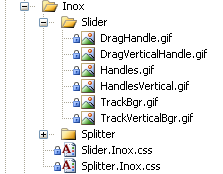
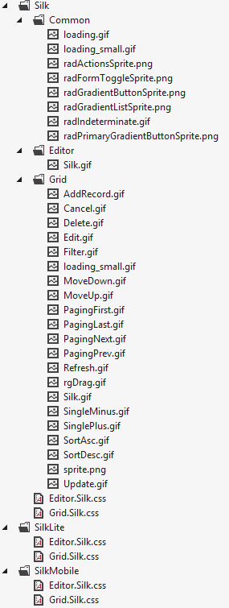
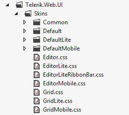

# How Skins Work

This article explains how Skins work for the Telerik UI for ASP.NET AJAX controls suite. Use the links to navigate to the main sections of the subject:

* [Built-in Skins List](#built-in-skins)

* [Custom Skins](#custom-skins)

* [Modified Built-in Skins](#modified-built-in-skins)

* [Non-skinned Controls](#non-skinned-controls)

* [Base Stylesheets](#base-stylesheets)

* [Render Mode and Skins](#render-mode-and-skins)

* [Skin Folder Structure](#skin-folder-structure)

	* [Different Skins for Different Render Modes](#different-skins-for-different-render-modes)

## Built-in Skins

These are the skins provided by Telerik. Since Q3 2011 they are embedded in the Telerik.Web.UI.Skins.dll assembly as web resources (they were previously in the Telerik.Web.UI.dll assembly). To use a built-in skin, the developer only needs to set the **Skin** property of the control. Non-embedded versions of the built-in skins are provided in "*C:\Program Files\Telerik\UI for ASP.NET AJAX suiteversion\Skins*" and in the **/Skins/** folder inside the Telerik UI for ASP.NET AJAX installation ZIP archive. The complete list of embedded skins is available below:

1. **Black**

1. **BlackMetroTouch**

1. **Bootstrap**

1. **Default**

1. **Glow**

1. **Material** (available for the [Lightweight RenderMode]() only)

1. **Metro**

1. **MetroTouch**

1. **Office2007**

1. **Office2010Black**

1. **Office2010Blue**

1. **Office2010Silver**

1. **Outlook**

1. **Silk**

1. **Simple**

1. **Sunset**

1. **Telerik**

1. **Vista**

1. **Web20**

1. **WebBlue**

1. **Windows7**

>tip Some skins have a predefined font, others inherit the font of the page. You can read more in the [Fonts]() article.

@[template - Material skin is available only in Lightweight mode](/_templates/common/skins-notes.md#material-only-in-lightweight)

>note The **Hay**, **Forest**, **Sitefinity** and **Transparent** skins are obsolete and have been removed from the Telerik.Web.UI.Skins.dll assembly as of **Q1 2014**. You can find more information on the matter in [this blog post](http://blogs.telerik.com/aspnet-ajax/posts/13-04-11/6-telerik-asp.net-ajax-skins-going-obsolete).

## Custom Skins

These are skins created by the developer. They are not embedded in the Telerik.Web.UI assembly, so the control cannot register them automatically. If you use a custom skin you need to set the **EnableEmbeddedSkins** property of the control to **false**, as well as set the **Skin** property to the name of the custom skin. If you do not do so, an exception will be thrown saying that there is no embedded skin matching the **Skin** property:

* *Telerik.Web.UI.RadSlider with ID='RadSlider1'* was unable to find embedded skin with name **'MySkin'**. Please, make sure that you spelled the skin name correctly, or if you want to use a custom skin, set **EnableEmbeddedSkins = false**.

## Modified Built-in Skins

It is possible to create a custom skin by taking an embedded one and making various adjustments. The non-embedded versions of the built-in skins are provided in the 'Skins' folder of the Telerik UI for ASP.NET AJAX install location. One can pick any skin for any control and modify some CSS rules. Then the modified custom skin must be added to the website, the **EnableEmbeddedSkins** property of the control must be set to **false** and the modified CSS file must be manually registered in the ASPX page (or user control).

## Non-skinned Controls

If you do not want a predefined skin for a control, set its **EnableEmbeddedSkins** property to **"false"**.

## Base Stylesheets

Usually, a Telerik control has some collection of CSS styles, which should be applied regardless of the used skin (either built-in or custom). Such common CSS styles are included and registered on the page in a base stylesheet. If you want to disable this automatic registration, set **EnableEmbeddedBaseStylesheet** to **false**.

## Render Mode and Skins

Telerik supports three [Render Modes](): Classic, Lightweight and Mobile.

If you do not specify a Render Mode in your web.config file or in the control configuration, the [RadDeviceDetectionFramework]() specifies the Render Mode that will be sent to the browser. In older browsers it will resolve to Classic mode, in newer browsers to Lightweight, and when the requesting browser is a mobile browser—to Mobile.

If the browser is modern but the concrete control does not support a Lightweight mode, it will fallback to the Classic mode. The same applies with Mobile—if the control does not support it, it will fallback to LightWeight, and then to Classic (if LightWeight is also not supported).

If you explicitly set the `RenderMode` of a control to `Lightweight`, for example, it will not use the Mobile mode, even when the requesting browser comes from a mobile device.

## Skin Folder Structure

A skin consists of a CSS file and images. Here is a typical skin folder structure:

>caption Figure 1: General folder structure of a skin and its files

The CSS files are named in the following manner: **[Control].[Skin].css** e.g., **Slider.Glow.css**.

The images are stored in a folder named after the control.

The base stylesheets (if present as non-embedded files) are stored in the parent folder of all skin folders and are named after the control - e.g., Slider.css

### Different Skins for Different Render Modes

Each Render Mode of a control has its own rendering and, therefore, the [base stylesheet](#base-stylesheets) and the skin-specific stylesheet it requires are different from those used for the other Render Modes.

To reduce the footprint of the controls, each skin mode is kept in a separate folder and is only sent when needed.

When customizing a built-in skin, you should use the folder according to the Render Mode you will be using.

The Render Mode-specific folders have the following structure: **[Skin Name][RenderMode]**. For example, **SilkLite** (for the Lightweight Render Mode) and **SilkMobile** (for the Mobile Render Mode) are the two sibling folders next to the **Silk** folder.

**Figure 2** and **Figure 3** show the basic file structure and location of a skin with its Render Mode-specific variations. For brevity, only files related to RadGrid and RadEditor are shown. A full-blown skin will contain the full control list according to the [supported render modes](). **Figure 3** shows a collapsed structure of the Default skin and its Render Mode variations as well.

>caption Figure 2: Folder structure for Render Mode-specific skins

>caption Figure 3: Location of Render Mode-specific base stylesheets

>note If you set `RenderMode` to Auto, you will need to devise an approach that will detect the requesting browser (e.g., by using the [RadDeviceDetectionFramework]()) and [register]() the appropriate customized stylesheets.

## See Also

* [Skins Troubleshooting]()

* [Skin Registration]()

* [Fonts]()

* [Modifying Built-in Skins]()

* [Creating a Custom Skin]()
