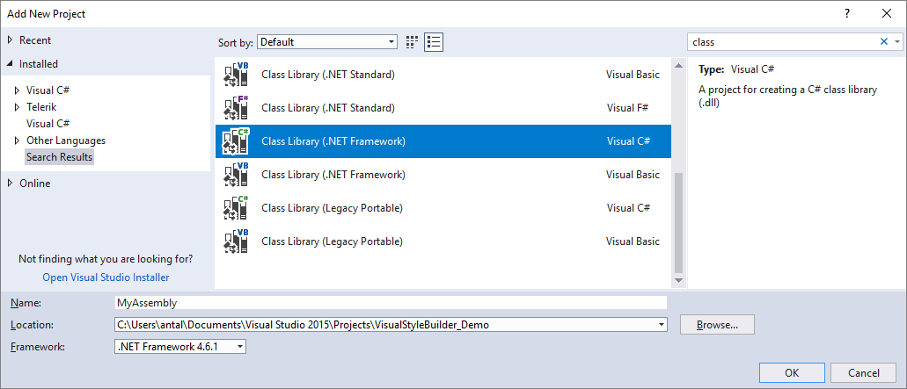
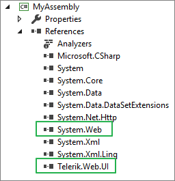
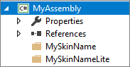
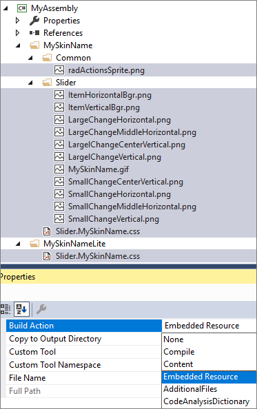

# How to Load Skins from External Assemblies

>tip A sample project demonstrating this approach is available in the following Code Library: [How to load skins from external assemblies](https://www.telerik.com/community/code-library/aspnet-ajax/general/how-to-load-skins-from-external-assemblies)

## Create custom Skins Assembly

As of Q1 2011 release, developers are be able to load skins from an external assembly. In this article, we will describe the steps for creating a custom Skins Assembly.

>tip Registering custom skins by path can also be done through [RadSkinManager - Load skins by specifying a path](https://docs.telerik.com/devtools/aspnet-ajax/controls/radskinmanager#loading-skins-by-specifying-a-path).

 For the documentation we will be using RadSlider control and creating our custom Skins Assembly from the custom skin files generated by [Visual Stylebuilder (Classic rendering)]() and [Sass ThemeBuilder (Lightweight rendering)]().  More information on how to create a custom skin is available in the [Controlling Visual Appearance]() section in the documentation.

 Below you will find step-by-step instructions that will guide you through this process.

1. Create a new class library project and give it a name. We will name it **MyAssembly**.

	>important The namespace must be the same as the assembly name.

	

2. Add a reference to the Telerik.Web.UI assembly

	

3. Create the folder named after the custom skin. Use the skin's name for **Classic** RenderMode, for example, `MySkinName`, or append the "Lite" word to the skin's name for **Lightweight** RenderMode, for example, `MySkinNameLite`.

	

4. Drop the skin related files in their respective folder and mark them as embedded resources (right click, select *Properties* and from the *Build Action* dropdown choose *Embedded Resource*).

	>tip You can select multiple files and mark them as embedded resource at once.

	

5. Because of the specifics of Embedded Resources in an Assembly, the links in the CSS files must be replaced with WebResource URLs.

	Consider the following URL: `url('Common/radActionsSprite.png')`. For WebResources, the full path is required, including the namespace separated by dots (`.`). `url('<%=WebResource("NameSpace.Folder.SubFolder.someFile.png")%>')`.

	Example:

	**CSS**

		/*background-image: url('Common/radActionsSprite.png');*/
		background-image: url('<%=WebResource("MyAssembly.MySkinName.Common.radActionsSprite.png")%>');

6. Create a `public class` for the control we plan to style and add `EmbeddedSkin` attributes to its class definition to tell which skins will be loaded from it. For example:

 	**C#**

		namespace MyAssembly
		{
		    //add EmbeddedSkin attributes to the class definition to tell which skins will be loaded from it
		    [Telerik.Web.EmbeddedSkin("Slider", "MySkinName", typeof(RadSlider))] // custom skin: MySkinName
		    public class RadSlider
		    {
		    }
		}

	The above class defines the skin “MySkinName” for the Slider control. Note the third parameter of the attribute – it is very important to set it so the Telerik skin registrar code can know which skin to load for the given control.

7. Add WebResource attributes just above the NameSpace for all the resources from step 4 in the new assembly. RadSlider.cs class file should look like the following:

	**C#**

		// Classic RenderMode
		[assembly: System.Web.UI.WebResource("MyAssembly.MySkinName.Slider.MySkinName.css", "text/css", PerformSubstitution = true)]
		[assembly: System.Web.UI.WebResource("MyAssembly.MySkinName.Slider.ItemHorizontalBgr.png", "image/png")]
		[assembly: System.Web.UI.WebResource("MyAssembly.MySkinName.Slider.ItemVerticalBgr.png", "image/png")]
		[assembly: System.Web.UI.WebResource("MyAssembly.MySkinName.Slider.LargeChangeHorizontal.png", "image/png")]
		[assembly: System.Web.UI.WebResource("MyAssembly.MySkinName.Slider.LargeChangeMiddleHorizontal.png", "image/png")]
		[assembly: System.Web.UI.WebResource("MyAssembly.MySkinName.Slider.LargelChangeCenterVertical.png", "image/png")]
		[assembly: System.Web.UI.WebResource("MyAssembly.MySkinName.Slider.LargelChangeVertical.png", "image/png")]
		[assembly: System.Web.UI.WebResource("MyAssembly.MySkinName.Slider.MySkinName.png", "image/png")]
		[assembly: System.Web.UI.WebResource("MyAssembly.MySkinName.Slider.SmallChangeCenterVertical.png", "image/png")]
		[assembly: System.Web.UI.WebResource("MyAssembly.MySkinName.Slider.SmallChangeHorizontal.png", "image/png")]
		[assembly: System.Web.UI.WebResource("MyAssembly.MySkinName.Slider.SmallChangeMiddleHorizontal.png", "image/png")]
		[assembly: System.Web.UI.WebResource("MyAssembly.MySkinName.Slider.SmallChangeVertical.png", "image/png")]

		// Common resources
		[assembly: System.Web.UI.WebResource("MyAssembly.MySkinName.Common.radActionsSprite.png", "image/png")]

		// LightWeight RenderMode
		[assembly: System.Web.UI.WebResource("MyAssembly.MySkinNameLite.Slider.MySkinName.css", "text/css", PerformSubstitution = true)]

		namespace MyAssembly
		{
		    //add EmbeddedSkin attributes to the class definition to tell which skins will be loaded from it
		    [Telerik.Web.EmbeddedSkin("Slider", "MySkinName", typeof(RadSlider))] // custom skin
		    public class RadSlider
		    {
		    }
		}

	Example for registering multiple skins for LightWeight rendering:

	**C#**

		// CSS file for Skin 1
		[assembly: System.Web.UI.WebResource("MyAssembly.SkinName1Lite.Slider.SkinName1.css", "text/css", PerformSubstitution = true)]
		// CSS file for Skin 2
		[assembly: System.Web.UI.WebResource("MyAssembly.SkinName2Lite.Slider.SkinName2.css", "text/css", PerformSubstitution = true)]
		// CSS file for Skin 3
		[assembly: System.Web.UI.WebResource("MyAssembly.SkinName3Lite.Slider.SkinName3.css", "text/css", PerformSubstitution = true)]

		namespace MyAssembly
		{
		    [Telerik.Web.EmbeddedSkin("Slider", "SkinName1", typeof(RadSlider))] // Skin 1
		    [Telerik.Web.EmbeddedSkin("Slider", "SkinName2", typeof(RadSlider))] // Skin 2
		    [Telerik.Web.EmbeddedSkin("Slider", "SkinName3", typeof(RadSlider))] // Skin 3
		    public class RadSlider
		    {
		    }
		}

1. We will now compile our new project to get the custom skins assembly **MyAssembly.dll** and place it in the bin folder of a Web Site next to the **Telerik.Web.UI.dll** or in the **GAC**. If you are using Web Application, you will need to add a reference to it.

1. In the **web.config** file for the web site/application, add a new **appSettings** entry with the name of the assembly, so the Telerik assemblies will know where to look for Skins:

	**XML**

		<appSettings>
			<add key="Telerik.ScriptManager.TelerikCdn" value="Disabled"/>
			<add key="Telerik.StyleSheetManager.TelerikCdn" value="Disabled"/>
			<!--Add this key to enable the skins from external assembly-->
			<add key="Telerik.Web.SkinsAssembly" value="MyAssembly"/>
			<!--END-->
		</appSettings>

	If skins assembly is in the GAC, you must use its full name.

	**ASP.NET**

		<telerik:RadSlider ID="RadSlider1" runat="server" ItemType="Item" TrackPosition="Center" Height="80" Width="379"
			RenderMode="Lightweight" Skin="MySkinName">
		    <Items>
		        <telerik:RadSliderItem Text="10" Value="10" ToolTip="10" runat="server"></telerik:RadSliderItem>
		        <telerik:RadSliderItem Text="20" Value="20" ToolTip="20" runat="server"></telerik:RadSliderItem>
		        <telerik:RadSliderItem Text="30" Value="30" ToolTip="30" runat="server"></telerik:RadSliderItem>
		    </Items>
		</telerik:RadSlider>

A final note – it is possible to have one of the default skins in a custom assembly – for example you customize the Hay skin and put it in a custom class project by following the steps above. Once you set the *Telerik.Web.SkinsAssembly* setting in the *web.config*, the Hay skin will no longer be loaded from Telerik.Web.UI even if it is present there as well.

## See also
* [Code Library sample](https://www.telerik.com/community/code-library/aspnet-ajax/general/how-to-load-skins-from-external-assemblies)
* [Load skins using RadSkinManager](https://docs.telerik.com/devtools/aspnet-ajax/controls/radskinmanager#loading-skins-by-specifying-a-path)
