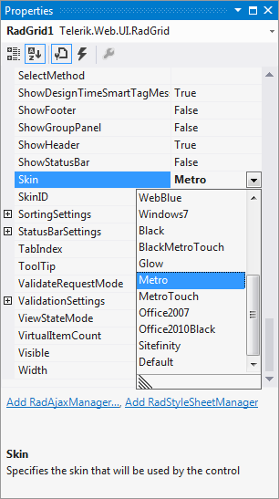
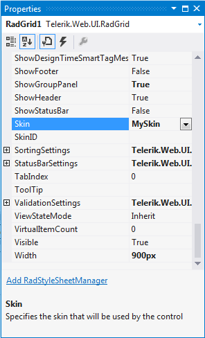

# Controlling Visual Appearance Overview


The visual appearance of Telerik UI for ASP.NET AJAX is defined through "skins". A skin consists of a CSS file and image	files (which are optional). Telerik UI for ASP.NET AJAX come with a set of built-in skins which are embedded in the	Telerik.Web.UI.Skins assembly and ready to be used. Developers can use the built-in skins as they are, or customize them.

>note The Telerik UI for ASP.NET AJAX controls have complex HTML structures and use Skins to provide styling. Thus, CSS and sometimes images are used instead of inline rules for creating borders, rounded corners, background colors, font colors or other design elements.
>
>This means that simple properties like `ForeColor`, `BackColor`, `BorderColor`, `BorderStyle`, etc., may not work for the Telerik controls. To change the way a control looks, you should use CSS.


## Using a skin

To use a skin you just need to set the **Skin** property of the control to the designated skin name.Keep in mind that skin names are case-sensitive. You can set the Skin property declaratively, in design time or from code-behind.


@[template - Material skin is available only in Lightweight mode](/_templates/common/skins-notes.md#material-only-in-lightweight)


>important If you are using a custom skin, you need to set the **EnableEmbeddedSkins** property to **false** .	If you don't do that, the control will try to register an embedded skin with the specified name and will fail with an exception. For more information you can check the [How skins work]() and [Skin registration]() topics.

## Setting the skin from design time

To set the skin in design time you need to follow these steps:

1. Select the control of interest by clicking it.

1. Open its properties (either from the context menu or by pressing F4).

1. Find the **Skin** property in the property grid (it is located in the "Appearance" category).

1. To use a built-in skin:

	1. Open the drop-down control which contains all built-in skins.

	1. Select a value from the drop-down to set that skin.

		

1. To use a custom (user-defined) skin:

	1. Register the CSS file(s) of the skin to the Page (unless they are placed in an ASP.NET theme folder).

	1. Set the **EnableEmbeddedSkins** property to **false.**

	1. Type the name of the skin in the text box.

		

## Setting the skin declaratively

To set the skin declaratively you need to set the **Skin** attribute of the control tag. Keep in mind that it is case-sensitive.

`<telerik:RadSlider ID="RadSlider1" Skin="Outlook" runat="server" />`

## Setting the skin from code-behind

To set the skin from code-behind you need to set the Skin property of the control to the designated value:

````C#
<TelerikControl>.Skin = "Outlook";
````
````VB
<TelerikControl>.Skin = "Outlook"				
````

## Setting the skin globally from web.config

Review the bottom section of [this help topic]() for more details.

For more information about controls skinning, we recommend watching the following video:

[Skinning - Deep Dive for the Telerik UI for ASP.NET AJAX](http://tv.telerik.com/aspnet/webinar/skinning-deep-dive-radcontrols-aspnet-ajax)
