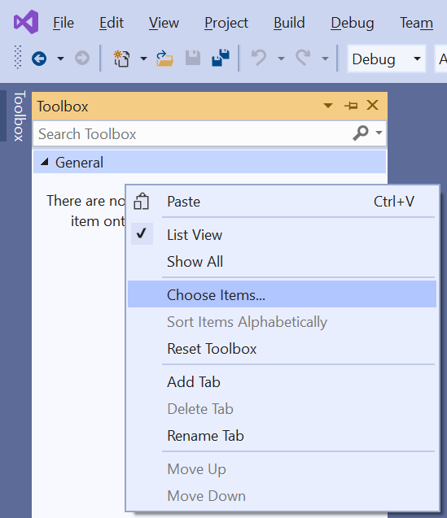

# Adding the Telerik Controls to the Visual Studio Toolbox

Telerik UI for ASP.NET controls are added automatically to the Visual Studio Toolbox during [MSI installation](https://docs.telerik.com/devtools/aspnet-ajax/installation/installing-the-telerik-controls-from-msi-file). If you'd like to add the controls to your project (aspx, ascx, masterpage, etc.) see [Add the Controls to Your Project](https://docs.telerik.com/devtools/aspnet-ajax/getting-started/first-steps#add-the-controls-to-your-project).

The easiest way to setup the Telerik controls in your toolbox is to use the [Telerik Toolbox Configuration Wizard](), part of the [Progress Telerik UI for ASP.NET AJAX VS Extension
](https://marketplace.visualstudio.com/items?itemName=TelerikInc.TelerikASPNETAJAXVSExtensions).

If you are installing Telerik UI for ASP.NET AJAX from a [ZIP distribution](), however, you can do this manually by following the steps below:

1. Log into [your account](https://www.telerik.com/account/product-download?product=RCAJAX) and download the Telerik_UI_for_ASP.NET_AJAX_20xx_x_xxx_Dev_hotfix.zip hotfix zip installation

1. Open your application in Visual Studio.

1. Expand the Toolbox.

1. Expand the **General** section. Alternatively, you can create a new section by selecting the **Add Tab** option from the context menu (right click anywhere in the toolbox). When the new tab is added you can choose its name (e.g. Telerik UI for ASP.NET AJAX RX YYYY).

1. Right-click in the **General** section (or the new one you just created) and open **Choose Items**.

1. On the **.NET Framework Components** tab, click **Browse**.

1. Browse to the installation folder, open the **Bin45** folder and select the **Telerik.Web.UI.dll**.

	* If the Windows Installer MSI Package was used to install Telerik UI for ASP.NET AJAX, the **bin45**	folder is located in **C:\Program Files (x86)\Progress\Telerik UI for ASP.NET AJAX RX YYYY\Bin45**. If this folder is missing, download the hotfix installation and obtain the Telerik.Web.UI.dll assembly from it as instructed in point 1 in the above list.

	* If the ZIP was used to install the Telerik controls, the **Bin45** folder is located in the folder where the installation files have been unzipped.

	>note If you want to add Telerik controls for .NET 3.5 or .NET 4.0 web project you should select the Telerik.Web.UI.dll from the **C:\Program Files (x86)\Progress\UI for ASP.NET AJAX RX YYYY\Bin35** or **~/Bin40** folder.

## Troubleshooting

If the controls do not appear in the ToolBox, please make sure that the project is of type ASP.NET Web Forms site or application.

## See Also
 * [Add the Controls to Your Project](https://docs.telerik.com/devtools/aspnet-ajax/getting-started/first-steps#add-the-controls-to-your-project).
