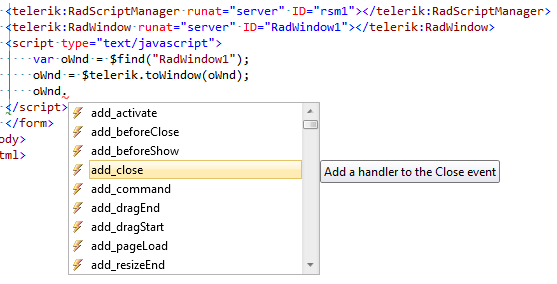

# How to Use JavaScript Intellisense for the Telerik Controls

>tip This article explains how to enable JavaScript intellisense for a given Telerik control's client-side properties and methods.
>This intellisense is different than the default JavaScript intellisense Visual Studio offers and does not affect it.
>The jQuery and Telerik Static client library intellisense are also a separate feature and are described in [this help article]().

The **Telerik® UI for ASP.NET AJAX** offer intellisense information for the **code-behind** out of the box as Visual Studio automatically loads the needed information from our assembly. It can display it without any further configuration, because the type of the variables is known.

The case with **JavaScript** is a bit more complex, because it is a weakly typed programming language, i.e. a variable does not need a type to function and thus Visual Studio cannot know what information to load for it.

You can overcome this difficulty by casting the objects which hold references to the **Telerik controls** to their respective type by using the method each control provides in the [Telerik static client library](), for example:

````JavaScript
<telerik:RadScriptManager runat="server" ID="rsm1"></telerik:RadScriptManager>
<telerik:RadWindow RenderMode="Lightweight" runat="server" ID="RadWindow1"></telerik:RadWindow>
<script type="text/javascript">
    var oWnd = $find("RadWindow1");
    oWnd = $telerik.toWindow(oWnd);
</script>
````

A similar approach allows Visual Studio to show the intellisense for this variable:


>tip This cast is not needed for production environment, it is useful for development and would not yield any benefit when the site is live - it will work just as well without it, it is actually an extra operation.
>

>tip If you are using Visual Studio 2008, you will need to install its Service Pack 1 to get support for `-vsdoc.js`files that contain the JavaScript intellisence. You can find mode information on the matter in the [VS2008 SP1 Hotfix to Support "-vsdoc.js" IntelliSense Doc Files](http://blogs.msdn.com/b/webdev/archive/2008/11/07/hotfix-to-enable-vsdoc-js-intellisense-doc-files-is-now-available.aspx) blog post.
>

>tip Visual Studio 2017 changed the way JavaScript Intellisense works and the approach described in this article no longer works with it. You can find a feature request for its support in the following page: [VS2017 JavaScript Intellisense support for UI for ASP.NET AJAX](https://feedback.telerik.com/Project/108/Feedback/Details/226029-vs2017-javascript-intellisense-support-for-ui-for-asp-net-ajax) so you can track its status. In the meantime, you can consider using [the TypeScript definitions for UI for ASP.NET AJAX]().

>caption A list with the available methods

| $telerik.toAjaxLoadingPanel(object) | Casts the passed object to a RadAjaxLoadingPanel |
| ------ | ------ |
|$telerik.toAjaxManager(object)|Casts the passed object to a RadAjaxManager|
|$telerik.toAjaxPanel(object)|Casts the passed object to a RadAjaxPanel|
|$telerik.toAsyncUpload(object)|Casts the passed object to a RadAsyncUpload|
|$telerik.toButton(object)|Casts the passed object to a RadButton|
|$telerik.toCalendar(object)|Casts the passed object to a RadCalendar|
|$telerik.toCaptcha(object)|Casts the passed object to a RadCaptcha|
|$telerik.toColorPicker(object)|Casts the passed object to a RadColorPicker|
|$telerik.toComboBox(object)|Casts the passed object to a RadComboBox|
|$telerik.toDataPager(object)|Casts the passed object to a RadDataPager|
|$telerik.toDateInput(object)|Casts the passed object to a RadDateInput|
|$telerik.toDatePicker(object)|Casts the passed object to a RadDatePicker|
|$telerik.toDateTimePicker(object)|Casts the passed object to a RadDateTimePicker|
|$telerik.toDock(object)|Casts the passed object to a RadDock|
|$telerik.toDockZone(object)|Casts the passed object to a RadDockZone|
|$telerik.toEditor(object)|Casts the passed object to a RadEditor|
|$telerik.toFileExplorer(object)|Casts the passed object to a RadFileExplorer|
|$telerik.toFormDecorator(object)|Casts the passed object to a RadFormDecorator|
|$telerik.toGrid(object)|Casts the passed object to a RadGrid|
|$telerik.toHtmlChart(object)|Casts the passed object to a RadHtmlChart|
|$telerik.toImageEditor(object)|Casts the passed object to a RadImageEditor|
|$telerik.toInputManager(object)|Casts the passed object to a RadInputManager|
|$telerik.toLinearGauge(object)|Casts the passed object to a RadLinearGauge|
|$telerik.toListBox(object)|Casts the passed object to a RadListBox|
|$telerik.toListView(object)|Casts the passed object to a RadListView|
|$telerik.toMaskedTextBox(object)|Casts the passed object to a RadMaskedTextBox|
|$telerik.toMenu(object)|Casts the passed object to a RadMenu|
|$telerik.toMultiPage(object)|Casts the passed object to a RadMultiPage|
|$telerik.toNotification(object)|Casts the passed object to a RadNotification|
|$telerik.toNumericTextBox(object)|Casts the passed object to a RadNumericTextBox|
|$telerik.toPane(object)|Casts the passed object to a RadPane|
|$telerik.toPanelBar(object)|Casts the passed object to a RadPanelBar|
|$telerik.toRadialGauge(object)|Casts the passed object to a RadRadialGauge|
|$telerik.toRating(object)|Casts the passed object to a RadRating|
|$telerik.toRotator(object)|Casts the passed object to a RadRotator|
|$telerik.toScheduler(object)|Casts the passed object to a RadScheduler|
|$telerik.toSlider(object)|Casts the passed object to a RadSlider|
|$telerik.toSliderItem(object)|Casts the passed object to a RadSliderItem|
|$telerik.toSlidingPane(object)|Casts the passed object to a RadSlidingPane|
|$telerik.toSlidingZone(object)|Casts the passed object to a RadSlidingZone|
|$telerik.toSocialShare(object)|Casts the passed object to a RadSocialShare|
|$telerik.toSpell(object)|Casts the passed object to a RadSpell|
|$telerik.toSplitBar(object)|Casts the passed object to a RadSplitBar|
|$telerik.toSplitter(object)|Casts the passed object to a RadSplitter|
|$telerik.toTabStrip(object)|Casts the passed object to a RadTabStrip|
|$telerik.toTagCloud(object)|Casts the passed object to a RadTagCloud|
|$telerik.toTextBox(object)|Casts the passed object to a RadTextBox|
|$telerik.toTimeView(object)|Casts the passed object to a RadTimeView|
|$telerik.toToolBar(object)|Casts the passed object to a RadToolBar|
|$telerik.toToolTip(object)|Casts the passed object to a RadToolTip|
|$telerik.toToolTipManager(object)|Casts the passed object to a RadToolTipManager|
|$telerik.toTreeList(object)|Casts the passed object to a RadTreeList|
|$telerik.toTreeView(object)|Casts the passed object to a RadTreeView|
|$telerik.toUpload(object)|Casts the passed object to a RadUpload|
|$telerik.toWindow(object)|Casts the passed object to a RadWindow|
|$telerik.toWindowManager(object)|Casts the passed object to a RadWindowManager|
|$telerik.toXmlHttpPanel(object)|Casts the passed object to a RadXmlHttpPanel|
