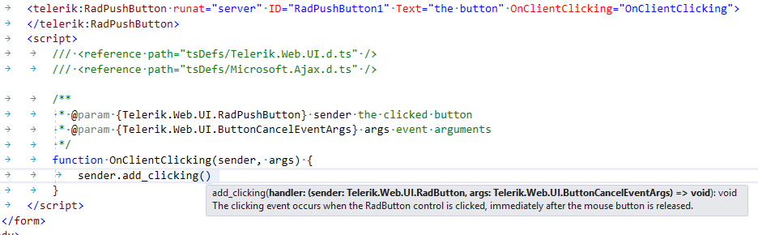

# How to Use JavaScript Intellisense for the Telerik Controls

>note This article explains how to enable JavaScript intellisense for a given Telerik control's client-side properties and methods.
>This intellisense is different than the default JavaScript intellisense Visual Studio offers and does not affect it.
>The jQuery and Telerik Static client library intellisense are also a separate feature and are described in [this help article]().

The **Telerik® UI for ASP.NET AJAX** offer intellisense information for the **code-behind** out of the box as Visual Studio automatically loads the needed information from our assembly. It can display it without any further configuration, because the type of the variables is known.

The case with **JavaScript** is a bit more complex, because it is a weakly typed programming language, i.e. a variable does not need a type to function and thus Visual Studio cannot know what information to load for it.

This article contains two sets of instructions:

* [TypeScript-based IntelliSense - default](#visual-studio-2017)
* [VSDoc-based IntelliSense - used previously](#visual-studio-2017)
* [IntelliSense for Visual Studio 2015 and earlier](#visual-studio-2015-and-earlier)

## TypeScript-based IntelliSense

As of Visual Studio 2017, Microsoft use a [new language service for JavaScript Intellisense](https://docs.microsoft.com/en-us/visualstudio/ide/javascript-intellisense?view=vs-2017) that is based on TypeScript. This means that `-vsdoc.js` files are no longer read and supported for JavaScript intellisense and you need to treat it like a strongly typed language in order to get Intellisense for non-standard object types, including custom controls like the Telerik controls.

You can read more about this service, how it works and what features it supportes in the following articles:

* [Microsoft/TypeScript GitHub repo wiki: JavaScript Language Service in Visual Studio](https://github.com/Microsoft/TypeScript/wiki/JavaScript-Language-Service-in-Visual-Studio)

* [Microsoft/TypeScript GitHub repo wiki: JSDoc support in JavaScript](https://github.com/Microsoft/TypeScript/wiki/JsDoc-support-in-JavaScript)

With this in mind, you may want to consider writing directly in TypeScript and using the [TypeScript Definitions for Telerik UI for ASP.NET AJAX]().

To use JavaScript Intellisense for the Telerik UI for ASP.NET AJAX controls in VS 2017, you must

1. Add the [TypeScript Definitions for Telerik UI for ASP.NET AJAX]() to your project.

1. Reference the definition files in the file you are working in. Assuming the `.d.ts` files are in the `tsDefs` folder, here is a sample reference

    **JavaScript**

        /// <reference path="tsDefs/Telerik.Web.UI.d.ts" />
        /// <reference path="tsDefs/Microsoft.Ajax.d.ts" />

1. Use the **JSDoc** syntax to define the object types for the variables you will use.

    This includes event handler functions and control references obtained in other code.

### Examples

Here follows a list of several common scenarios that can help you get started with using JSDoc declarations of variables and arguments.

>caption Declare a variable type.

````JavaScript
/// <reference path="tsDefs/Telerik.Web.UI.d.ts" />
/// <reference path="tsDefs/Microsoft.Ajax.d.ts" />

function doWork() {
	//initialize a variable with its type to provide intellisense
	//remove this first line later as it will throw an exception
	var button = new Telerik.Web.UI.RadPushButton;

	var button = $find("<%=RadPushButton1.ClientID%>");
	//or any other approach that the actual code will use
	var button = getButtonFromPage();


	//define a simple object type
	/** @type { Telerik.Web.UI.RadPushButton } */
	var btn;
}
````


The following should theoretically work as well according to the [JSDoc support in JavaScript article](https://github.com/Microsoft/TypeScript/wiki/JsDoc-support-in-JavaScript), yet in our tests such casts were unreliable.

````JavaScript
/// <reference path="tsDefs/Telerik.Web.UI.d.ts" />
/// <reference path="tsDefs/Microsoft.Ajax.d.ts" />

//while this approach is documented as declaring object types, it does not seem to work
function shouldWorkButMayNot() {
	//cast an object
	var myButton =  /** @type {Telerik.Web.UI.RadPushButton} */ $find("<%=RadPushButton1.ClientID%>");
}
````

Defining several fields in a container object also works, and that is sometimes a pattern used to store references from a page for use in an external JS file:

````JavaScript
/// <reference path="tsDefs/Telerik.Web.UI.d.ts" />
/// <reference path="tsDefs/Microsoft.Ajax.d.ts" />
function doWork() {
	/**
	 * @type {{
				button: Telerik.Web.UI.RadPushButton,
				grid: Telerik.Web.UI.RadGrid
			}}
	 */
	var referencesList;
	referencesList.button.set_text("new text");
}
````


>caption Set type to event handler arguments.

You can specify the type of the first argument (the control that fired the event), and use its client-side methods for working with its events in order to see the exact type of the event arguments object, so you can fill it up in the parameters list as well.



so you can use both arguments fully.


````JavaScript
/// <reference path="tsDefs/Telerik.Web.UI.d.ts" />
/// <reference path="tsDefs/Microsoft.Ajax.d.ts" />

/**
 * @param {Telerik.Web.UI.RadPushButton} sender the clicked button
 * @param {Telerik.Web.UI.ButtonCancelEventArgs} args event arguments
 */
function OnClientClicking(sender, args) {
	sender.set_text("new text");
}
````

## VSDoc-based IntelliSense

Visual Studio 2017 uses a new Intellisense mode for JavaScript based on TypeScript. You can revert to the old behavior by going to **Tools** > **Options** > **Text Editor** > **JavaScript/TypeScript** > **Language Service** and **uncheck** the checkbox from **Enable the new JavaScript Language service**. Make sure to restart Visual Studio for the changes to take effect.


With this, you can use the old JavaScript documenttion provided in the `vsdoc` files.

````ASP.NET
<!-- This can enable the old JS intellisense for the current page -->
<asp:ScriptManager ID="ScriptManager1" runat="server">
	<Scripts>
		<asp:ScriptReference Assembly="Telerik.Web.UI" Name="Telerik.Web.UI.Common.Core.js" />
	</Scripts>
</asp:ScriptManager>
<telerik:RadWindow RenderMode="Lightweight" runat="server" ID="RadWindow1"></telerik:RadWindow>
<script type="text/javascript">
	function doWork() {
		var oWnd = $find("RadWindow1");
		oWnd = $telerik.toWindow(oWnd);
	}
</script>
````


Creating custom Intellisense pages is no longer possible in VS 2017, and you need to use an `<asp:ScriptManager>` with the Telerik `Core.js` reference in all pages you want JavaScript Intellisense in. An `<asp:ScriptManagerProxy>` does not work for user controls, and neither can be added in `.js` files, so your other option is to read onward and see how to use the TypeScript-based intellisense data.


## IntelliSense for Visual Studio 2015 and earlier

You can get intellisense for the JavaScript objects of the Telerik controls by **casting** the objects which hold references to the **Telerik controls** to their respective type by using the method each control provides in the [Telerik static client library](), for example:

````JavaScript
<telerik:RadScriptManager runat="server" ID="rsm1"></telerik:RadScriptManager>
<telerik:RadWindow RenderMode="Lightweight" runat="server" ID="RadWindow1"></telerik:RadWindow>
<script type="text/javascript">
    var oWnd = $find("RadWindow1");
    oWnd = $telerik.toWindow(oWnd);
</script>
````

A similar approach allows Visual Studio to show the intellisense for this variable:


>tip This cast is not needed for production environment, it is useful for development and would not yield any benefit when the site is live - it will work just as well without it, it is actually an extra operation.
>

>note If you are using Visual Studio 2008, you will need to install its Service Pack 1 to get support for `-vsdoc.js`files that contain the JavaScript intellisence. You can find mode information on the matter in the [VS2008 SP1 Hotfix to Support "-vsdoc.js" IntelliSense Doc Files](http://blogs.msdn.com/b/webdev/archive/2008/11/07/hotfix-to-enable-vsdoc-js-intellisense-doc-files-is-now-available.aspx) blog post.
>

>note Visual Studio 2017 changed the way JavaScript Intellisense works and the approach described in this article no longer works with it. You can find a feature request for its support in the following page: [VS2017 JavaScript Intellisense support for UI for ASP.NET AJAX](https://feedback.telerik.com/Project/108/Feedback/Details/226029-vs2017-javascript-intellisense-support-for-ui-for-asp-net-ajax) so you can track its status. In the meantime, you can consider using [the TypeScript definitions for UI for ASP.NET AJAX]().

>caption A list with the available methods

| $telerik.toAjaxLoadingPanel(object) | Casts the passed object to a RadAjaxLoadingPanel |
| ------ | ------ |
|$telerik.toAjaxManager(object)|Casts the passed object to a RadAjaxManager|
|$telerik.toAjaxPanel(object)|Casts the passed object to a RadAjaxPanel|
|$telerik.toAsyncUpload(object)|Casts the passed object to a RadAsyncUpload|
|$telerik.toButton(object)|Casts the passed object to a RadButton|
|$telerik.toCalendar(object)|Casts the passed object to a RadCalendar|
|$telerik.toCaptcha(object)|Casts the passed object to a RadCaptcha|
|$telerik.toColorPicker(object)|Casts the passed object to a RadColorPicker|
|$telerik.toComboBox(object)|Casts the passed object to a RadComboBox|
|$telerik.toDataPager(object)|Casts the passed object to a RadDataPager|
|$telerik.toDateInput(object)|Casts the passed object to a RadDateInput|
|$telerik.toDatePicker(object)|Casts the passed object to a RadDatePicker|
|$telerik.toDateTimePicker(object)|Casts the passed object to a RadDateTimePicker|
|$telerik.toDock(object)|Casts the passed object to a RadDock|
|$telerik.toDockZone(object)|Casts the passed object to a RadDockZone|
|$telerik.toEditor(object)|Casts the passed object to a RadEditor|
|$telerik.toFileExplorer(object)|Casts the passed object to a RadFileExplorer|
|$telerik.toFormDecorator(object)|Casts the passed object to a RadFormDecorator|
|$telerik.toGrid(object)|Casts the passed object to a RadGrid|
|$telerik.toHtmlChart(object)|Casts the passed object to a RadHtmlChart|
|$telerik.toImageEditor(object)|Casts the passed object to a RadImageEditor|
|$telerik.toInputManager(object)|Casts the passed object to a RadInputManager|
|$telerik.toLinearGauge(object)|Casts the passed object to a RadLinearGauge|
|$telerik.toListBox(object)|Casts the passed object to a RadListBox|
|$telerik.toListView(object)|Casts the passed object to a RadListView|
|$telerik.toMaskedTextBox(object)|Casts the passed object to a RadMaskedTextBox|
|$telerik.toMenu(object)|Casts the passed object to a RadMenu|
|$telerik.toMultiPage(object)|Casts the passed object to a RadMultiPage|
|$telerik.toNotification(object)|Casts the passed object to a RadNotification|
|$telerik.toNumericTextBox(object)|Casts the passed object to a RadNumericTextBox|
|$telerik.toPane(object)|Casts the passed object to a RadPane|
|$telerik.toPanelBar(object)|Casts the passed object to a RadPanelBar|
|$telerik.toRadialGauge(object)|Casts the passed object to a RadRadialGauge|
|$telerik.toRating(object)|Casts the passed object to a RadRating|
|$telerik.toRotator(object)|Casts the passed object to a RadRotator|
|$telerik.toScheduler(object)|Casts the passed object to a RadScheduler|
|$telerik.toSlider(object)|Casts the passed object to a RadSlider|
|$telerik.toSliderItem(object)|Casts the passed object to a RadSliderItem|
|$telerik.toSlidingPane(object)|Casts the passed object to a RadSlidingPane|
|$telerik.toSlidingZone(object)|Casts the passed object to a RadSlidingZone|
|$telerik.toSocialShare(object)|Casts the passed object to a RadSocialShare|
|$telerik.toSpell(object)|Casts the passed object to a RadSpell|
|$telerik.toSplitBar(object)|Casts the passed object to a RadSplitBar|
|$telerik.toSplitter(object)|Casts the passed object to a RadSplitter|
|$telerik.toTabStrip(object)|Casts the passed object to a RadTabStrip|
|$telerik.toTagCloud(object)|Casts the passed object to a RadTagCloud|
|$telerik.toTextBox(object)|Casts the passed object to a RadTextBox|
|$telerik.toTimeView(object)|Casts the passed object to a RadTimeView|
|$telerik.toToolBar(object)|Casts the passed object to a RadToolBar|
|$telerik.toToolTip(object)|Casts the passed object to a RadToolTip|
|$telerik.toToolTipManager(object)|Casts the passed object to a RadToolTipManager|
|$telerik.toTreeList(object)|Casts the passed object to a RadTreeList|
|$telerik.toTreeView(object)|Casts the passed object to a RadTreeView|
|$telerik.toUpload(object)|Casts the passed object to a RadUpload|
|$telerik.toWindow(object)|Casts the passed object to a RadWindow|
|$telerik.toWindowManager(object)|Casts the passed object to a RadWindowManager|
|$telerik.toXmlHttpPanel(object)|Casts the passed object to a RadXmlHttpPanel|
