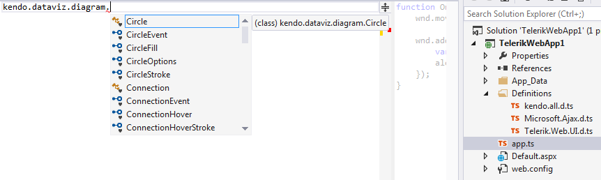

# Add TypeScript Definitions for Controls Using Kendo UI

This article explains how to add the **Kendo UI TypeScript definitions** in order to	have full intellisense for controls from the UI for ASP.NET AJAX suite that use **Kendo UI** widgets.

## Getting the Kendo TypeScript Definitions

If you have a license for the **Kendo UI** distribution, you can find the **kendo.all.d.ts** file in the **typescript** folder, inside the downloaded package.Otherwise, you can get the file by downloading the trial version — [Try Kendo UI](https://www.telerik.com/download/kendo-ui).

You can read more about the **Kendo TypeScript** definitions in the [Kendo UI TypeScript Support](https://docs.telerik.com/kendo-ui/typescript) help article.

## Adding the Definitions to the Project

By following these steps you will have full intellisense for the exposed **Kendo** widgets:

1. Make sure that the instructions from the [Add TypeScript Definitions for the Telerik® UI for ASP.NET AJAX Suite]() article are followed and that the **Microsoft.Ajax.d.ts** and **Telerik.Web.UI.d.ts** are added properly;

1. Put the **kendo.all.d.ts** file in the same folder—e.g., **Definitions**.
>caption 

You can learn how to get a reference to the	integrated Kendo widgets and use them in TypeScript code in the	[Use TypeScript for Controls Using Kendo UI]() help article.

### See Also

 * [What is TypeScript]()

 * [Add TypeScript Definitions for the Telerik® UI for ASP.NET AJAX Suite]()

 * [Use TypeScript for Controls Using Kendo UI]()
