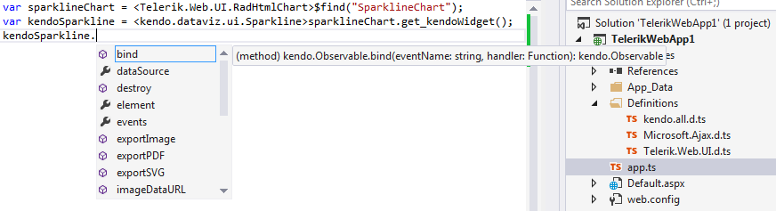

# Use TypeScript for Controls Using Kendo UI

This article explains how to use the **Kendo TypeScript definitions**	with controls from the UI for ASP.NET AJAX suite that use **Kendo UI** widgets.

## Getting a Reference to the Client-side Object of Kendo Widgets

By design, every control from the UI for ASP.NE T AJAX suite that integrates a **Kendo** widget, exposes the client-side **get_kendoWidget** method, which returns a reference to the widget object.

>note Exception to that rule is [RadClientDataSource]() in versions prior to **Q2 2015**. In older version it exposes the **get_dataSourceObject** method to return the reference to the **Kendo** DataSource object.
>

## How to use Intellisense

The **get_kendoWidget** method returns an object of type *`Object`*. In order to have the **Kendo** intellisense, you should cast it to the proper type.

````JavaScript
var sparklineChart = <Telerik.Web.UI.RadHtmlChart>$find("SparklineChart");
var kendoSparkline = <kendo.dataviz.ui.Sparkline>sparklineChart.get_kendoWidget();
````

>caption Figure 1: Using the Kendo Sparkline chart’s intellisense with an object returned by a RadHtmlChart.



Once the type casting is done, you can utilize any available client-side method exposed by the **Kendo** widget. You can find more details about the widgets’ API in the [Kendo API reference](http://docs.telerik.com/kendo-ui/introduction).

### See Also

 * [Add TypeScript Definitions for Controls Using Kendo UI]()

 * [Kendo API reference](http://docs.telerik.com/kendo-ui/introduction)
