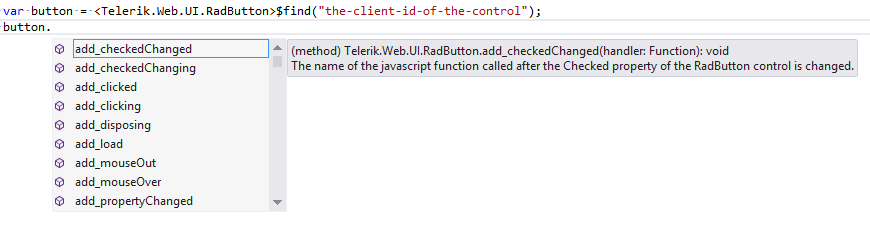
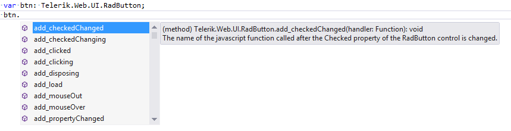
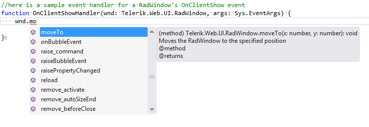
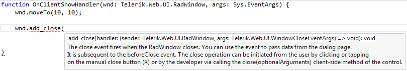
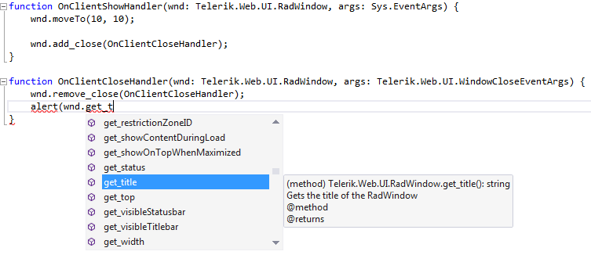

# Use TypeScript for the Telerik UI for ASP.NET AJAX Suite


This article explains how to use the **TypeScript definitions**	available for the **Telerik UI for ASP.NET AJAX** suite.

To continue with this help article, make sure that the	Telerik UI for ASP.NET AJAX **TypeScript** definitions are properly added	to your Web Application. You can find helpful instructions about that	in the [Add TypeScript Definitions for the Telerik UI for ASP.NET AJAX Suite]() article.

You can quickly navigate through the sections in this list:

1. [Getting a Reference to the Client-side Object](#getting-a-reference-to-the-client-side-object)

1. [Using Intellisense for the Telerik Controls](#using-intellisense-for-the-telerik-controls)

1. [Attaching Event Handlers via Properties](#attaching-event-handlers-via-properties)

1. [Attaching Event Handlers via Client-side Methods](#attaching-event-handlers-via-client-side-methods) — demonstrates how to examine the handler signature and identify the proper object types needed as the function’s parameters.

## Getting a Reference to the Client-side Object

The MS AJAX framework exposes the client-side $find method,	which returns the reference of the control’s client-side object. In **TypeScript**, the object returned is of type *`Sys.Component`*.In order to use the returned value with the proper object type, you need to cast it to it.

**Example 1**: Casting in TypeScript.

````JavaScript
var btn: Telerik.Web.UI.RadButton;
btn = <Telerik.Web.UI.RadButton>$find("the-client-id-of-the-control");
````


## Using Intellisense for the Telerik Controls

For Visual Studio to display the intellisense popup with the available methods and explanations,it has to know the type of the object the cursor is on. There are two ways to instruct the IDE about this:

* Cast the variable to the desired object type: 

**Example 2**: Casting to RadButton object type.

````JavaScript
var button = <telerik.web.ui.radbutton>$find("the-client-id-of-the-control");
````

>caption Figure 1: Intellisense for a variable cast to the Telerik control object.


* Define the object type when you declare the variable:

**Example 3**: Defining the type of a variable.

````JavaScript
var btn : Telerik.Web.UI.RadButton;
````

>caption Figure 2: Intellisense for a variable cast to the Telerik control object.


## Attaching Event Handlers via Properties

All controls from the Telerik UI for ASP.NET AJAX suite provide a rich set of client-side events that can be attached via properties (e.g., the RadButton’s OnClientClicking).

The name of the JavaScript function should be set as a value to the event property.The same applies in **TypeScript** as well. Additionally, to have intellisense,you should define the object types of the exposed arguments in the function’s signature	(see **Example 4** and **Figure 3**).

**Example 4**: Attaching an event handler via property.

````ASP.NET
<telerik:RadWindow RenderMode="Lightweight" runat="server" ID="RadWindow1" Title="My RadWindow"
	OnClientShow="OnClientShowHandler" VisibleOnPageLoad="true">
	<ContentTemplate>
		Popup's Content
	</ContentTemplate>
</telerik:RadWindow>
````

````JavaScript
function OnClientShowHandler(wnd: Telerik.Web.UI.RadWindow, args: Sys.EventArgs) {
	wnd.moveTo(10, 10);
}
````

>caption Figure 3: Intellisense for event handler arguments


## Attaching Event Handlers via Client-side Methods

Once the control’s reference is available,you can use the client-side API of the Telerik controlsto attach/detach event handlers. The example here (**Example 5**) is a continuation of the example from the [Attaching Event Handlers via Properties](#attaching-event-handlers-via-properties) section (**Example 4**).
>caption Figure 4: Attaching event handler via client-side method.



**Figure 4** showcases the process of adding a handler method.	Notice how the signature of the event handler is shown in the intellisense balloon. This helps you build the logic in the	event handler function. Additionally, when the event handler	function is in the scope of the *`add_[eventName]`* method, the objecttypes are already known (**Figure 5**), so you do not need to additionally define the arguments’ types.
>caption Figure 5: Using event’s arguments



**Example 5**: Attaching an event handler via client-side method.

````JavaScript
function OnClientShowHandler(wnd: Telerik.Web.UI.RadWindow, args: Sys.EventArgs) {
	wnd.moveTo(10, 10);

	wnd.add_close(OnClientCloseHandler);
}

function OnClientCloseHandler(wnd: Telerik.Web.UI.RadWindow, args: Telerik.Web.UI.WindowCloseEventArgs) {
	wnd.remove_close(OnClientCloseHandler);
	alert(wnd.get_title() + " is closing");
}	
````

### See Also

 * [What is TypeScript]()

 * [Add TypeScript Definitions for the Telerik UI for ASP.NET AJAX Suite]()
