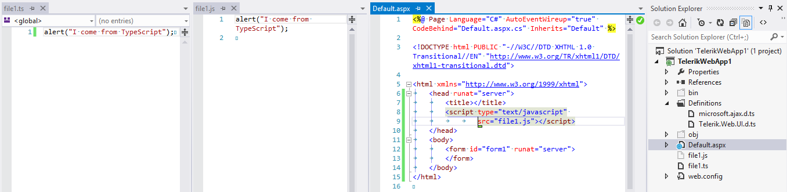

# What is TypeScript

**TypeScript** is a language that can be considered a superset of JavaScript.	It provides types and casting to JavaScript which make writing JavaScript	similar to writing C# (including providing advanced intellisense).	The TypeScript code is translated to JavaScript by the IDE. You can read more about it in the [typescriptlang.org](http://www.typescriptlang.org/) site.
>caption Figure 1: Using TypeScript language in a Telerik web application.

TypeScript infers the object types and in order to work with custom objects (like the client-side objects of the Telerik controls),	it needs to have **definition files** for them. They are similar to vsdoc files and markdown documentation.

## 

You can learn more about using TypeScript for the Telerik® UI for ASP.NET AJAX suite in the following help articles:

* [Add TypeScript Definitions for the Telerik® UI for ASP.NET AJAX Suite]()

* [Use TypeScript for the Telerik® UI for ASP.NET AJAX Suite]()

* [Add TypeScript Definitions for Controls Using Kendo UI]()

* [Use TypeScript for Controls Using Kendo UI]()

### See Also

 * [How to Use JavaScript Intellisense for the Telerik Controls]()
