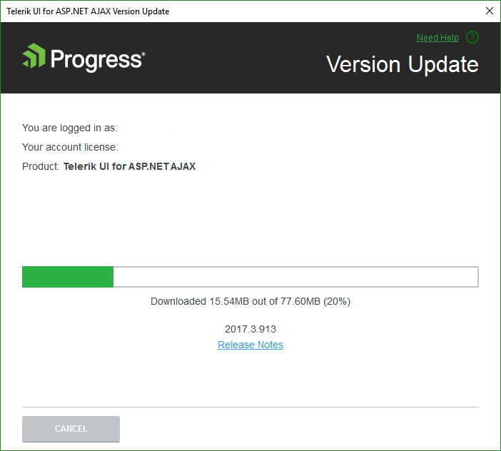

# Automatic Latest Version Retrieval

## 

With the Telerik Visual Studio Extensions you keep your projects in an up-to-date state.The Latest Version Acquirer tool automatically retrieves the freshest Telerik UI for ASP.NET AJAX distribution,available on the Telerik website. Running the [Upgrade Wizard]()as a next step makes the task of latest Telerik UI for ASP.NET AJAX package utilization extremely easy.

Once a day, upon Visual Studio launch, the Telerik Web.UI VSExtensions queue the Telerik website for a new version ofTelerik UI for ASP.NET AJAX. A dialog gets displayed when a new version is discovered:

>note If you've disabled the notifications, you can use the[Options Dialog]()to activate them again.
>

Clicking the Get Now button starts the Latest Version Acquirer tool,	prompting for your Telerik credentials and the type of license you own in its first page.	If you do not have a[www.telerik.com](http://www.telerik.com)	account, you can create one through the Register link.

You can check the additional information about the release by clicking the Release Notes link.	This will start a browser, navigated to a page with the release notes related to the specific version.

You can use the Save my password checkbox to save having to enter your Telerik credentials multiple times.	The persistance is done in a secure manner and credentials are saved in a per-user context. This way other users on the machine	that do not have access to your user data from downloading through your account.

If your subscription has expired, you could either proceed with downloading a trial distribution or you	could renew it and initiate the download again.

Once the download succeeds, the latest version of the Telerik UI for ASP.NET AJAX Extensions will be available for usein the [Upgrade Wizard]() and the[New Project Wizard]().

>tip The Download buttons of the[Upgrade Wizard]()and the[New Project Wizard]()launch theLatest Version Acquirer tool too.
>

>note The Latest Version Acquirer tool actually downloads the hotfix zip files, containing the latest Telerik binaries	and any resources vital for the Telerik Web Application/Web Site project creation. These get unpacked to	the%appdata%\Telerik\Updatesfolder.
>If you find the list of packages offered too long and you don't need the older versions, you can	close Visual Studio and use Windows Explorer to delete these distributions.
>

