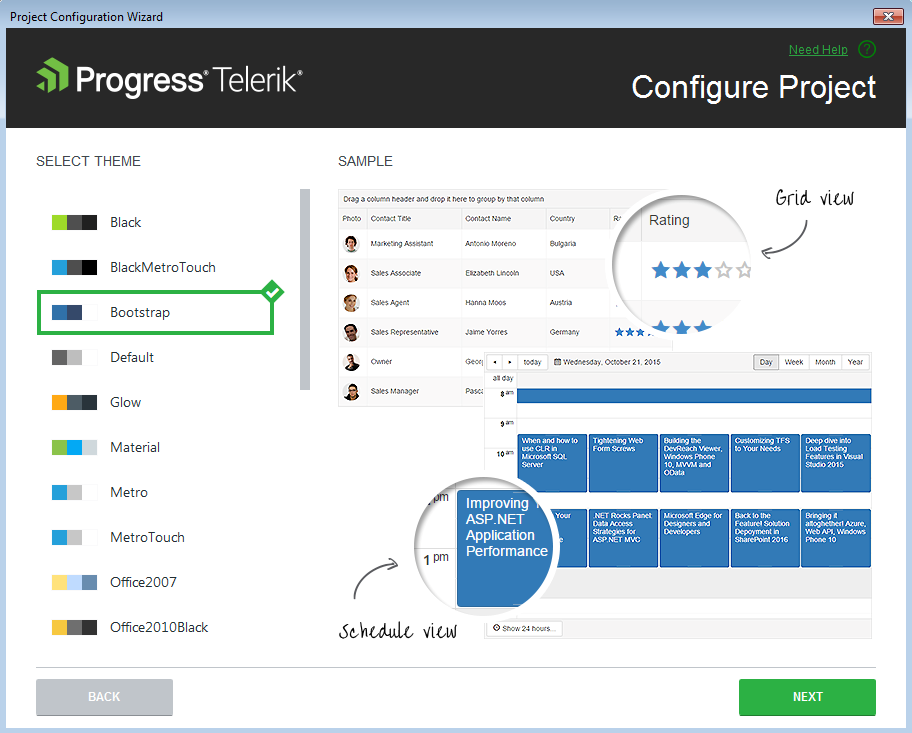
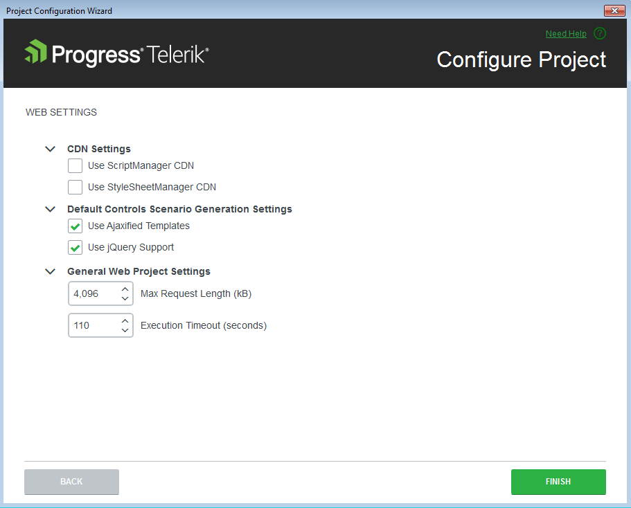

# Configure Project

The Project management functionality of the Visual Studio Extensions handles project assembly reference updates, web.config entry management and updates of the supporting resources.

This functionality is handled by three wizards - the Project Configuration Wizard, [Convert Project Wizard]() and the [Upgrade Wizard]().

Telerik Project Configuration wizard could be accessed through the Telerik > Telerik UI for ASP.NET AJAX menu:

The Project Configuration Wizard’s first page lets you define which Telerik DPL assemblies will be added to your project:

 

The version of the assemblies are the same as the one with which your project has been created, converted or upgraded.

The second page of the Project Configuration Wizard gives you the ability to select which theme pack will be added to your project. Check the content of each theme or see the preview of it when select it into the Project Configuration wizard and select the one you want to be included in the project:

 

>note If you prefer the Telerik assemblies to be copied into your solution folder, the **Copy referenced assemblies to solution and source control** option could be selected *only* into the [Visual Studio Extensions Options]() but it is not applicable for Visual Studio web site projects.

On the third page the wizard suggests more site settings and several resource options:

  

* **Use ScriptManger CDN** - Define if the site will utilize [RadScriptManager CDN Support]().

* **Use StyleSheetManager CDN** - Define if the site will utilize [RadStyleSheetManager CDN Support]().

* **Use jQuery Support** - Define if the pages that will be created via the Scenario Wizard will use jQuery support by default.

* **Use Ajaxified Templates** - Define if the pages that will be created via the Scenario Wizard will use [RadAjaxManager]() by default.

* **General Web Project settings** - [RadUpload]()-related configuration - the [Maximum Request Length and Execution Timeout]() settings of the site.

>note The Project Configuration wizard does not allow the targeted Telerik controls distribution to be changed when configuring a project. In that mode you can change the other project properties though. Changing the Telerik UI for ASP.NET AJAX version of a project is handled by the [Upgrade Wizard]().
>

When a web project gets reconfigured, Visual Studio Extensions perform the following changes:

* Telerik assembly references get added or are changed in the project.

* [The user gets notified]() through the Project Configuration wizard if the wizard cannot find a correct Telerik.Web.Design assembly in the GAC.

The web.config file gets updated as per the choices in the wizard:

* The global skin registration is updated.

* A registration for the "telerik" tag prefix is added, so that it is not needed to have the `<%@ Register %>` directive in each page.

* RadScriptManager and RadStyleSheetManager default CDN settings are persisted.
