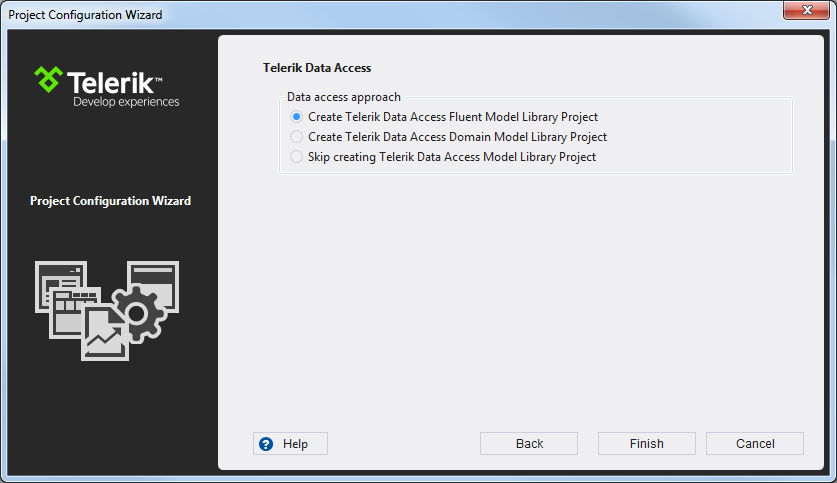

# Creation and Configuration Wizard

## 

The Project management functionality of the Visual Studio Extensions handles project assembly reference updates, web.config entry management and updates of the supporting resources.

This functionality is handled by two wizards - the Project Configuration Wizard and the [Upgrade Wizard]().

The Project Configuration Wizard is called when:

* Creating a new Telerik WebSite/WebApplication (through the Visual Studio New Project dialog).

* Converting a web project to a Telerik one (accessed through the Telerik > Telerik UI for ASP.NET AJAX menu).

* Configuring a Telerik web project (accessed through the Telerik > Telerik UI for ASP.NET AJAX menu).

The Project Configuration Wizard’s first page lets you define settings related to Telerik controls:

* __Telerik Assemblies__ - Select the Telerik controls distribution to be used. You can choose from the detected assemblies (from an installation folder or from the GAC), or you can browse to an assemblies located somewhere on your hard drive (e.g. when you've downloaded a zip file from the [Latest Internal Builds](http://blogs.telerik.com/blogs/posts/09-01-07/download_latest_internal_builds.aspx) page).

* __Project type__ – Select the Telerik project type. (option is only available in __New Project Wizard__).

* __Skin packs__ - Choose the skin packs to be added to the project. Check the content of each skin pack (a skin pack is an assembly that contains one or more skins) and select the one(s) you want to be included in the project. If you want to add or remove a skin pack later, you can use the Configure Project wizard.

* __Default skin__ - Select a global site-wide skin to be used by Telerik UI for ASP.NET AJAX. This can be overridden by using the[Skin]() property of each single control afterwards.

* __Add referenced assemblies to solution__ -	Choose whether to copy referenced assemblies to your solution folder. The assemblies will automatically get added to source control when using Microsoft Team Foundation Server.

>note The __Add referenced assemblies to solution__ option is not available for Visual Studio web site projects or when using GAC based distributions.
>

On the third page the wizard suggests Document Processing assemblies to be included in your project.

On the second page the wizard suggests more site settings and several resource options:

* __Use ScriptManger CDN__ - Define if the site will utilize [RadScriptManager CDN Support](3962E5BD-7414-41F5-82AA-8D144A9327AF).

* __Use StyleSheetManager CDN__ - Define if the site will utilize [RadStyleSheetManager CDN Support](D7505CD2-4BB7-42D9-86E4-522D48085ABD).

* __Copy RadSpell Dictionaries__ - Select whether you wish the project wizard to copy the dictionary files required for [RadSpell](9E68C71D-5FE7-435E-9D6B-DE9F68B0A480) to your project.

* __Copy RadCaptcha Audio Files__ - Select whether you wish the project wizard to copy the audio files required for [RadCaptcha](502EA0E9-D33A-4AC6-914C-47C089020F36) audio code functionality.

* __Copy TypeScript definitions__ – Select whether you with the project wizard to copy the	[TypeScript definitions we provide for the UI for ASP.NET AJAX controls]().

* __General Web Project settings__ - [RadUpload](1B3CE36C-D24D-4DB8-92BA-B9E92F56809A)-related configuration - the [Maximum Request Length and Execution Timeout](3544C667-22D4-403B-91E4-43BC8CA94778) settings of the site.

* __Use jQuery Support__ - Define if the pages that will be created via the Scenario Wizard will use jQuery support by default.

* __Use Ajaxified Templates__ - Define if the pages that will be created via the Scenario Wizard will use [RadAjaxManager](546BFFA1-0A6D-4ACF-83E2-02D9592E7857) by default.

On the next step the Project Configuration Wizard’s Data Access page offers you initialize the creation of your data access layer using Telerik OpenAccess ORM.You are given the following options:

* __Create OpenAccess Fluent Library Project__After you choose this option an OpenAccess ORM project will be added, enabling you to create your object mapping in a declarative way. With this Code-Only approach all the necessary persistent classes and mappings are defined manually – the project will initially contain only a sample declaration to get you started. You can find more information about the Fluent Library project type	[here](http://www.telerik.com/help/openaccess-orm/getting-started-fluent-mapping-overview.html).

* __Create OpenAccess Domain Model Library Project__The Domain Model is an auto-generated and editable diagram of your persistent classes. This option will start the Add Domain Model wizard after exiting Project Configuration Wizard, so that you can configure your data layer without writing a single line of code. You can create a new model and define you classes later using the tools that OpenAccess Visual Designer is offering, or retrieve the schema of an already designed database and generate classes for the selected tables and views. The different scenarios are described in the articles below:[Create an empty model – Model First](http://www.telerik.com/help/openaccess-orm/getting-started-root-getting-started-with-update-schema-tools.html)[Generate the domain model from a database - Database First](http://www.telerik.com/help/openaccess-orm/getting-started-root-generating-model-mappings-taking-database-first-approach.html)

* __Skip creating an OpenAccess Model Library Project__No data access project will be added.

>note The Project Configuration wizard does not allow the targeted Telerik controls distribution to be changed when configuring a project. In that mode you can change the other project properties though. Changing the Telerik UI for ASP.NET AJAX distribution of a project is handled by the[Upgrade Wizard]().
>

When a web project gets reconfigured, Visual Studio Extensions perform the following changes:

* Telerik assembly references get added or are changed in the project.

* [The user gets notified]() through the Project Configuration wizard if the wizard cannot find a correct Telerik.Web.Design assembly in the GAC.

* The wizard copies the RadSpell dictionaries and RadCaptcha audio files shipped with the distribution so that they are up to date with the assemblies.

The web.config file gets updated as per the choices in the wizard:

* The global skin registration is updated.

* A registration for the "telerik" tag prefix is added, so that it is not needed to have the <%@ Register %> directive in each page.

* If an assembly from GAC is used, the web.config now contains an entry for it.

* RadScriptManager and RadStyleSheetManager default CDN settings are persisted.
