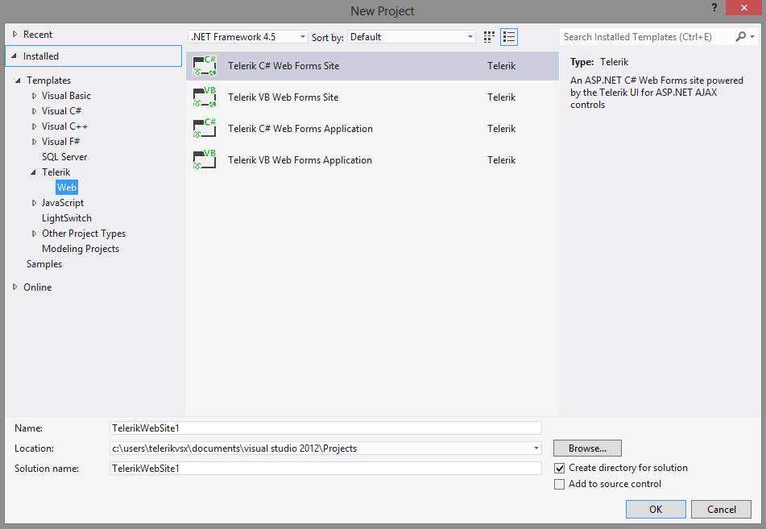
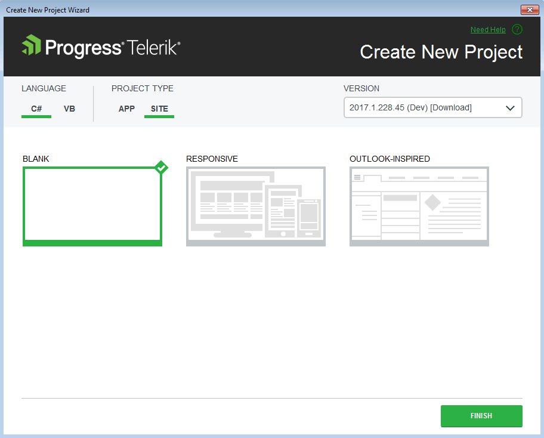

# Create Project

Telerik ASP.NET AJAX Visual Studio Extensions will help you to quickly create an application pre-configured to use Telerik UI for APS.NET AJAX. The fastest way to have such a project is using the Visual Studio New Project Wizard. Having opened it, the following four Telerik Ajax project templates could be found under the Telerik -> Web node:

For convenience the same project templates could be found under the Visual C# -> Web and Visual Basic -> Web nodes.

After you click the OK button, you get the Create New Project Wizard, provided by the Telerik UI for APS.NET AJAX Visual Studio Extensions. The wizard detects all the installed versions of UI for ASP.NET AJAX and lists them in the Version combobox. You can select a version which you want to be applied to your project. The following options could be set into the Create new project wizard: 

* **Language** - Select the Telerik project language (the option is only available in the **New Project Wizard**). You can choose between two options: C# or VB. 

* **Project Type** - Select the Telerik project type (the option is only available in the **New Project Wizard**). You can choose between two options: APP (Application) or SITE (Web Site).

* **Project Template** - Select the Telerik project template (the option is only available in the **New Project Wizard**). The Blank template only references the assemblies and has the [mandatory additions to the web.config](#mandatory-additions-to-the-webconfig). The *Responsive* template uses the [RadPageLayout]() control to provide a basic template for a responsive web page.

>note If you prefer the Telerik assemblies to be copied into your solution folder, the **Copy referenced assemblies to solution and source control** option could be selected *only* into the [Visual Studio Extensions Options]() but it is not applicable for Visual Studio web site projects.

>note When creating a new project, the [Render Mode]() of the Telerik controls is automatically set to **Lightweight**.
