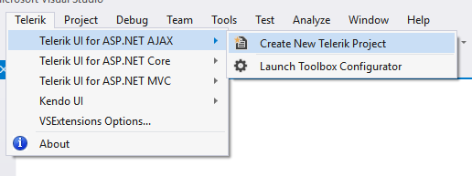
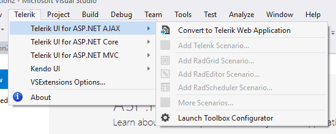
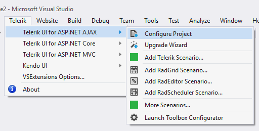
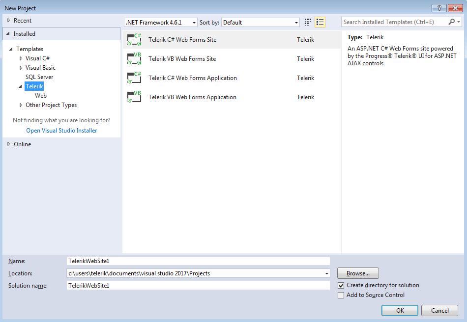

# Visual Studio Extensions Overview

Visual Studio Extensions for Telerik® UI for ASP.NET AJAX aim to help developers when creating web projects (web site and web application) with the Telerik® UI for ASP.NET AJAX.

The extensions handle the following major points in the development with Telerik® UI for ASP.NET AJAX:

* [Project creation, conversion and configuration]() - aid with the project configuration which handles reference management, web.config modifications and management of additional resources (scripts, skins …).

* [Project upgrade]() - upgrading Telerik® UI for ASP.NET AJAX to a new version.

* [Common scenario page creation]() - aid creating pages with the most common scenarios in the usage of Telerik® UI for ASP.NET AJAX.

* [Toolbox configuration]() - select what version of Telerik UI to be populated in the Toolbox.

Visual Studio Extensions for Telerik® UI for ASP.NET AJAX are distributed with the Telerik® UI for ASP.NET AJAX installer. They can be downloaded and installed as separate product from the Visual Studio Gallery only for Visual Studio 2012 and later. The extensions support Visual Studio 2010, 2012, 2013, 2015 and 2017 handling.NET 3.5, .NET 4.0 and .NET 4.5 projects.

The Visual Studio Extensions can be accessed through the Telerik | Telerik® UI for ASP.NET AJAX menu which has different menu items depending on the selected project in Visual Studio. The extensions can be accessed through the context menu of a web project as well.

>caption No selected project in Visual Studio

>caption Selected project in Visual Studio is Standard Web Project (Web Site or Web Application)

>caption Selected project in Visual Studio is Telerik Web Project (Web Site or Web Application)

When installed, the extensions add several project templates to the New Project dialog of Visual Studio:

These are available in the language specific nodes of the dialog as well:

* New WebSite contains Telerik controls WebSite both for C# and VB.NET

* New Project contains Telerik controls Web Application under both CSharp\Web and Visual Basic\Web nodes
