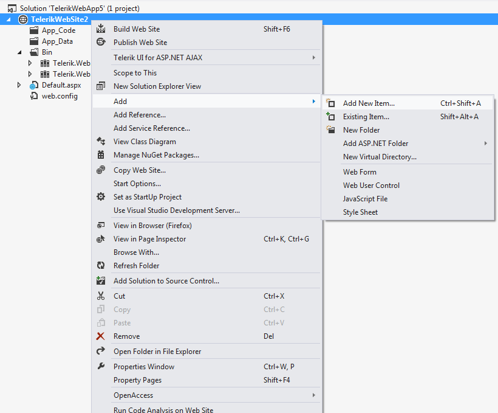

# Scenario Wizard

## 

Visual Studio Extensions provide the user with a number of templates that aid the creation of pages with the most common scenarios in the development with Telerik UI for ASP.NET AJAX. The scenarios consist of template files, representing an ASPX page or a set of ASPX pages/user controls/custom classes.

You can start the Telerik UI for ASP.NET AJAX Scenario wizard by using one of the following:

* Click an Add Scenario menu item from the Telerik UI for ASP.NET AJAX menu
 

**Note:** The Add Scenario menus won't start the wizard when the **Telerik.Web.UI** assembly referenced by the project does not support the scenarios accompanying the latest installation. You should upgrade the **Telerik.Web.UI** assembly reference to a recent version in order to create scenario pages.

* Select the Telerik Scenario item template from the Add New Item dialog
 **Important:** In case your project does not have a reference to the Telerik.Web.UI assembly, upon completion, the wizard will update your project and web.config file.

The Scenario wizard starts with the Scenario Selection screen, where you choose which scenario you want to be created in your web project. Following the steps of the wizard you can create a page, containing the most performance-optimized RadEditor configuration, a page, containing Export-configured RadGrid, a page, containing a custom template for RadScheduler and many more.

