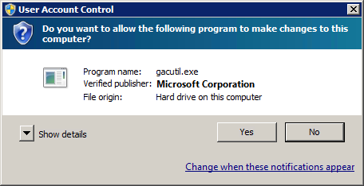

# Telerik Web Design Assembly

## 

The Visual Studio designer classes of the **Telerik UI for ASP.NET AJAX** are located in the **Telerik.Web.Design** assembly.

During the installation of **Telerik UI for ASP.NET AJAX**, the **Telerik.Web.Design** assembly gets added to the [GAC](http://msdn.microsoft.com/en-us/library/yf1d93sz(VS.80).aspx). Starting a page with any Telerik control on it in design mode, the Visual Studio IDE searches the designer class of the Telerik control and the **Telerik.Web.Design** assembly respectively. Normally, when the assembly is located in the GAC, the Visual Studio IDE loads it properly and displays the control designers.

There are several cases that errors occur in design time.

Here is a list of the circumstances when this is likely to happen:

* Manual upgrade - It is often faster to download the new Service Pack or [Latest Internal Build](http://blogs.telerik.com/blogs/09-01-07/download_latest_internal_builds.aspx) as a zip file and replace the Telerik.Web.UI reference manually. Forgetting to add the **Telerik.Web.Design** assembly to the GAC breaks the Visual Studio design time, because the Visual Studio IDE cannot load the appropriate design assembly version. The error message can be fixed by either adding the proper **Telerik.Web.Design** assembly to the GAC, or adding it to the local **BIN** folder - the Visual Studio IDE will resolve the designer classes properly. A Visual Studio IDE restart is recommended to avoid loading duplicate [shadow copied assemblies](http://msdn.microsoft.com/en-us/library/ms404279.aspx) (Visual Studio IDE default behavior).

* Using **Visual Studio 2008** without **Service Pack 1** applied - The pre-SP1 Visual Studio 2008 IDE has a bug with the proper assembly loading. The **Telerik.Web.Design** assembly exists in the GAC and the IDE loads it, but it cannot resolve the dependence between the **Telerik.Web.Design** and **Telerik.Web.UI** assemblies properly. To fix the design time error in this case, you could either [apply the Visual Studio SP1 upgrade](http://www.microsoft.com/downloads/details.aspx?FamilyId=FBEE1648-7106-44A7-9649-6D9F6D58056E&displaylang=en), or copy the **Telerik.Web.UI** assembly to the **[VisualStudioInstallationFolder]\Common7\IDE\PublicAssemblies** folder. This way the Visual Studio IDE would be able to properly resolve the reference between the two assemblies and load the designers.

>note Using the second approach (copying the **Telerik.Web.UI** assembly to the **[VisualStudioInstallationFolder]\Common7\IDE\PublicAssemblies** folder) could itself cause the problem described above. If you open a project, using a different version of the **Telerik.Web.UI** assembly than the one in the **PublicAssemblies** folder, the IDE could display an InvalidCast error message. It is suggested that you ensure the version of the **Telerik.Web.UI** assembly used by your project and its version in the **PublicAssemblies** folder are the same before loading the IDE.
>This instance of the error usually happens when upgrading Telerik UI for ASP.NET AJAX.
>

To help avoid these problems, the [Project Wizard]() detects the existence of the **Telerik.Web.Design** assembly in the GAC. If the assembly is not found in the GAC, the wizard will suggest to add it to the **Global Assembly Cache**:

In case **Telerik.Web.UI.Design.dll** is not found in the selected distribution the wizard will display a warning of possible design time problems:

>note Adding the design assembly to the GAC requires **elevated privileges** . In case you have **User Account Control** enabled on your machine you will have to grant permissions to the **GAC Utility** 
>

