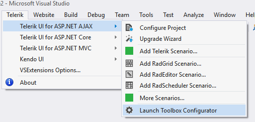
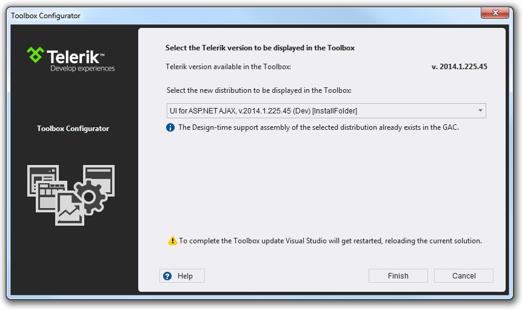

# Set Toolbox Version

Starting with **Q3 2010** we introduced the Toolbox Configuration utility. Its purpose is to choose which version of Telerik® UI for ASP.NET Ajax to be populated in the Visual Studio’s Toolbox. The user can select among all versions of Telerik® UI for ASP.NET Ajax that are currently on the machine and have been either installed or downloaded using the VS Extensions.

The Toolbox Configurator can be launched from the Telerik menu:

After running the Toolbox Configurator the user can make his selection using the dropdown menu which lists all versions discovered on the machine.

When the Finish button is clicked Visual Studio will be restarted so that the changes can take effect.

>note The Toolbox Configurator will overwrite the toolbox registration performed during installation.
>

The Toolbox Configurator is supported in Visual Studio 2008, 2010, 2012, 2013 and 2015.
