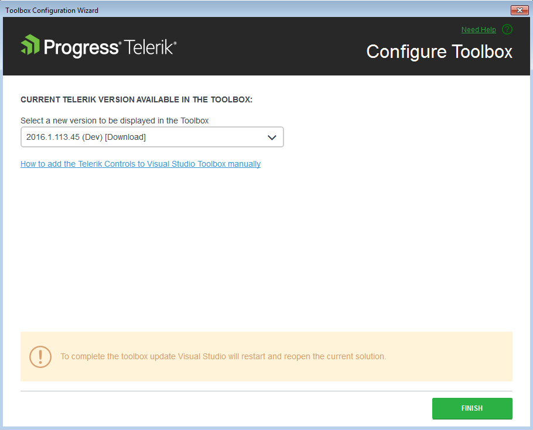

# Toolbox Configuration

## 

Starting with __Q3 2010__ we introduced the Toolbox Configuration utility. Its purpose is to choose which version of Telerik UI for ASP.NET Ajax to be populated in the Visual Studio’s Toolbox. The user can select among all versions of Telerik UI for ASP.NET AJAX that are currently on the machine and have been either installed or downloaded using the VS Extensions.

The Toolbox Configurator can be launched from the Telerik menu:

After running the Toolbox Configurator it shows the version of the currently installed distribution (if available). The user can make his selection using the dropdown menu which lists all versions discovered on the machine.

The utility has an option to install the design assemblies of the selected version in the GAC, if they are not previously installed. The design assemblies are critical for the design-time support of the chosen distribution.

When the Finish button is clicked Visual Studio will be restarted so that the changes can take effect.

>note The Toolbox Configurator will overwrite the toolbox registration performed during installation.
>

The Toolbox Configurator is supported in Visual Studio 2008, 2010, 2012, 2013 and 2015.
