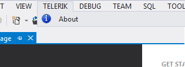
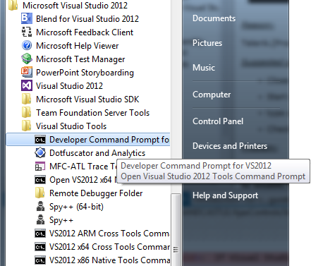
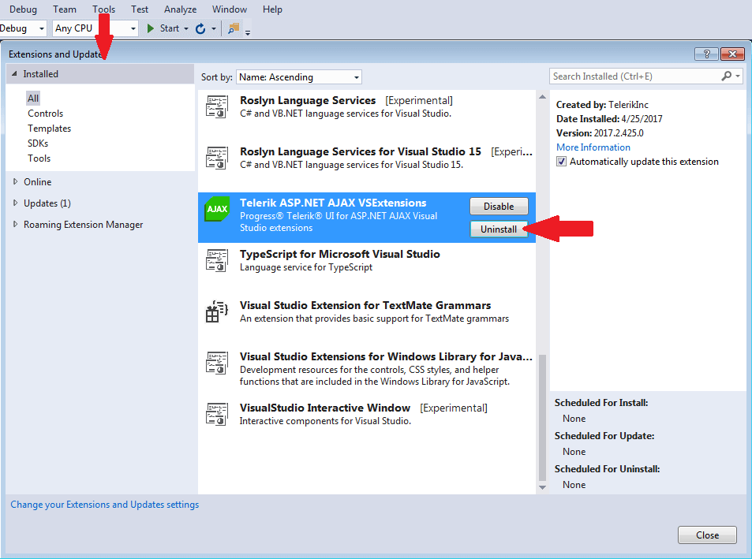

# Troubleshooting

**Troubleshooting**

*Problem:*

**The Telerik UI for ASP.NET AJAX submenu is missing and only the “About” option is available under the Telerik menu.**

*Reason:*

Telerik.[Product].VSPackage which is part of the VSExtensions failed to load properly, or was not installed correctly.

*Suggested solution:*

* Close all instances of Visual Studio;

* Start a Visual Studio Command Prompt (*Start menu -> Microsoft Visual Studio 20xx -> Visual Studio Tools -> Visual Studio 20xx Command Prompt*);

* type *devenv.exe /resetskippkgs* and hit Enter;

* Check the Telerik menu, or try to create new Telerik project (they should work properly);

*Problem:*

**An error occurs when attempting to create a new Telerik project (“Error: this template attempted to load assembly ‘Telerik.[Product].VSPackage, Version=[Version], Culture=neutral, PublicKeyToken=[PublicKeyToken]. For more information on this problem and how to enable this template, please see documentation and Customizing Project Templates.”)**

*Reason:*

Missing Telerik.[Product].VSPackage.dll file from *[TelerikControlsInstallDir]\VSExtensions\VS20xx* for VS2005 and VS2008 and *[VisualStudio2010InstallDir]\Common7\IDE\Extensions\Telerik\Telerik [Product] VSExtensions\[Version]* for VS2010 and later.

*Suggested solution:*

If Visual Studio 2012 is used

* Launch Visual Studio 2012

* Go toTools | Extensions and Updates (Visual Studio 2010: Tools | Extension Manager)

* Select Telerik [Product] VSExtensions and press Uninstall button

* Go to the Online Gallery and search for Telerik [Product] VSExtensions. Download the extensions and install them

* Restart VS2012 and check the Telerik menu, or try to create new Telerik project (the wizards should work properly)
