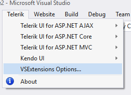
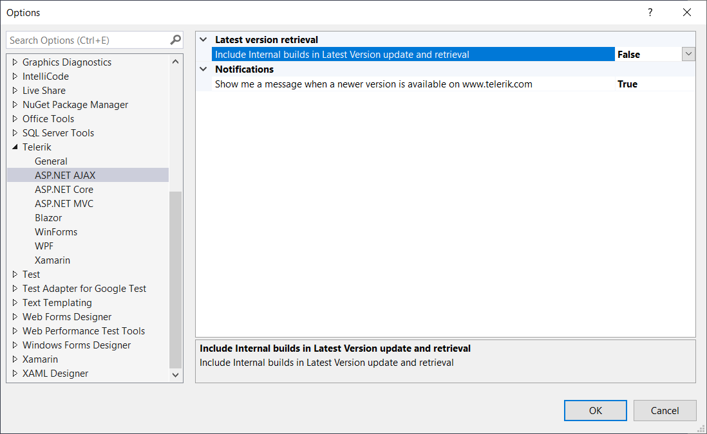

# Visual Studio Extensions Options

The Visual Studio Extensions options dialog provides settings, so you can configure the Telerik Visual Studio Extensions to best suit your needs.

It can be accessed through **Visual Studio | Telerik | VSExtensions Options**

The Options dialog contains two sets of options that affect the **Telerik UI for ASP.NET AJAX** Visual Studio Extensions.

## General Settings

The settings under the General category affect all of the installed **Telerik Visual Studio Extensions**.

### Project setup

**Copy referenced assemblies to solution and integrate with source control**- Sets the default value for the **Copy referenced assemblies to solution** option in the Project Configuration Wizard

### Project Upgrade Notifications for Detected Local Distributions

**Suggest project upgrades for Telerik product version available on my computer** – When enabled, you will be prompted to upgrade upon opening a project, which is not using the latest version of Telerik UI for ASP.NET AJAX installed on your system

**Suggest upgrades when an equal Dev release detected on projects using a Trial** – When enabled, you will be prompted to upgrade if a licensed version of Telerik UI for ASP.NET AJAX is available on your system, but the current project uses a trial version

### Other Notifications

**Notify me when a Telerik subscription I have is about to expire** – When enabled, you will receive reminders if any of your subscriptions expire within the next month.

>note You can benefit subscription reminders only if you have saved your credentials in the [Latest Version Acquirer tool]().

### Select a folder for downloads

Configures the path where the extensions look for and store distributions.

>note Changing the folder path will not move existing folder contents from your previous path. Please, move your previous folder contents manually in case you still want to use them.

## Telerik UI for ASP.NET AJAX Settings

All settings falling under the AJAX category affect only the **Telerik UI for ASP.NET AJAX** Visual Studio Extensions.

### Latest version retrieval

**Include internal builds in Latest Version update and retrieval** – When enabled, the [Latest Version Acquirer tool]() will retrieve internal builds as well as official releases when checking for a new version.

### Notifications

**Show me a message when a newer version is available** – When enabled, you will receive notifications if a new version of **Telerik UI for ASP.NET AJAX** is available on the Telerik website.
