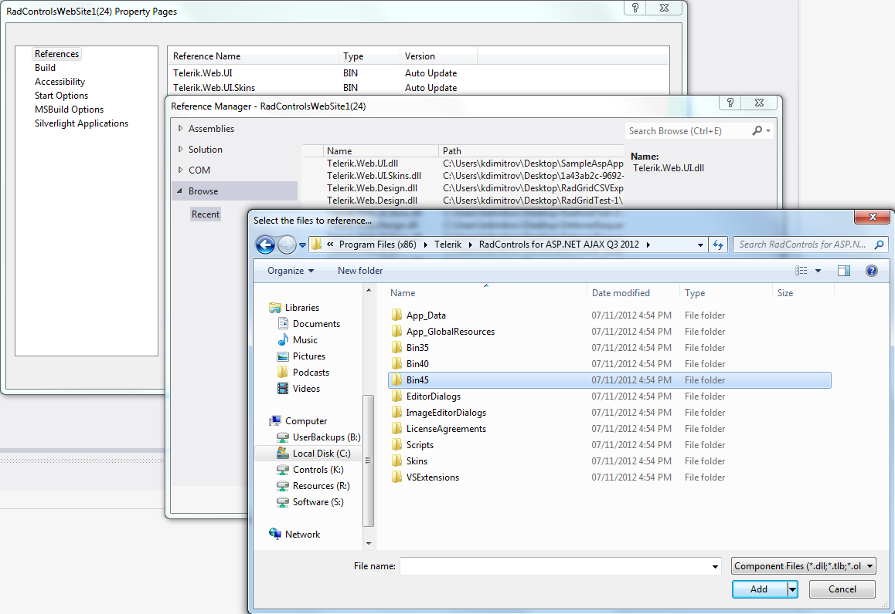

# Design-time Troubleshooting

This article describes common issues related to the design-time rendering of the Telerik® UI for ASP.NET AJAX controls. Here is a list with the main sections:

* [Unknown server tag/Could not load file or assembly errors](#unknown-server-tagcould-not-load-file-or-assembly-errors)

* [An unhandled exception has occurred. (A)(control type) cannot be cast to (B)(control type)](#an-unhandled-exception-has-occurred-acontrol-type-cannot-be-cast-to-bcontrol-type)

* [Visual Studio crashes if the project uses Microsoft Report Viewer when designing a local report (.rdlc) and adding a dataset](#visual-studio-crashes-if-the-project-uses-microsoft-report-viewer-when-designing-a-local-report-rdlc-and-adding-a-dataset)

* [Designer files are not updated or are missing Telerik controls](#designer-files-are-not-updated-or-are-missing-telerik-controls)

* [Design-time Issues with Visual Studio 2008](#design-time-issues-with-visual-studio-2008)

>note The **Telerik.Web.Design.dll** assembly is installed in the GAC by the automated installer of the Telerik® UI for ASP.NET AJAX suite.Some of the design-time issues described below may require you to modify the GAC in order to remove duplicate assemblies. The [Using the Global Assembly Cache]() help article can help you with that.

## Unknown server tag/Could not load file or assembly errors

**Problem**: When a project using Telerik controls is open and a page is loaded, a page displays the *`"Unknown Server Tag"* or *"Could not load file or assembly 'Telerik.Web.UI, version='XXXXX'..."`* error.

**Reason**: This error usually happens when the project does not contain a reference to the Telerik.Web.UI assembly, or the reference is broken.Possible causes for the errors:

* There is a GAC-reference for the Telerik.Web.UI assembly in the project and the GAC has been updated (the "old" Telerik.Web.UI assembly is deleted and a "new" one is added to the GAC). As a result, the Telerik.Web.UI assembly, referenced by the WebSite, does not exist in the GAC.

* There is a BIN-reference for the Telerik.Web.UI assembly in the project, which has been deleted for some reason. As a result, Visual Studio cannot find the Telerik.Web.UI assembly.

* The reference to the Telerik.Web.UI assembly (either in Register directive or web.config, or Telerik http handlers/modules registrations in web.config) contains hard-coded version number which does not match the version of the Telerik assembly referenced in your project.

**Solutions**:

1. Update the reference to the Telerik.Web.UI assembly in your project

1. GAC Reference:

	1. Manually: By editing the web.config and/or the ASPX/ASCX/Master/UserControl files to reflect the assembly version change. You can also skip to specify the *exact assembly version* to prevent future conflicts.
	
	1. Automatically: By using the Property Pages. You will still need to update the `<%@ Register Assembly="Telerik.Web.UI"… %>` directives in your pages manually.

		

		

		>note To avoid the need to manually modify the `<%@ Register Assembly="Telerik.Web.UI"… %>` directives, we recommend that you register the tag prefix in the web.config instead, as shown in the screenshot below.

		

1. Bin reference:

	1. Browse to the Telerik.Web.UI assembly through the Property Pages

		

		>note When browsing to the Telerik.Web.UI assembly in the context of a WebSite Project, Visual Studio will always add a GAC reference if it finds the same version of the Telerik.Web.UI assembly.
	
	1. Use the Convert To Telerik project menu item available under the Telerik -> Telerik® UI for ASP.NET AJAX menu in Visual Studio*.

		*Available when the Visual Studio Extensions feature has been selected during Telerik® UI for ASP.NET AJAX install.

## An unhandled exception has occurred. [A][control type] cannot be cast to [B][control type]

**Error Message**: Design time displays error rendering control *(Error: "An unhandled exception has occurred.[A][control type] cannot be cast to [B][control type]. Type A originates from 'Telerik.Web.UI, Version=[Version], Culture=neutral,PublicKeyToken=121fae78165ba3d4' in the context 'LoadNeither' at location '[location1]'. Type B originates from 'Telerik.Web.UI,Version=[Version], Culture=neutral, PublicKeyToken=121fae78165ba3d4' in the context 'LoadNeither' at location '[location2]'.")*

**Reasons**: Using the Trial and the Dev variations of the Telerik controls assembly (having the same version) in a single instance of Visual Studio.

A typical scenario:

1. Start Visual Studio.

1. Open a project referencing the Trial variation of the Telerik.Web.UI assembly.

1. Load a page with Telerik controls in design mode.

1. Close the project without closing Visual Studio.

1. Open a project referencing the Dev variation of the Telerik.Web.UI assembly	(versioned as the Trial one) in the same instance of Visual Studio.

1. Load a page with Telerik controls in design mode.

The reason for the error is that the .NET Framework cannot distinguish the Dev assembly from the Trial one.Once one assembly loaded in the Visual Studio AppDomain, it cannot be unloaded until the IDE gets closed.

**Suggested solution**:

Restart Visual Studio between the reload one of the two projects

>tip It is a good practice to use the Dev variation of the Telerik.Web.UI assembly in all your projects once purchased. This will ensure you avoid the design time error described above. It will also ensure you won't get undesired Trial messages when running your project.

## Visual Studio crashes if the project uses Microsoft Report Viewer when designing a local report (.rdlc) and adding a dataset.

**Error Message**: `System.IO.FileNotFoundException`: *Could not load file or assembly 'Microsoft.AnalysisServices.AdomdClient, Version=10.0.0.0, Culture=neutral, PublicKeyToken=89845dcd8080cc91' or one of its dependencies. The system cannot find the file specified*.

**Reasons**: We are required to refer the **Microsoft.AnalysisServices.AdomdClient** assembly with a specific version - **Version=10.0.0.0**. If this assembly is not referenced by the solution or is not present in the GAC of the machine, Visual Studio cannot find it and it crashes. The version we require comes with Microsoft SQL Server 2008 R2 SP2 Feature Pack, but the Microsoft SQL Server 2012 Feature Pack will install Microsoft.AnalysisServices.AdomdClient assembly with **Version=11.0.0.0** and newer versions are also available.

**Solution**: Ensure that the machine has  **Microsoft.AnalysisServices.AdomdClient Version=10.0.0.0** on it. To do that, **install** the free **Microsoft SQL Server 2008 R2 SP2 Feature Pack** from [http://www.microsoft.com/en-us/download/details.aspx?id=30440](http://www.microsoft.com/en-us/download/details.aspx?id=30440). You only need the following components from the available list (make sure to select the correct processor architecture for your machine):

* **SQLSERVER2008_ASADOMD10**

* **SQLSERVER2008_ASAMO10**

Client reports indicate that on Windows 10 you also need to reference the Telerik.Web.Spreadsheet.dll assembly in your project for Telerik versions after Q1 2016.

## Designer files are not updated or are missing Telerik controls

On rare occasions, the `designer.cs`/`designer.vb` files may not be updated when you change the markup of a page, or they may be missing the Telerik controls altogether. Here is a list of possible reasons and solutions that may help if this happens to you:

* See if the issue occurs on another machine (e.g., a colleague). If not, compare the machines to try to find the difference that causes it.

* When Visual Studio 2013 is used together with TFS and *Get Everything when a solution or project is opened* under *Options* > *Source Control* -> *Environment* is checked. The solution is to uncheck it and manually retrieve the latest version. This issue occurs with the native ASP.NET controls as well.
 
* Try deleting your local copy of the project and get it anew from your source control.

* Try deleting the contents of the `license.licx` file or the entire file so Visual Studio can generate it again.
 
* Try deleting the *.suo file of the solution

* Try uninstalling the Telerik Visual Studio Extensions.

* Try moving the control declaration from the markup to the code-behind, if possible in your scenario.

* Try removing the Telerik assembly references and adding them again via the VS dialogs. We advise that you copy them to the BIN folder of your application and point the references there.

* Ensure the Telerik control tags are in PascalCase and not in all lowercase, a report suggested that this caused their classes in the designer files to also become lowercase which causes them to be a mismatch for the actual classes.

## Design-time Issues with Visual Studio 2008

Starting from **Q1 2009** (Version 2009.1.311) there is a brand new assembly installed in your GAC - **Telerik.Web.Design.dll**. We decided to separate the design-time code from the web control implementation code. The reasons are many - better separation of concerns, less assembly references for the main assembly (Telerik.Web.UI.dll). We now have the freedom to extend the design time capabilities of Telerik® UI for ASP.NET AJAX without bloating the main control assembly.

Why didn't we make it that way from the beginning? The only reason is that Visual Studio 2008 had a problem with loading GAC-ed design-time assemblies of control libraries deployed in the BIN folder of a web site. Strangely enough the problem didn't appear in Visual Studio 2005. The good news is that this bug has been fixed in Visual Studio 2008 SP1! The problem does not exist in Visual Studio 2010 RC and Visual Studio 2012 as well.

If you for some reason cannot upgrade to **Visual Studio 2008 SP1** you might face the following exception after upgrading to Telerik® UI for ASP.NET AJAX Q1 2009 or later:

* **Error Creating Control** - Telerik control

* Failed to create designer ...

>caption Two ways this error gets represented to the end user:

>important The instructions below are not applicable if you used the **Telerik® UI for ASP.NET AJAX** installer to setup **Telerik controls** on your machine and you have **Visual Studio 2005** and/or **Visual Studio 2008 SP1** and/or **Visual Studio 2010** and/or **Visual Studio 2012** . The design time should work properly out of the box with that setup.

>note The **Telerik.Web.Design** assembly contains the Visual Studio designers of the controls. You don't need to add a reference to it into your project.

There are three ways to solve this problem (apart from the obvious upgrade to Visual Studio 2008 SP1):

* Bin-deploy the design-time assembly

	This solution would work only in case you have **not installed** Telerik® UI for ASP.NET AJAX using the provided setup program. Assemblies installed by a setup program cannot be removed from GAC until the program is uninstalled.This approach is suitable when using only the dll-s from a zip (be that a hotfix or latest internal build).

	1. Remove Telerik.Web.Design.dll from the GAC (this would fail if you have installed RadCotnrols for ASP.NET Ajax via the installer)
	
	1. Copy Telerik.Web.Design.dll to your project's BIN subfolder. Ensure that the version of the Telerik.Web.Design assembly is the same as the version of the Telerik.Web.UI assembly. **Don't add a reference to the Telerik.Web.Design assembly, perform a simple Windows Explorer-copy.**
	
	1. Restart Visual Studio

	>note The [Visual Studio Extensions for Telerik® UI for ASP.NET AJAX help handle this approach]().

* GAC-deploy the control library assembly

	1. Add Telerik.Web.UI.dll in the GAC (see details in [this topic]())
	
	1. Remove Telerik.Web.UI.dll from your bin folder
	
	1. Make sure you have the following line in your web.config:
	
		**XML** 

			<add assembly="Telerik.Web.UI, Version=2009.1.311.35, Culture=neutral, PublicKeyToken=121FAE78165BA3D4"/> 
	
	1. Restart Visual Studio

* Copy Telerik.Web.UI.dll to *c:\Program Files\Microsoft Visual Studio 9.0\Common7\IDE\PublicAssemblies* and restart Visual Studio.

	>note Using the third approach (copying the **Telerik.Web.UI** assembly to the **[VisualStudioInstallationFolder]\Common7\IDE\PublicAssemblies** folder) could itself cause the problem described above. If you open a project, using a different version of the **Telerik.Web.UI** assembly than the one in the **PublicAssemblies** folder, the IDE could display an InvalidCast error message. It is suggested that you ensure the version of the **Telerik.Web.UI** assembly used by your project and its version in the **PublicAssemblies** folder are the same before loading the IDE. This instance of the error usually happens when upgrading Telerik® UI for ASP.NET AJAX.

### See Also

 * [General Troubleshooting]()

 * [Web Resources Troubleshooting]()

 * [ToolBox Troubleshooting]()

 * [Skins Troubleshooting]()
