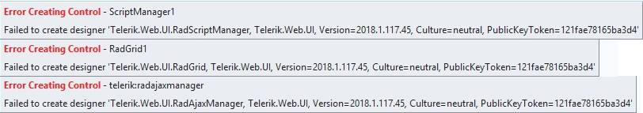

## Environment

<table>
	<tbody>
		<tr>
			<td>Product</td>
			<td>Progress® Telerik® UI for ASP.NET AJAX</td>
		</tr>
	</tbody>
</table>

## Description

If you are using a version prior to R1 2018 and upgrade to R1 2018 or later and the automated upgrade wizard, you may get errors similar to the following:

## Cause

As of R1 2018, the `Telerik.Web.Design.dll` assembly is no longer added by the automated `.msi` installer to the GAC. Therefore, if you are using a prior version, your project may not have the reference added explicitly to the `Bin` even though it used to work by finding the assembly in the GAC.

## Solution

To solve this issue:

1. Copy the `Telerik.Web.Design.dll` file with the correct version (for example, from the installation folder) to the `~/bin` folder of the project and add a reference to it in Visual Studio. If you reference the Telerik assemblies from another folder, make sure the `Telerik.Web.Design.dll` file is present there and is referenced in the Visual Studio project.

	You can also [download the hotfix archive]() from the Telerik AJAX website that contains all necessary assemblies so you can easily copy the `Telerik.Web.Design.dll` assembly to your target location.

	Note that while the issue is already fixed in version 2018.1.215.2 of [Telerik ASP.NET AJAX VS Extensions](https://marketplace.visualstudio.com/items?itemName=TelerikInc.TelerikASPNETAJAXVSExtensions), the `Telerik.Web.Design.dll` assembly is not added to the `Bin` folder of a newly created Telerik AJAX website or application. 

1. Download and install the assembly.

1. Restart your Visual Studio to upgrade to the latest version of the Telerik ASP.NET AJAX VS Extensions.

Note that the `Telerik.Web.Design.dll` cannot be added to the `Bin` folder when dragging and dropping a Telerik ASP.NET control from the Toolbox of Visual Studio. In this case, only the `Telerik.Web.UI.dll` is copied to the `Bin` folder and you will need to manually copy the `Telerik.Web.Design.dll` to the `Bin` folder and, then, reference it.
