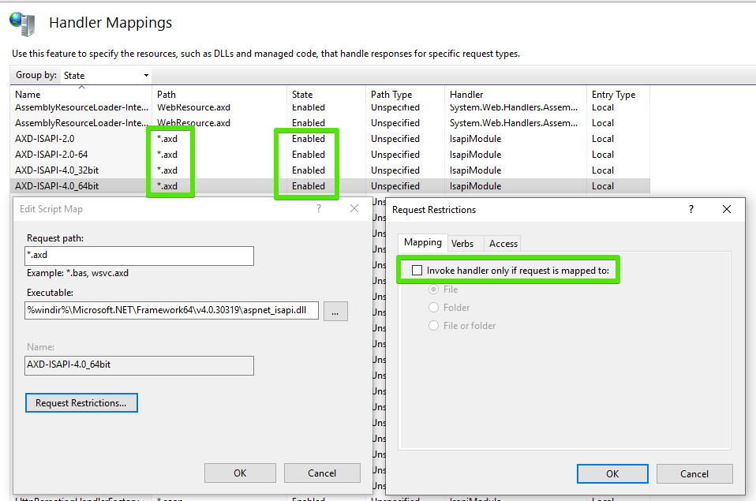

## Environment

<table>
	<tbody>
		<tr>
			<td>Product</td>
			<td>Progress® Telerik® UI for ASP.NET AJAX</td>
		</tr>
	</tbody>
</table>

## Description

When working with Telerik UI for ASP.NET AJAX, I get a 404 error that the requested URL was not found.

## Solution

To solve the issue, use any of the following approaches:

* In the IIS management console, check that the `.axd` extension (the default HTTP handler extension) is allowed under the **Handler Mappings** feature of IIS:

	

* Click the **Edit** button as displayed in the previous screenshot to check if the **Verify if file exists** checkbox is unchecked.

* If you are using Telerik® UI for ASP.NET AJAX, check if the `ScriptResource.axd` HTTP handler is correctly registered in your `web.config` as shown in the following statement:

	**ASP.NET 3.5: web.config**

		<add path="ScriptResource.axd" verb="GET,HEAD" type="System.Web.Handlers.ScriptResourceHandler, System.Web.Extensions, Version=3.5.0.0, Culture=neutral, PublicKeyToken=31BF3856AD364E35" validate="false"/>

	**.NET 3.5 and IIS7 Integrated Mode: web.config** The following statement has to be present in the `<handlers>` section instead of `<httpHandlers>`:

		<handlers>
			<add name="ScriptResource" preCondition="integratedMode" verb="GET,HEAD" path="ScriptResource.axd" type="System.Web.Handlers.ScriptResourceHandler, System.Web.Extensions, Version=3.5.0.0, Culture=neutral, PublicKeyToken=31BF3856AD364E35" />   

	(For ASP.NET 4.0-4.8) Note that as of .NET 4.0 and later, the `ScriptResource.axd` instance is no longer needed in the `web.config` file. However, if you have it in your `web.config`, make sure that its `Version` value corresponds to the .NET version used by your Web Forms application.

* If you are using Telerik UI for ASP.NET AJAX and the ScriptManager, check if the `Telerik.Web.UI.WebResource.axd` HTTP handler is correctly registered in your `web.config`:

	**ASP.NET 3.5-4.8: web.config**

		<add path="Telerik.Web.UI.WebResource.axd" type="Telerik.Web.UI.WebResource" verb="*" validate="false" />

	**IIS7 Integrated Mode: web.config** The following statement has to be present in the `<handlers>` section instead of `<httpHandlers>`:

		<handlers>  
			<add name="Telerik_Web_UI_WebResource_axd" path="Telerik.Web.UI.WebResource.axd" type="Telerik.Web.UI.WebResource" verb="*" preCondition="integratedMode" />

* Check if there is a firewall, proxy, or other similar networking configuration that does not allow access to the `axd` handler.

Note the following popular threads on the 404 error:

* [`404 Not found error`](https://www.telerik.com/forums/404-not-found-error#RmyQAhZgg06uEBW4UOStRw)

* [`RadSpell Web.config 404 error`](https://www.telerik.com/forums/radspell-web-config-404-error#xquGbOZ4aUSY_07LCbuuew)

* [`RadAsyncUpload 404 loading Telerik.Web.UI.WebResource.axd`](https://stackoverflow.com/questions/23086554/telerik-radasyncupload-404-loading-telerik-web-ui-webresource-axd)

* [`RadEditor 404 File or directory not found`](https://www.telerik.com/forums/404-file-or-directory-not-found-when-i-click-image-manager-in-rareditor's)
