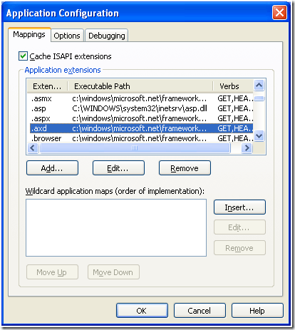

# Web Resources Troubleshooting


This article explains the most common issues related to WebResource utilization and the Telerik UI for ASP.NET AJAX controls and their troubleshooting steps.

If you are using an ASP.NET server control with rich client-side behavior it is likely built to utilize web resources. Sometimes your page loads and that rich server side control does not work at all — the tree view does not expand, the grid cannot sort etc. Most of the times this is because the JavaScript files of those controls have failed to load.

If your browser is configured to prompt on JavaScript errors you may see an error message similar to this one:

*"RadTreeView is undefined"*

if you are using Telerik UI for ASP.NET AJAX.

Receiving this message indicates that there is a Web Resource related issue.


The following sections describe ways to find out what is causing that error message.

## Determine the Error

There are several ways to see what the WebResource error is:

### Manually Requesting the WebResource Handler

The fastest way would be to view the rendered output of your page and get the URL of the offending script tag. For instance:

````HTML
<div id="RadTreeView1_wrapper"><script type="text/javascript"
src="/Sample/WebResource.axd?d=axd__
axd&t=633437882200000000"></script>
````


If you paste that URL in your browser's address bar (after the domain and folder of course),the web server should serve back the content of that web resource. In case of a problem with the web resource HTTP handler you would see an error page saying that the server returned HTTP error code 404 (not found) or 500 (server error).

### Using Web Development Tools to Request the WebResource Handler

You could use an HTTP traffic sniffer tool - [Fiddler](http://www.telerik.com/fiddler) for Internet Explorer or [FireBug](http://www.getfirebug.com/) for FireFox to find out if the request to a web resource file failed.

## Dealing with the Error

Once the error is determined, you would have to fix it. The most common errors are "This is an invalid webresource request" 404 and 500:

### This is an Invalid WebResource Request

Such issues often come up when a user has a copy of the page that contains WebResource URLs that have been invalidated by the server (the machine key changed or the Application Pool was recycled). When such a cached copy of the page with the old links is executed, the browser will invoke GET requests for those WebResource URLs and .NET will not be able to decode them anymore, so such exceptions will occur. WebResource URLs are handled by the .NET code and individual controls (like the Telerik controls) cannot affect or fix this.

There are, however, a few ways to alleviate such a problem:

* after a while browser caches are cleaned up and the users will get correct links, so simply waiting a bit may alleviate the situation

* clearing the cache of the browser always helps

* look into ways to increase the Application Pool recycle time or implement a heartbeat-like functionality to keep it alive at all times

* use the CDNs Telerik provides (for [scripts]() and [skins]()) and the [MS AJAX CDN](http://www.asp.net/ajax/cdn#Using_ASPNET_Ajax_from_the_CDN_20) so WebResources are used as rarely as possible (only some dialogs, the binary image and file uploads will keep using webresources).


### Dealing with the 404 Error Code (the Requested URL was Not Found)

Please check the following:

1. Check in the IIS management console that the .axd extension (the default HTTP handler extension) is allowed:

	

1. Also check if the "Verify if file exists" checkbox is unchecked (click on the "Edit" button appearing in the previous screenshot to check).

1. If you are using Telerik UI for ASP.NET Ajax check if the "ScriptResource.axd" HTTP handler is correctly registered in your web.config. Look for the following statement: 

	**ASP.NET 3.5:**

	**web.config**

		<add path="ScriptResource.axd" verb="GET,HEAD" type="System.Web.Handlers.ScriptResourceHandler, System.Web.Extensions, Version=3.5.0.0, Culture=neutral, PublicKeyToken=31BF3856AD364E35" validate="false"/> 


	**ASP.NET 4.0:**

	**web.config**
	
		<add path="ScriptResource.axd" verb="GET,HEAD" type="System.Web.Handlers.ScriptResourceHandler System.Web.Extensions, Version=4.0.0.0, Culture=neutral, PublicKeyToken=31BF3856AD364E35" validate="false"> 


	**ASP.NET 4.5:**

	**web.config**

		<add path="ScriptResource.axd" verb="GET,HEAD" type="System.Web.Handlers.ScriptResourceHandler, System.Web.Extensions, Version=4.5.0.0, Culture=neutral, PublicKeyToken=31BF3856AD364E35" validate="false"> 


	**IIS7 Integrated Mode** 

	The following statement should be present in the `<handlers>` section instead of `<httpHandlers>`:

	**web.config**

		<handlers>
			<add name="ScriptResource" preCondition="integratedMode" verb="GET,HEAD" path="ScriptResource.axd" type="System.Web.Handlers.ScriptResourceHandler, System.Web.Extensions, Version=3.5.0.0, Culture=neutral, PublicKeyToken=31BF3856AD364E35" />   


	>note If you are using .NET 3.5 the version of the System.Web.Extensions assembly should be "3.5.0.0".	If you are using .NET 4.0 the version should be "4.0.0.0" and if you are using .NET 4.5 the version should be "4.5.0.0". Always make sure you are referring to the right assembly version.


1. If you are using Telerik UI for ASP.NET Ajax and RadScriptManager check if the Telerik.Web.UI.WebResource.axd HTTP handler is correctly registered in your web.config:

	**ASP.NET 3.5:**

	**web.config**

		<add path="Telerik.Web.UI.WebResource.axd" verb="*" type="Telerik.Web.UI.WebResource, Telerik.Web.UI, Culture=neutral, PublicKeyToken=121fae78165ba3d4" validate="false" /> 


	**ASP.NET 4.0:**

	**web.config**

		<add path="Telerik.Web.UI.WebResource.axd" verb="*" type="Telerik.Web.UI.WebResource, Telerik.Web.UI, Culture=neutral, PublicKeyToken=121fae78165ba3d4" validate="false" /> 


	**ASP.NET 4.5:**

	**web.config**

		<add path="Telerik.Web.UI.WebResource.axd" verb="*" type="Telerik.Web.UI.WebResource, Telerik.Web.UI, Culture=neutral, PublicKeyToken=121fae78165ba3d4" validate="false" /> 


	**IIS7 Integrated Mode**

	The following statement should be present in the `<handlers>` section instead of `<httpHandlers>`:

	**web.config**

		<handlers>  
			<add name="Telerik.Web.UI.WebResource" path="Telerik.Web.UI.WebResource.axd" verb="*"    type="Telerik.Web.UI.WebResource, Telerik.Web.UI, Culture=neutral, PublicKeyToken=121fae78165ba3d4"/> 


	>note The version in the HTTP handler registration statement will vary depending on the release date and .NET runtime (3.5 or 4.0 or 4.5). Always make sure you are referring to the right assembly version. *

### Dealing with the 500 Error Code (Server Error)

Check the detailed error message where the two common cases are:

1. "Padding is invalid and cannot be removed"

	The problem is likely to be related with the machine key. [This](http://msdn2.microsoft.com/en-us/library/ms998288.aspx) MSDN article describes how to create a custom machine key.

1. "Specified argument was out of the range of valid values. Parameter name: utcDate"

	The assembly containing the embedded resources is probably built in the future (its last modified time is later than the current time). This can occur when deploying in a different time zone. In such case run the following command line statement (the commas and plus at the end are important!): *`copy /b <path to assembly which is built in the future>+,,`*

### See Also

 * [General Troubleshooting]()

 * [Design-time Troubleshooting]()

 * [ToolBox Troubleshooting]()

 * [Skins Troubleshooting]()
