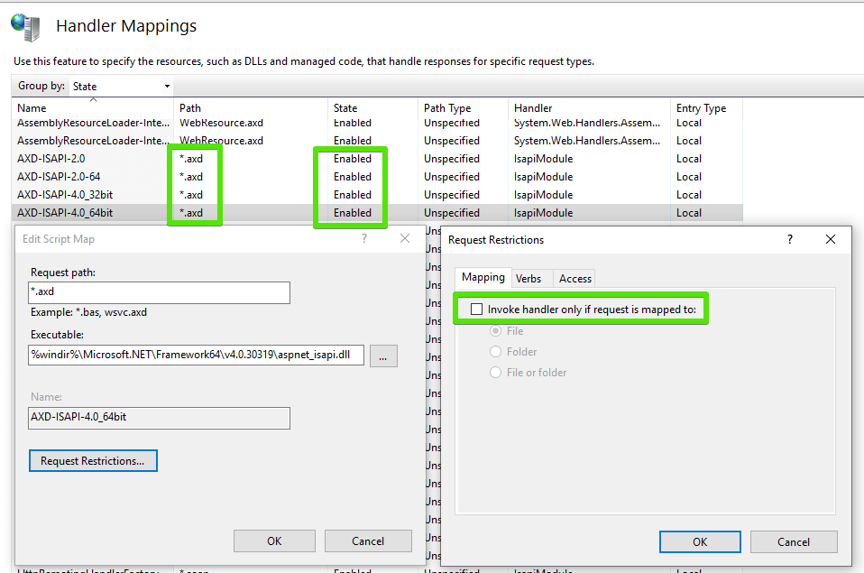

# Web Resources Troubleshooting


This article explains the most common issues related to WebResource utilization and the Telerik® UI for ASP.NET AJAX controls and their troubleshooting steps.

If you are using an ASP.NET server control with rich client-side behavior it is likely built to utilize web resources. Sometimes your page loads and that rich server side control does not work at all — the tree view does not expand, the grid cannot sort etc. Most of the times this is because the JavaScript files of those controls have failed to load.

If your browser is configured to prompt on JavaScript errors you may see an error message similar to this one:

*"RadTreeView is undefined"*

If you are using Telerik® UI for ASP.NET AJAX, receiving this message indicates that there might be a Web Resource related issue.


The following sections describe ways to find out what is causing that error message.

## Determine the Error

There are several ways to see what the WebResource error is:

### Manually Requesting the WebResource Handler

The fastest way would be to view the rendered output of your page and get the URL of the offending script tag. For instance:

````HTML
<script type="text/javascript"
src="/Sample/WebResource.axd?d=axd__
axd&t=633437882200000000"></script>
````


If you paste that URL in your browser's address bar (after the domain and folder of course), the web server should serve back the content of that web resource. In case of a problem with the web resource HTTP handler you would see an error page saying that the server returned HTTP error code 404 (not found) or 500 (server error).

### Using Web Development Tools to Request the WebResource Handler

Presently, it is very popular to use an HTTP traffic sniffer tool like [Google DevTools](https://developers.google.com/web/tools/chrome-devtools/resources), [Fiddler](https://www.telerik.com/fiddler) or [Firefox FireBug](http://www.getfirebug.com/) to find out if the request to a web resource file has failed and what the exact error is.

## Dealing with the Error

Once the error is determined, you would have to fix it. The most common errors are "This is an invalid webresource request" 404 and 500:

### This is an Invalid WebResource Request

Such issues often come up when a user has a copy of the page that contains WebResource URLs that have been invalidated by the server (the machine key changed or the Application Pool was recycled). When such a cached copy of the page with the old links is executed, the browser will invoke GET requests for those WebResource URLs and .NET will not be able to decode them anymore, so such exceptions will occur. WebResource URLs are handled by the .NET code and individual controls (like the Telerik controls) cannot affect or fix this.

There are, however, a few ways to alleviate such a problem:

* After a while browser caches are cleaned up and the users will get correct links, so simply waiting a bit may alleviate the situation

* Clearing the cache of the browser always helps (press Ctrl+Shift+Del to open the Clear Browsing Data browser dialog or test in Incognito mode) 

* Look into ways to increase the Application Pool recycle time or implement a heartbeat-like functionality to keep it alive at all times

* You may experience the error in a load balanced environment where the servers are configured to use different machine keys. In this case, the request to a resource may fail due to the encrypted querystring parameter identifying the resource being non-decryptable on the other server. To solve it, you should ensure that all servers use the same <machineKey> and Telerik.Web.UI.WebResourceSession as explained in the [Integrating RadControls in WebFarm/WebGarden](https://www.telerik.com/blogs/integrate-radcontrols-for-asp.net-ajax-in-a-webfarm-or-webgarden) article.

* [Important tip] Use the CDNs (for [scripts]() and [skins]()) plus the [MS AJAX CDN](https://www.asp.net/ajax/cdn#Using_ASPNET_Ajax_from_the_CDN_20) so WebResources are used as rarely as possible (only some dialogs, the binary image and file uploads will keep using WebResources).


### Unauthorized Access (401) Error

When your project uses a form of authentication (e.g., Windows Authentication), access to most resources (like pages, images, handlers) is not allowed for anonymous (unauthorized users). This affects the Telerik controls because they use a number of [HTTP Handlers](#mandatory-additions-to-the-webconfig) that also get blocked.

There are two ways to resolve this:

* use the CDNs Telerik provides (for [scripts]() and [skins]()) and the [MS AJAX CDN](https://www.asp.net/ajax/cdn#Using_ASPNET_Ajax_from_the_CDN_20) so WebResources are used as rarely as possible (only some dialogs, the binary image and file uploads will keep using webresources).

	>tip You can also use [single request for all scripts]() and a [combined base stylesheet request]() to greatly reduce the number of network requests.

* Or, add `<location>` elements to your web.config for all the handlers you use, so ASP.NET does not block them. For example:

	**web.config**

		<configuration>
		  ...
		  <location path="Telerik.Web.UI.WebResource.axd">
		    <system.web>
		      <authorization>
			<allow users="*"/>
		      </authorization>
		    </system.web>
		  </location>
		  <location path="Telerik.Web.UI.DialogHandler.aspx">
		    <system.web>
		      <authorization>
			<allow users="*"/>
		      </authorization>
		    </system.web>
		  </location>
		  <location path="ScriptResource.axd">
		    <system.web>
		      <authorization>
			<allow users="*"/>
		      </authorization>
		    </system.web>
		  </location>
		  <location path="WebResource.axd">
		    <system.web>
		      <authorization>
			<allow users="*"/>
		      </authorization>
		    </system.web>
		  </location>
		  ...
		</configuration>


### Dealing with the 404 Error Code (the Requested URL was Not Found)

Please check the following:

1. Check in the IIS management console that the .axd extension (the default HTTP handler extension) is allowed under the Handler Mappings feature of IIS:

	

1. Also check if the "Verify if file exists" checkbox is unchecked (click on the "Edit" button appearing in the previous screenshot to check).

1. If you are using Telerik® UI for ASP.NET AJAX check if the "ScriptResource.axd" HTTP handler is correctly registered in your web.config. Look for the following statement: 

	**ASP.NET 3.5:**

	**web.config**

		<add path="ScriptResource.axd" verb="GET,HEAD" type="System.Web.Handlers.ScriptResourceHandler, System.Web.Extensions, Version=3.5.0.0, Culture=neutral, PublicKeyToken=31BF3856AD364E35" validate="false"/> 

	**.NET 3.5 and IIS7 Integrated Mode** 

	The following statement should be present in the `<handlers>` section instead of `<httpHandlers>`:

	**web.config**

		<handlers>
			<add name="ScriptResource" preCondition="integratedMode" verb="GET,HEAD" path="ScriptResource.axd" type="System.Web.Handlers.ScriptResourceHandler, System.Web.Extensions, Version=3.5.0.0, Culture=neutral, PublicKeyToken=31BF3856AD364E35" />   


	>note **ASP.NET 4.0-4.8:** The ScriptResource.axd instance is no longer needed in the web.config as of .NET 4.0 and later, but if you have it in your web.config make sure that its Version value corresponds to the .NET version used by your Web Forms app.


1. If you are using Telerik® UI for ASP.NET AJAX and RadScriptManager check if the Telerik.Web.UI.WebResource.axd HTTP handler is correctly registered in your web.config:

	**ASP.NET 3.5-4.8:**

	**web.config**

		<add path="Telerik.Web.UI.WebResource.axd" type="Telerik.Web.UI.WebResource" verb="*" validate="false" />


	**IIS7 Integrated Mode**

	The following statement should be present in the `<handlers>` section instead of `<httpHandlers>`:

	**web.config**

		<handlers>  
			<add name="Telerik_Web_UI_WebResource_axd" path="Telerik.Web.UI.WebResource.axd" type="Telerik.Web.UI.WebResource" verb="*" preCondition="integratedMode" />
			
1. Check if there is a firewall, proxy or other similar networking configuration that does not allow access to the axd handler.

>note Some popular threads on the error 404 are [404 Not found error](https://www.telerik.com/forums/404-not-found-error#RmyQAhZgg06uEBW4UOStRw), [RadSpell - Web.config 404 error](https://www.telerik.com/forums/radspell-web-config-404-error#xquGbOZ4aUSY_07LCbuuew), [RadAsyncUpload 404 loading Telerik.Web.UI.WebResource.axd](https://stackoverflow.com/questions/23086554/telerik-radasyncupload-404-loading-telerik-web-ui-webresource-axd), [RadEditor - 404 File or directory not found](https://www.telerik.com/forums/404-file-or-directory-not-found-when-i-click-image-manager-in-rareditor's).

### Dealing with the 500 Error Code (Server Error)

Check the detailed error message where the two common cases are:

1. "Padding is invalid and cannot be removed"

	The problem is likely to be related with the machine key. [This](https://msdn2.microsoft.com/en-us/library/ms998288.aspx) MSDN article describes how to create a custom machine key.

1. "Specified argument was out of the range of valid values. Parameter name: utcDate"

	The assembly containing the embedded resources is probably built in the future (its last modified time is later than the current time). This can occur when deploying in a different time zone. In such case run the following command line statement (the commas and plus at the end are important!): *`copy /b <path to assembly which is built in the future>+,,`*
	
1. [RadAsyncUpload throws HTTP 500 with a red dot beside the uploaded file name](https://stackoverflow.com/questions/20170482/radasyncupload-throws-http-500-with-a-red-dot-beside-the-uploaded-file-name) - Make sure that the Telerik.Web.UI.WebResource.axd handler is registered in the web.config.

1. [Telerik.Web.UI.WebResource.axd 500 (Internal Server Error)](https://stackoverflow.com/questions/21490064/telerik-web-ui-webresource-axd-500-internal-server-error) - the error might be due to a missing/incorrect stylesheet webresource file - in this case, upgrade to the latest available version of the product. You can also  the value of the RenderMode property to Lightweight/Classic to see whether it will help. Please also report such an errors in the [feedback portal](https://feedback.telerik.com/aspnet-ajax), the ticketing system or the [forum](https://www.telerik.com/forums/aspnet-ajax) so that we can verify and fix them.

### What to do if there is no error, but the body of the returned resource is blank

If the Telerik.Web.UI.ScriptFolder or Telerik.Web.UI.ScriptsFolder" web.config appSettings are set, make sure that the path to the resources is valid since it is case-sensitive.
You can find more on these properties in the [Combining External Scripts]() article.

### Other ASP.NET handler errors related to URL routing, redirects and frendly URLs

Please check the following KB article on the matter: [Error: Web.config registration missing! The Telerik dialogs require a HttpHandler registration in the web.config file](https://www.telerik.com/support/kb/aspnet-ajax/editor/details/error-web-config-registration-missing!-the-telerik-dialogs-require-a-httphandler-registration-in-the-web-config-file-). Issues 2, 3 and 4 are very common for the axd handlers in ASP.NET Web Forms.

### See Also

 * [General Troubleshooting]()

 * [Design-time Troubleshooting]()

 * [ToolBox Troubleshooting]()

 * [Skins Troubleshooting]()
 
 * [Debugging ASP.NET 2.0 Web Resources: Decrypting the URL and Getting the Resource Name](https://www.telerik.com/blogs/debugging-asp-net-2-0-web-resources-decrypting-the-url-and-getting-the-resource-name)
 
 * [Integrating RadControls in WebFarm/WebGarden](https://www.telerik.com/blogs/integrate-radcontrols-for-asp.net-ajax-in-a-webfarm-or-webgarden) 
 
 * [Web Farm Deployment Considerations](https://docs.microsoft.com/en-us/previous-versions/msp-n-p/ff649308(v=pandp.10)?redirectedfrom=MSDN#web-farm-deployment-considerations)
