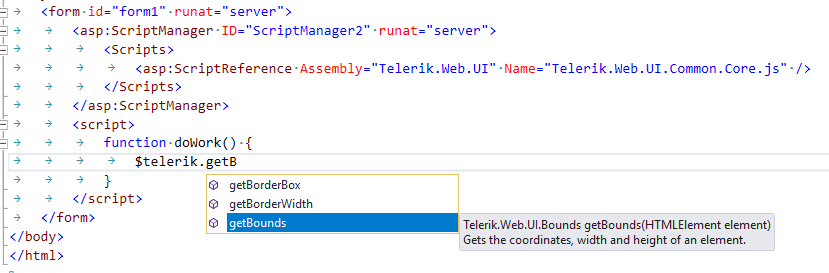
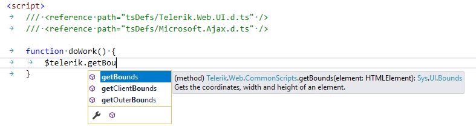
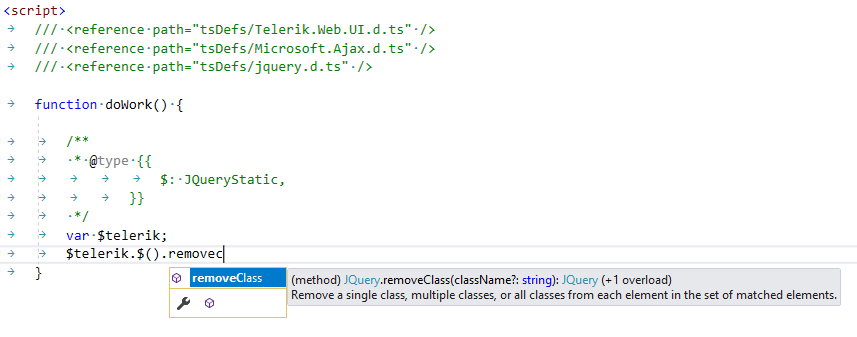
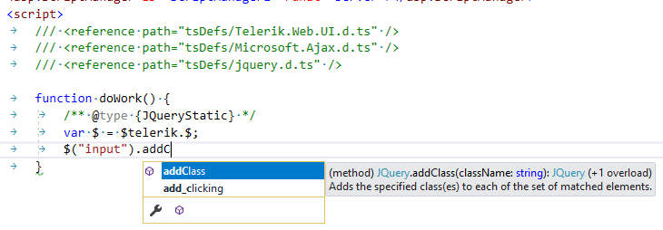
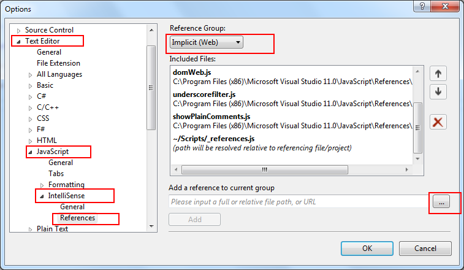
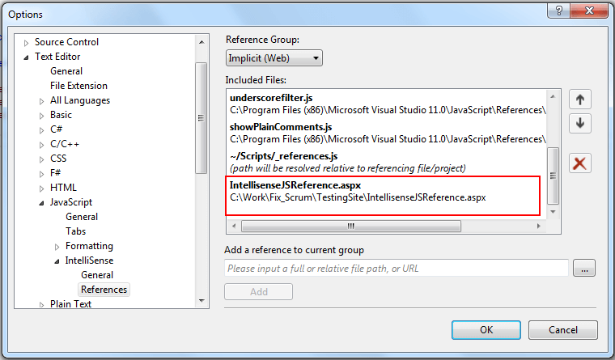
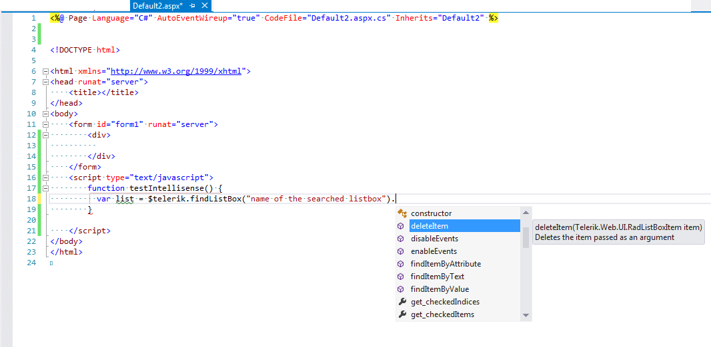
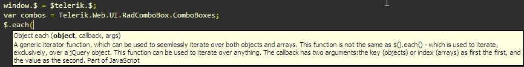

# jQuery Intellisense

This article shows how to enable the IntelliSense of the embedded in Telerik.Web.UI assembly jQuery library.

Separate sections below explain the cases for the different Visual Studio versions and Telerik.Web.UI versions:

* [Visual Studio 2017](#visual-studio-2017)

* [Visual Studio 2012 and Visual Studio 2013 with Q3 2012 or later](#jquery-intellisense-in-vs-2012-and-vs-2013-using-telerik-ui-for-aspnet-ajax-q3-2012-or-later)

* [Visual Studio 2010 with Q2 2011 SP1 or later](#jquery-intellisense-in-vs-2010-using-telerik-ui-for-aspnet-ajax-q2-2011-sp1-or-later)

* [Visual Studio 2008 with Q1 2011 or later](#jquery-intellisense-in-vs-2008-using-telerik-ui-for-aspnet-ajax-q1-2011-or-later)

* [Visual Studio 2008 with Q1 2009 SP1 or later](#enable-jquery-intellisense-using-telerik-ui-for-aspnet-ajax-q1-2009-sp1-or-higher)

* [Visual Studio 2008 with Q3 2008](#enable-jquery-intellisense-using-telerik-ui-for-aspnet-ajax-version-q3-2008)

## Visual Studio 2017

Visual Studio 2017 uses a new Intellisense mode for JavaScript based on TypeScript. You can revert to the old behavior by going to **Tools** > **Options** > **Text Editor** > **JavaScript/TypeScript** > **Language Service** and **uncheck** the checkbox from **Enable the new JavaScript Language service**. Make sure to restart Visual Studio for the changes to take effect.


With this, you can use the old JavaScript documenttion like in [Visual Studio 2012 and Visual Studio 2013 with Q3 2012 or later](#jquery-intellisense-in-vs-2012-and-vs-2013-using-telerik-ui-for-aspnet-ajax-q3-2012-or-later).

````ASP.NET
<!-- This can enable the old JS intellisense for the current page -->
<asp:ScriptManager ID="ScriptManager1" runat="server">
	<Scripts>
		<asp:ScriptReference Assembly="Telerik.Web.UI" Name="Telerik.Web.UI.Common.Core.js" />
	</Scripts>
</asp:ScriptManager>
<script>
	function doWork() {
		var bounds = $telerik.getBounds(document.getElementById("someElement"));
	}
</script>
````



The only difference is that creating custom Intellisense pages is no longer possible, and you need to use an `<asp:ScriptManager>` with the Telerik `Core.js` reference in all pages you want Intellisense in. An `<asp:ScriptManagerProxy>` does not work for user controls, and neither can be added in `.js` files, so your other option is to read onward and see how to use the TypeScript-based intellisense data.

Visual Studio 2017 started using TypeScript for JavaScript intellisense. You can read more about this in the [How to Use JavaScript Intellisense for the Telerik Controls]() article. The article also explains how to use Intellisense for the Telerik controls objects and event handlers.

To use JavaScript intellisense for the jQuery brought by the Telerik UI for ASP.NET AJAX controls, you must:

1. [Add the Telerik UI for ASP.NET AJAX TypeScript definitions]() to your project.

1. To use Intellisense for the `$telerik` static methods, you only need the Telerik TypeScript definitions:

    **JavaScript**
    
        /// <reference path="tsDefs/Telerik.Web.UI.d.ts" />
        /// <reference path="tsDefs/Microsoft.Ajax.d.ts" />
        
        function doWork() {
        	$telerik.getBounds(someDomElement);
        }
        
    
        
    >note To use jQuery intellisense, read onward. Using jQuery intellisense does not require the Telerik controls or the jQuery they bring.

1. Add jQuery TypeScript definitions to your project. For example, you can obtain them from the [jquery.TypeScript.DefinitelyTyped NuGet package](https://www.nuget.org/packages/jquery.TypeScript.DefinitelyTyped/).

1. Reference the definitions in the file you will be working in. For example, if the `.d.ts` files are in the `tsDefs` folder:

    **JavaScript**
    
        /// <reference path="tsDefs/Telerik.Web.UI.d.ts" />
        /// <reference path="tsDefs/Microsoft.Ajax.d.ts" />
        /// <reference path="tsDefs/jquery.d.ts" />
        
1. Define the type of the `$telerik` variable:
    
    **JavaScript**
    
        /// <reference path="tsDefs/Telerik.Web.UI.d.ts" />
        /// <reference path="tsDefs/Microsoft.Ajax.d.ts" />
        /// <reference path="tsDefs/jquery.d.ts" />
        
        function doWork() {
        	/**
        	 * @type { {
        				$: JQueryStatic,
        			} }
        	 */
        	var $telerik;
        	$telerik.$(".someSelector").removeClass("someClass")
        }
        
    

    >note Changing the type of the object will remove the Telerik Static Client Library intellisense from it. So, you may want to consider assigning jQuery to a global variable:
    
    **JavaScript**
    
        /// <reference path="tsDefs/Telerik.Web.UI.d.ts" />
        /// <reference path="tsDefs/Microsoft.Ajax.d.ts" />
        /// <reference path="tsDefs/jquery.d.ts" />
        
        function doWork() {
        	/** @type {JQueryStatic} */
        	var $ = $telerik.$;
        	$("input").addClass("someClass")
        }
        
    


## jQuery IntelliSense in VS 2012 and VS 2013 using Telerik® UI for ASP.NET AJAX Q3 2012 or later

>tip IntelliSense will not work if **RadScriptManager** is used instead of ScriptManager. For all intents and purposes,the reference to the later seems to be hard coded in Visual Studio. So, when you write your code you can use the ScriptManagerto get the intellisense working and when ready - replace the ScriptManager with **RadScriptManager** .

The following simple markup provides IntelliSense for the current page:

````ASP.NET
<asp:ScriptManager ID="ScriptManager2" runat="server">
    <Scripts>
        <asp:ScriptReference Assembly="Telerik.Web.UI" Name="Telerik.Web.UI.Common.Core.js" />
    </Scripts>
</asp:ScriptManager>
````

You can also enable it for all pages by creating a custom page and adding it to the VS settings:

1. Create a sample aspx page (e.g. IntellisenseJSReference.aspx) with the following mark up:

	**ASP.NET**
	
		<asp:ScriptManager runat="server" ID="ScriptManager3">
		   <Scripts>
			   <asp:ScriptReference Assembly="Telerik.Web.UI" Name="Telerik.Web.UI.Common.Core.js" />
			   <asp:ScriptReference Assembly="Telerik.Web.UI" Name="Telerik.Web.UI.Common.jQuery.js" />
			   <asp:ScriptReference Assembly="Telerik.Web.UI" Name="Telerik.Web.UI.Common.jQueryInclude.js" />
		   </Scripts>
		</asp:ScriptManager> 

1. Go to Tools -> Options, find TextEditor -> JavaScript -> IntelliSense -> References menu. Set Reference Group to Implicit(Web):

	

1. Add the created aspx page as a reference and click OK:

	

1. Go to sample page and test the javascript intellisense

	

## jQuery IntelliSense in VS 2010 using Telerik® UI for ASP.NET AJAX Q2 2011 SP1 or later

Since the Q2 2011 SP1 release of Telerik® UI for ASP.NET AJAX, IntelliSense is automatically enabled when RadScriptManager is on a page. There is no need to add the previously required ScriptReferences to RadScriptManager to enable IntelliSense:

````ASP.NET
<telerik:RadScriptManager runat="server" ID="RadScriptManager1">
</telerik:RadScriptManager> 
````

If you have been using the script references before, you can safely remove them with the new release:

````ASP.NET
You no longer need these for jQuery intellisense
<Scripts>
    <asp:ScriptReference Assembly="Telerik.Web.UI" Name="Telerik.Web.UI.Common.Core.js" />
    <asp:ScriptReference Assembly="Telerik.Web.UI" Name="Telerik.Web.UI.Common.jQuery.js" />
    <asp:ScriptReference Assembly="Telerik.Web.UI" Name="Telerik.Web.UI.Common.jQueryInclude.js" />
</Scripts>
````

## jQuery IntelliSense in VS 2008 using Telerik® UI for ASP.NET AJAX Q1 2011 or later

Since the Q1 2011 release of Telerik® UI for ASP.NET AJAX, jQuery IntelliSense does not work with the scripts embedded in the Telerik.Web.UI.dll. The relevant jQuery scripts can be referenced as external files similarly to the following:

````ASP.NET
<asp:ScriptManager ID="ScriptManager1" runat="server">
    <Scripts>
        <asp:ScriptReference Assembly="Telerik.Web.UI" Name="Telerik.Web.UI.Common.Core.js" />
    </Scripts>
</asp:ScriptManager>
````

## Enable jQuery Intellisense using Telerik® UI for ASP.NET AJAX Q1 2009 SP1 or higher

1. Install Visual Studio 2008 SP1

2. Install VS 2008 [Patch KB958502](http://connect.microsoft.com/VisualStudio/Downloads/DownloadDetails.aspx?DownloadID=14883) to Support *"-vsdoc.js"* Intellisense Files

3. Add the following script references in your page:

	**ASP.NET**
	
		<asp:ScriptManager runat="server" ID="ScriptManager1">
		   <Scripts>
			   <asp:ScriptReference Assembly="Telerik.Web.UI" Name="Telerik.Web.UI.Common.Core.js" />
			   <asp:ScriptReference Assembly="Telerik.Web.UI" Name="Telerik.Web.UI.Common.jQuery.js" />
			   <asp:ScriptReference Assembly="Telerik.Web.UI" Name="Telerik.Web.UI.Common.jQueryInclude.js" />
		   </Scripts>
		</asp:ScriptManager> 

>tip IntelliSense will not work if **RadScriptManager** is used instead of ScriptManager. For all intents and purposes, the reference to the later seems to be hard coded in Visual Studio. So, when you write your code you can use the ScriptManager to get the intellisense working and when ready - replace the ScriptManager with **RadScriptManager** 

Here is a screenshot:



## Enable jQuery Intellisense using Telerik® UI for ASP.NET AJAX version Q3 2008

1. Install Visual Studio 2008 SP1

2. Install VS 2008 [Patch KB958502](http://connect.microsoft.com/VisualStudio/Downloads/DownloadDetails.aspx?DownloadID=14883) to Support "-vsdoc.js" Intellisense Files

3. Download the [jQuery IntelliSense documentation file](http://code.google.com/p/jqueryjs/downloads/detail?name=jquery-1.2.6-vsdoc.js) and add it to your project. Rename it to **jquery-telerik-vsdoc.js**

4. Add a new file to your project, **jquery-telerik.js**, with the following content:

	**JavaScript**
	
		var jQuery = window.jQuery = window.$ = $telerik.$;

	This will make jQuery accessible under its default alias - $.

	Make sure that both jquery-telerik.js and jquery-telerik-vsdoc.js are in the same folder.

5. Add script references for jQuery and the jquery-telerik.js file in the ScriptManager on the page:

	**ASP.NET**

		<asp:ScriptManager ID="ScriptManager" runat="server">
		   <Scripts>
			   <asp:ScriptReference Assembly="Telerik.Web.UI" Name="Telerik.Web.UI.Common.Core.js" />
			   <asp:ScriptReference Assembly="Telerik.Web.UI" Name="Telerik.Web.UI.Common.jQuery.js" />
			   <asp:ScriptReference Path="~/jquery-telerik.js" />
		   </Scripts>
		</asp:ScriptManager> 

### See Also

 * [What is jQuery?]()

 * [Using jQuery]()
