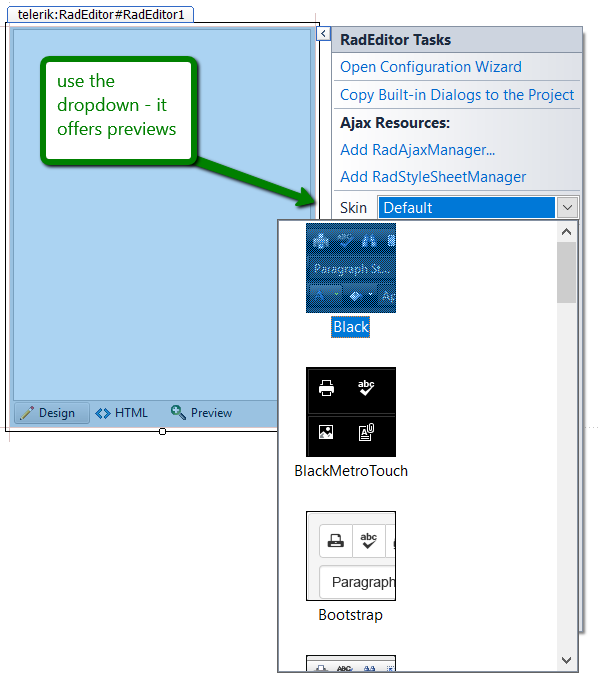

# Change Control Appearance

The UI for ASP.NET AJAX controls use [Skins]() to change their appearance. We provide over 20 built-in skins that can fit in the majority of web application designs.

The easiest way to [set a skin](#using-a-skin) is to use the **Design-time Skin dropdown in the Smart Tag** of the control. You can show the Smart Tag in Source Mode by pressing `Ctrl+.`.

>caption Figure 1: Set skin through the Design-time dropdown

## Custom Appearance

In case you need to tweak the control appearance to something that is not provided out-of-the-box by a built-in skin, there are two distinct approaches:

* You can [create a few CSS overrides]() that will implement the small change you seek.

* Or, you can [create a custom skin]() that matches your requirements.

In either case, you may find helpful the [Improve Your Debugging Skills with Chrome DevTools](https://www.telerik.com/blogs/improve-your-debugging-skills-with-chrome-devtools) blog post.

If you experience issues with the control appearance, start by examining the [Different appearance or behavior in Internet Explorer on local and production servers](https://www.telerik.com/support/kb/aspnet-ajax/details/different-appearance-in-internet-explorer-on-local-and-production-servers) KB article.

## Next Steps
* [More Learning Resources]()
* [Customize control behavior]()
* [Change control appearance]()
* [Start from the First Steps]()

## See Also

Appearance
* [Controlling Visual Appearance Overview]()
* [How Skins Work]()
* [Skin Registration]()
* [Modifying Built-in Skins]()
* [Creating a Custom Skin]()
* [RadSkinManager]()
* [Progress Virtual Classroom](https://learn.telerik.com/)
