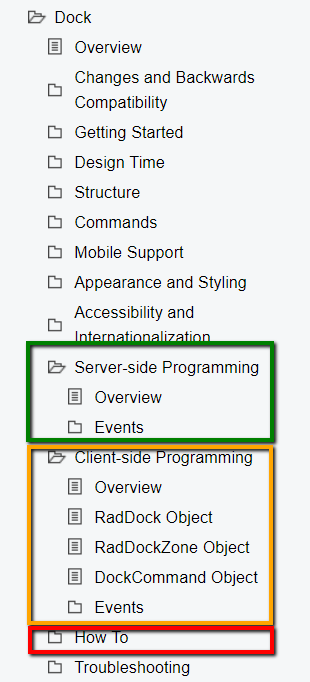

# Customize Control Behavior

Once you have the controls [working in your project](), and you [are acquainted with their features](), you can tailor their behavior to your specific project needs. This article provides a short overview of how to customize the behavior of the UI for ASP.NET AJAX controls.

## Look for Properties and Events, and Ready Solutions

We try to create built-in features for the most common use cases, and the rich API the controls provide lets you customize their behavior further. The first step to customizing the control behavior is to look for similar built-in features and their corresponding events and API.

If you do not immediately see a feature you need, **take a look at the control properties and events** and it is likely that something will stand out as relevant. **Searching online** for your question is likely to provide you with **[demos](https://demos.telerik.com/aspnet-ajax/)**, **[documentation]()** or **[forum](https://www.telerik.com/forums/aspnet-ajax)** threads that treat similar questions and can **jump-start your development**. You can also find a lot of examples in the **[Code Library section](https://www.telerik.com/support/code-library/aspnet-ajax)** and in the **[Knowledge Base articles](https://www.telerik.com/support/kb/aspnet-ajax)**.

## Using the Documentation

Each control also has a section in its documentation that is dedicated to listing properties and events with details on what they do and how they are used. The folders are invariably called **`Server-side Programming`** and **`Client-side Programming`** in the table of contents on the left hand side.
This is the first place to look at when you need to **implement additional logic** around the control's functionality as it provides **API reference and event handling information**.

>caption Figure 1: How to find API reference and event handling in the documentation



## Nested Controls

**Complex controls** often use other Telerik controls internally, and so **customizing** their behavior usually **boils down to accessing the child controls and using their properties and events** as if they were not nested. Thus, looking for child control references is a shortcut to customizing complex controls.  They can be exposed as properties, and often times using `.FindControl()` will let you access them on the server.

When you need to get work done **in the browser**, you will need a **reference to the client-side object** of the control. This is a bit peculiar in MS AJAX, and the [Get Client-side Reference to a Control Object]() help article explains how to do that.

### Client-side Event Handling

The Telerik UI for ASP.NET AJAX controls provide many client-side events. Since they are server-side controls to being with, these events are exposed via serializable server properties and not as event attributes.

**To handle a client-side event of a Telerik controls, you must provide only the string name of the handler function, without parentheses.** If you add the parentheses, the event handler function will try to execute as soon as the page loads, and this will usually result in errors.

>caption Example 1: Handling the client-side click of a Telerik button vs standard button

````ASPX
<input onclick="return myStandardClickHandler(this);" value="Standard control" id="Button1" runat="server" type="submit" />
<telerik:RadPushButton OnClientClicking="myTelerikClickHandler" Text="Telerik control" ID="RadPushButton1" runat="server"></telerik:RadPushButton>
<script>
    function myStandardClickHandler(btn) {
        //to get the object that fired the event, you must wire the event in a special way
        alert(btn);
        //the standard way of stopping further handler execution
        return false;
    }
    function myTelerikClickHandler(sender, args) {
        //the reference to the Telerik control that fired the event is available as the first argument
        alert(sender);
        //cancellable Telerik control events allow you to stop event execution like this
        args.set_cancel(true);
    }
</script>
````

## Next Steps

Below you can find guidance on getting started with other common tasks:

* [Change control appearance]()
* [Further information]()

## See Also

* [First Steps]()
* [Explore control features]()
* [Customize control behavior]()
* [Progress Virtual Classroom](https://learn.telerik.com/)
