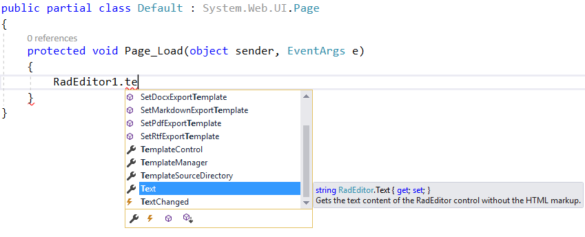
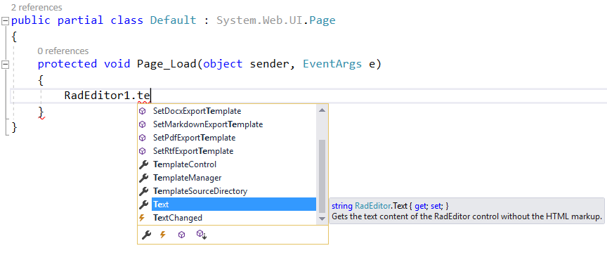
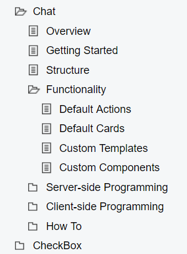
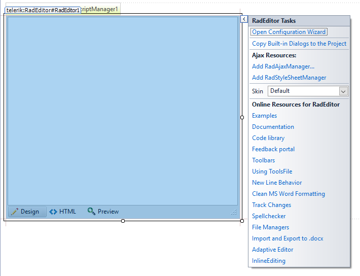

# Explore Control Features

Once you have the controls [working in your project](), it's time to see what they can do. This article provides a short overview of how to get started with finding control functionality so you can use it.

## Demos

To get an overview of what each control offers, the fastest approach is to go to our [Live Demos](http://demos.telerik.com/aspnet-ajax).

You can **download the demo site** from your telerik.com account as a VS project and play around with the demos in the comfort of your IDE. The ` Telerik_UI_for_ASP.NET_AJAX_<version>_Demos_Dev.msi` and `Telerik_UI_for_ASP.NET_AJAX_<version>_Dev.zip` files contain the demo site. If your license is a trial one, you will see `...Trial.msi` and `...Trial.zip` respectively.

## Explore properties and tags

You can **explore** the available properties, events and inner tags of any control through the VS **intellisense** to get a quick glimpse of their concepts and availability.

>caption Figure 1: Explore Intellisense in the markup

>caption Figure 2: Explore Inetllisense in the code-behind

## Documentation

In addition to that, the **documentation** provides a section for each control that contains help articles **on distinct features and API reference**.

>caption Figure 3: Typical control documentation structure

## Design-time

Last, but not least, some most common tasks and configuration options are available in the control's **Smart Tag in Design Mode**. You will also find **design-time wizards** and **links** that can be useful when you are getting started with a feature, or even for advanced users who want to save time with setting up collections, data sources or properties.

>caption Figure 4: Smart Tag features

## Next Steps

Now that you have the Telerik UI for ASP.NET AJAX controls running in your project, you may want to explore their features, customize their behavior or change their appearance. Below you can find guidance on getting started with such tasks:

* [Customize control behavior]()
* [Change control appearance]()
* [Further information]()

## See Also

* [First Steps]()
