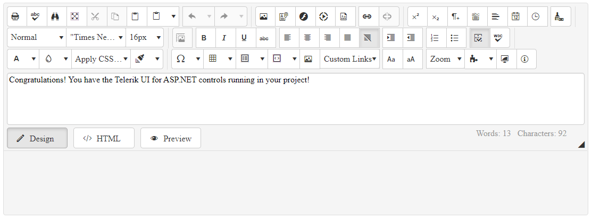

# First Steps by Installing with an MSI File

The Telerik UI for ASP.NET AJAX library provides an option for installing its controls by downloading and executing the MSI file, which contains the suite.  

MSI files are intended for easy and automatic installation of a product. This tutorial describes how to get up and running with Telerik UI for ASP.NET AJAX by downloading and installing the controls from the MSI file, which will install the suite on your computer and will automatically create the necessary virtual folders and projects.

* First, you will install the Telerik UI for ASP.NET AJAX library from an MSI file and load the demos.
* Next, you'll create your ASP.NET AJAX application and add the Editor control to it.
* Then, you will dive deeper by defining the HtmlChart control and binding it to sample data.
* Finally, you will add some styling to the controls.

>tip How about a free Telerik UI onboarding course? Learn how to take advantage of the [Telerik Virtual Classroom](https://learn.telerik.com/learn).

## Prerequisites

The following prerequisites are required for accomplishing the scenario in this tutorial. For more information on the third-party tooling versions supported by Telerik UI for ASP.NET AJAX, refer to the [list with system requirements](https://www.telerik.com/aspnet-ajax/tech-sheets/system-requirements).

1. [Install Visual Studio 2019 or later](https://visualstudio.microsoft.com/downloads/).

1. [Install .NET Framework 4.5 or later](https://dotnet.microsoft.com/en-us/download).

1. If a new user, [create a Telerik account](https://www.telerik.com/account/).

## Step 1: Install Telerik UI for ASP.NET AJAX

1. Log into your [Telerik account](https://www.telerik.com/account/product-download?product=RCAJAX).

1. For trial users, navigate to [Telerik UI for ASP.NET AJAX](https://www.telerik.com/products/aspnet-ajax) and select **Download Free Trial**.

  For commercial users, on the **DOWNLOADS** tab, choose **Progress® Telerik® UI for ASP.NET AJAX**, and then select **Latest Public Version**.

  >caption Download the Commercially Licensed Version
  

1. Download the **Automatic installation** (MSI) file.

1. Once the download completes, run the MSI file and follow the instructions. On a 32-bit machine and unless you specify otherwise, the wizard will install the Telerik UI for ASP.NET AJAX suite in the `C:\Program Files\Progress\` folder. On a 64-bit machine, the default path is `C:\Program Files (x86)\Progress\`.

>Tip: You can also install the msi silently as explained in [Silent MSI install]().

## Step 2: Download the Demos

1. From the **Resources** section of same page, download the MSI installation for the Telerik UI for ASP.NET AJAX examples. Once you install them on your machine, you can launch the live demos in either of the following ways:

  * For **Start Menu** programs, open **Telerik** > **Live Examples - UI for ASP.NET AJAX**.
  * For Windows Explorer, navigate to the Telerik control installation folder, typically `C:\Program Files\Progress\UI for ASP.NET AJAX RX YYYY\Live Demos` and double-click the `StartExamples.exe` file.

1. Load the **Live Examples** solution to your Visual Studio and start the project by clicking `F5`. The fastest way to load the examples is by using the **Start Menu** by selecting **Telerik** > **UI for ASP.NET AJAX RX YYYY -> Open Sample Web Site in Visual Studio**. Visual Studio will locally start the **Live Demos** by using the integrated ASP.NET Development Server.

>note The Telerik UI for ASP.NET AJAX package automatically adds the products to the Visual Studio toolbox. To add them manually, refer to the article on [adding the Telerik controls to the Visual Studio toolbox]().

## Step 3: Create the ASP.NET AJAX Project

Telerik UI for ASP.NET AJAX integrates into Visual Studio through the Telerik [Visual Studio Extensions](). The Telerik templates allow you to effortlessly create a pre-configured Telerik UI project that contains all required resources which enable you to use the Telerik controls.

>For adding the Telerik controls to an already existing project, refer to the article on [adding the Telerik controls to your project]().

1. Open Visual Studio and select **File** > **New** > **Project**.

1. In the search box, enter **Telerik**.

   If the list doesn't contain Telerik templates, then the Telerik extensions are missing. In this case, go to [Telerik UI for ASP.NET AJAX Extension](https://marketplace.visualstudio.com/items?itemName=TelerikInc.TelerikASPNETAJAXVSExtensions), download the file from the VS marketplace, and install it.

1. Select the **Telerik C# Web Forms Site** template. Click **Next**.

1. Enter **MyFirstTelerikSite** in the **Project name** field, select **.NET Framework 4.5** (or later), and then select **Create**.

1. In the **Create New Project Wizard**, select **BLANK**. Click **Finish**.

>caption Create the new ASP.NET project


## Step 4: Add the Editor to Your Project

The Web Forms Site created through the Telerik project templates includes all basic references and registrations required by the Telerik UI for ASP.NET AJAX controls, including a [ScriptManager control](), which is required by all AJAX controls. That's why you can add the [Editor](https://demos.telerik.com/aspnet-ajax/editor/examples/overview/defaultcs.aspx) to the page in a simple way as demonstrated in this step.

> Alternatively, you can add the Editor to your project by dragging it directly from the VS toolbox. For more information, refer to the article on [adding the Telerik controls to the Visual Studio toolbox]().

1. Open `Default.aspx` and declare `RadEditor` right after `RadScriptManager`:

   ```ASPX
   <telerik:RadScriptManager ID="RadScriptManager1" runat="server"></telerik:RadScriptManager>

   <telerik:RadEditor runat="server" ID="RadEditor1" </telerik:RadEditor>
   ```
1. Set the `RenderMode` and `Content` properties of the Editor:

   ```ASPX
   <telerik:RadScriptManager ID="RadScriptManager1" runat="server"></telerik:RadScriptManager>

   <telerik:RadEditor runat="server" ID="RadEditor1" RenderMode="Lightweight">
       <Content>             
           Congratulations! You have the Telerik UI for ASP.NET controls running in your project!         
       </Content>
   </telerik:RadEditor>
   ```

1. Run your page by pressing `F5`.

>caption Add the Editor to the page


## Step 5: Add the HtmlChart to Your Project

Let’s dive a little bit deeper in the configuration of the controls from the UI for ASP.NET AJAX suite. By following the steps below, you will create a data-bound [HtmlChart](). You will also add a handy tooltip that shows the values from a custom data field.

The sample uses a `DataTable`, but you can bind the HtmlChart to a [preferred data source type](). The page already contains a [ScriptManager control](#add-radeditor-to-the-application), so you are ready to declare the HtmlChart right after the Editor control that you added in the previous step:

1. In `Default.aspx`, define an HtmlChart with `ID="RadHtmlChart1"`:

    ```ASPX
    <telerik:RadHtmlChart ID="RadHtmlChart1" runat="server">
    </telerik:RadHtmlChart>
    ```

1. Add a `ChartTitle` to the created HtmlChart:

    ```ASPX
    <telerik:RadHtmlChart ID="RadHtmlChart1" runat="server">
        <ChartTitle Text="Sales Log"></ChartTitle>
    </telerik:RadHtmlChart>
    ```

1. Add `ColumnSeries` to the `PlotArea.Series` collection of the control:

    ```ASPX
    <telerik:RadHtmlChart ID="RadHtmlChart1" runat="server">
        <ChartTitle Text="Sales Log"></ChartTitle>
        <PlotArea>
            <Series>
                <telerik:ColumnSeries Name="Clothes"></telerik:ColumnSeries>
            </Series>
        </PlotArea>
    </telerik:RadHtmlChart>
    ```

1. In the code-behind of the page, create a `GetData()` method. This method returns the sample data that you will bind to the chart:

    ````C#
    private DataTable GetData()
        {
            DataTable dt = new DataTable();

            dt.Columns.Add("labels");
            dt.Columns.Add("values");
            dt.Columns.Add("colors");
            dt.Columns.Add("description");

            dt.Rows.Add("Week 1", 3, "#99C794", " 1 blouse and 2 trousers");
            dt.Rows.Add("Week 2", 10, "#5FB3B3", "7 blouses and 3 skirts");
            dt.Rows.Add("Week 3", 7, "#FAC863", "7 skirts");
            dt.Rows.Add("Week 4", 12, "#6699CC", "5 blouses, 5 trousers and 2 skirts");

            return dt;
        }
    ````
    ````VB
    Private Function GetData() As DataTable
        Dim dt As DataTable = New DataTable()

        dt.Columns.Add("labels")
        dt.Columns.Add("values")
        dt.Columns.Add("colors")
        dt.Columns.Add("description")

        dt.Rows.Add("Week 1", 3, "#99C794", " 1 blouse and 2 trousers")
        dt.Rows.Add("Week 2", 10, "#5FB3B3", "7 blouses and 3 skirts")
        dt.Rows.Add("Week 3", 7, "#FAC863", "7 skirts")
        dt.Rows.Add("Week 4", 12, "#6699CC", "5 blouses, 5 trousers and 2 skirts")

        Return dt
    End Function
    ````

1. Configure the data source of the chart to use the created sample data:

    ````C#
    protected void Page_Load(object sender, EventArgs e)
    {
        if (!IsPostBack)
        {
            RadHtmlChart1.DataSource = GetData();
        }
    }
    ````
    ````VB
    Protected Sub Page_Load(ByVal sender As Object, ByVal e As EventArgs) Handles Me.Load
        If Not IsPostBack Then
            RadHtmlChart1.DataSource = GetData()
        End If
    End Sub
    ````

1. Set the `colors` and `values` field names to the Series `DataFieldY` and `ColorField` properties:

    ```ASPX
    <telerik:RadHtmlChart ID="RadHtmlChart1" runat="server">
        <ChartTitle Text="Sales Log"></ChartTitle>
        <PlotArea>
            <Series>
                <telerik:ColumnSeries Name="Clothes" DataFieldY="values" ColorField="colors"></telerik:ColumnSeries>
            </Series>
        </PlotArea>
    </telerik:RadHtmlChart>
    ```

1. Set the `labels` field name to the `PlotArea.XAxis.DataLabelsField` value:

    ```ASPX
    <telerik:RadHtmlChart ID="RadHtmlChart1" runat="server">
        <ChartTitle Text="Sales Log"></ChartTitle>
        <PlotArea>
            <Series>
                <telerik:ColumnSeries Name="Clothes" DataFieldY="values" ColorField="colors"></telerik:ColumnSeries>
            </Series>
            <XAxis DataLabelsField="labels"></XAxis>
        </PlotArea>
    </telerik:RadHtmlChart>
    ```

1. Define a `TooltipsAppearance` nested tag in the series declaration. Then define a [custom Tooltip template]() in it. All fields from the passed data source are available through the `dataItem` object of the template:

    ```ASPX
    <telerik:RadHtmlChart ID="RadHtmlChart1" runat="server">
        <ChartTitle Text="Sales Log"></ChartTitle>
        <PlotArea>
            <Series>
                <telerik:ColumnSeries Name="Clothes" DataFieldY="values" ColorField="colors">
                    <TooltipsAppearance>
                        <ClientTemplate>
                            There are #=dataItem.description# sold in #=category#
                        </ClientTemplate>
                    </TooltipsAppearance>
                </telerik:ColumnSeries>
            </Series>
            <XAxis DataLabelsField="labels"></XAxis>
        </PlotArea>
    </telerik:RadHtmlChart>
    ```

1. Run the page by pressing `F5`. You are expected to see something similar to the following image:

>caption Bound HtmlChart with a custom Tooltip template


## Step 6: Style the Controls

Telerik UI for ASP.NET AJAX provides more than [20 predefined skins]() that allow you to change the look and feel of each component. To use the desired skin, set the skin name as the `Skin` property value of the control:

```ASPX
<telerik:RadEditor runat="server" ID="RadEditor2" Skin="Glow" RenderMode="Lightweight">
    <Content>             
        Congratulations! You have the Telerik UI for ASP.NET controls running in your project!     
    </Content>
</telerik:RadEditor>
```

>caption Apply the Glow skin to the Editor


That was it! Now you are ready to dive more deeply into Telerik UI for ASP.NET AJAX and take full advantage of its slick functionalities!

## Next Steps

* [System Requirements](https://www.telerik.com/aspnet-ajax/tech-sheets/system-requirements)
* [Available Product Files for Download]()
* [Included Assemblies]()
* [Adding Telerik ASP.NET AJAX Controls to a Page]()
