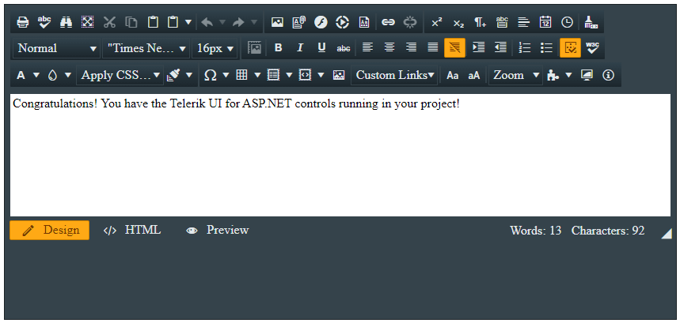

# First Steps by Installing from a NuGet Package

[NuGet](https://www.nuget.org/) is a popular .NET package manager. Progress maintains the Telerik NuGet Feed for registered users and you can include the Telerik UI for ASP.NET AJAX suite in your project as well as update to the latest available version from there. Installing the Telerik UI for ASP.NET AJAX library with NuGet works both for Windows and MacOS machines.

>The [legacy Telerik NuGet server](https://nuget.telerik.com/nuget) is now deprecated. Make sure to switch to the [new Telerik NuGet server](https://nuget.telerik.com/v3/index.json), which is faster, lighter, and reduces the number of requests from your NuGet client.

This tutorial describes how to get up and running with the Telerik UI for ASP.NET AJAX library by downloading and installing the controls with NuGet.

* First, you will add the Telerik NuGet feed to Visual Studio and install the Telerik UI for ASP.NET AJAX library.
* Next, you'll create your ASP.NET AJAX application and add the Editor control to it.
* Then, you will dive deeper by defining the HtmlChart control and binding it to sample data.
* Finally, you will add some styling to the controls.

## Prerequisites

1. [Install Visual Studio 2019 or later](https://visualstudio.microsoft.com/downloads/).

1. [Install .NET Framework 4.5 or later](https://dotnet.microsoft.com/en-us/download).

1. [Install the ASP.NET Web Forms application](https://docs.microsoft.com/en-us/aspnet/web-forms/) on your development or production machine. ASP.NET Web Forms is available in the .NET 4.0-4.8 installations.

1. If a new user, [create a Telerik account](https://www.telerik.com/account/).

## Step 1: Add the Telerik NuGet Feed to Visual Studio

Adding the Telerik NuGet feed to Visual Studio allows you to quickly install the required Telerik packages to your project.

The following video demonstrates the steps for adding the Telerik NuGet feed to Visual Studio. If you prefer, however, you can follow the steps that are listed in writing after the video.

<iframe width="560" height="315" src="https://www.youtube.com/embed/c3m_BLMXNDk" frameborder="0" allow="accelerometer; autoplay; encrypted-media; gyroscope; picture-in-picture" allowfullscreen></iframe>

To configure the Telerik NuGet Feed in Visual Studio:

1. Open Visual Studio and go to **Tools** > **NuGet Package Manager** > **Package Manager Settings**.

1. Select **Package Sources** and then click the **+** button to add a new package source.

1. Enter a **Name** for the new package source, for example, **Telerik NuGet**.

1. Add the `https://nuget.telerik.com/v3/index.json` URL as a **Source**. Click **OK**.

	>caption Visual Studio NuGet package manager and the Telerik NuGet feed.

	

## Step 2: Install Telerik UI for ASP.NET AJAX

Now that you have successfully added the Telerik NuGet feed as a package source, you need to authenticate your local NuGet instance, display the available packages, and install Telerik UI for ASP.NET AJAX:

1. Create a new WebForms project or open an existing one.

1. Go to **Tools** > **NuGet Package Manager** > **Manage NuGet Packages for Solution...**.

1. Select the Telerik NuGet **Package source** from the drop-down list on the left.

1. Select the **Browse** tab to see the available packages. In older Visual Studio versions, this tab is called **Online**.

1. Enter your Telerik credentials in the Windows Authentication dialog.

	>caption Enter your Telerik.com credentials to access the Telerik NuGet feed

	

1. Select the desired Telerik UI for ASP.NET AJAX package and click **Install**. To select the correct package version for your project, the .NET version of your project must correspond to the `.Net<version>` portion of the package name. For example, the correct package for `.NET Framework 4` projects is `Telerik.UI.for.AspNet.Ajax.Net40`.

	>caption Add the Telerik UI for ASP.NET AJAX package to the solution.

	


............
we need to add or edit the above steps to show how to add the Editor (and the Chart if necessary)
............


## Step 6: Style the Controls

Telerik UI for ASP.NET AJAX provides more than [20 predefined skins]() that allow you to change the look and feel of each component. To use the desired skin, set the skin name as the `Skin` property value of the control:

```ASPX
<telerik:RadEditor runat="server" ID="RadEditor2" Skin="Glow" RenderMode="Lightweight">
    <Content>             
        Congratulations! You have the Telerik UI for ASP.NET controls running in your project!     
    </Content>
</telerik:RadEditor>
```

>caption Apply the Glow skin to the Editor.


That was it! Now you are ready to dive more deeply into Telerik UI for ASP.NET AJAX and take full advantage of its slick functionalities!

## Next Steps

* [Available Product Files for Download]()
* [Available Assemblies]()
