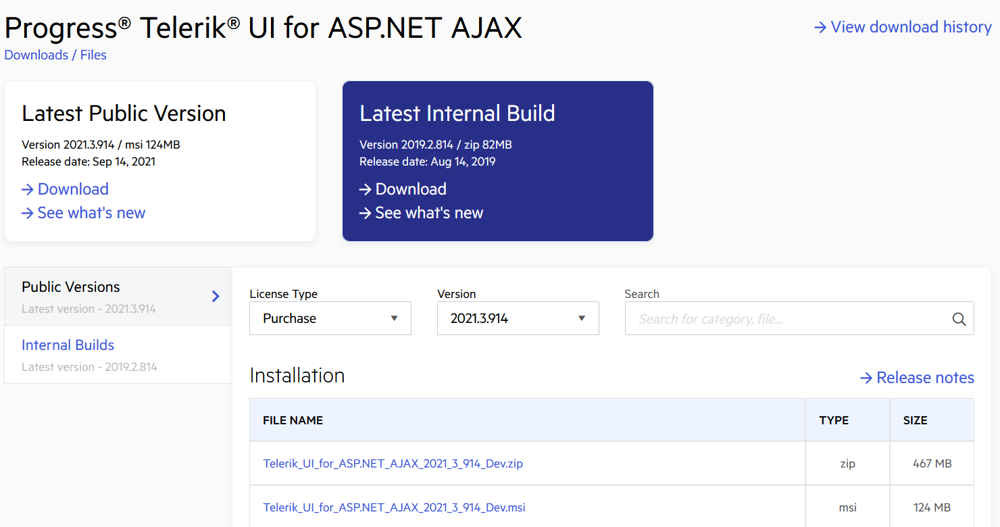
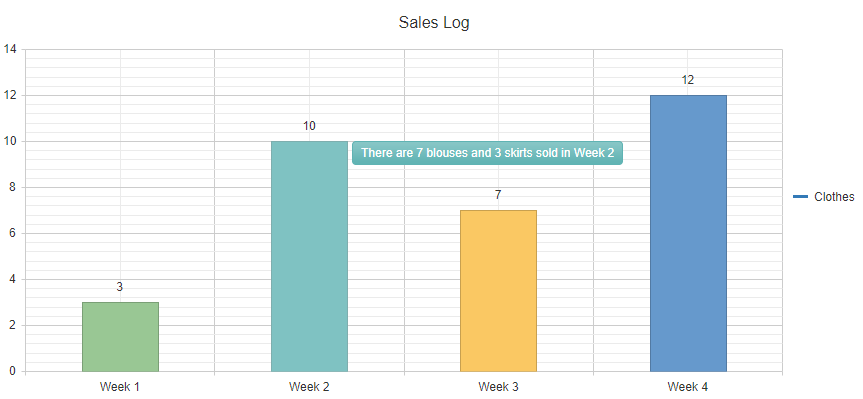

# First Steps with UI for ASP.NET AJAX

This article demonstrates the steps to create a [Web Forms application](https://docs.microsoft.com/en-us/aspnet/web-forms/what-is-web-forms) that uses [Telerik UI for ASP.NET AJAX](https://www.telerik.com/products/aspnet-ajax) components. You will download the Telerik components, create a project, and add the [RadEditor](https://docs.telerik.com/devtools/aspnet-ajax/controls/editor/overview) and [RadHtmlChart](https://docs.telerik.com/devtools/aspnet-ajax/controls/htmlchart/overview) controls. As RadHtmlChart requires data binding to show its full potential, you will learn how to bind the Telerik controls to sample data.

Throughout this tutorial, you'll find links to relevant articles that you don't need to read immediately, but will help you deepen your knowledge about the Telerik UI controls. If you want to experiment with the sample application created here, you can fork or download the source code from the [GitHub repository](https://github.com/telerik/aspnet-sdk/tree/master/Common/MyFirstTelerikSite).

## Prerequisites

To follow the steps in this tutorial, you need:

* Visual Studio 2019

* [.NET Framework 4.5 (or later)](https://dotnet.microsoft.com/download)

>important The prerequisites above apply only to this article and guarantee that you can successfully complete the tutorial. For a complete list with all supported frameworks and development tools, see [System Requirements](https://www.telerik.com/aspnet-ajax/tech-sheets/system-requirements).

## Download the Controls

The most convenient way to get the Telerik UI for ASP.NET AJAX controls on your development machine is to download the installer file:

* If you use a free trial license, go to [Download the Free Trial Version](#download-the-free-trial-version).

* If you have already purchased a commercial license, go to [Download the Commercially Licensed Version](#download-the-commercially-licensed-version).

### Download the Free Trial Version

The trial version of the Telerik UI for ASP.NET AJAX controls provides the same functionality as the commercially licensed version, but it displays a [copyright message](https://docs.telerik.com/devtools/aspnet-ajax/licensing/trial-license-limitations#trial-copyright-messages) on the page that uses the controls. To download the free trial:

1. Navigate to [Telerik UI for ASP.NET AJAX](https://www.telerik.com/products/aspnet-ajax) and select **Download Free Trial**.

1. If you aren’t logged in, log in with your Telerik account.

   >tip If you don’t have a Telerik account yet, you can create one for free.

1. Download the installer to your development machine.

Next, continue with the [Telerik UI installation](#install-telerik-ui-for-aspnet-ajax).

### Download the Commercially Licensed Version

If you have already purchased a commercial license, you can download the installer from your Telerik account:

1. Navigate to your [Telerik account](https://www.telerik.com/account/), select the **DOWNLOADS** tab, and then select **Progress® Telerik® UI for ASP.NET AJAX**. 

1. Select **Latest public version**.

>caption Download the Commercially Licensed Version


### Install Telerik UI for ASP.NET AJAX

Run the downloaded file, follow the on-screen instructions, and accept the default options to install the controls. For step-by-step instructions, see [Installing the Telerik Controls from MSI File](https://docs.telerik.com/devtools/aspnet-ajax/installation/installing-the-telerik-controls-from-msi-file).

>During the installation, verify that **Visual Studio 2019 Support** is selected under **Visual Studio Integration**.


This tutorial recommends using the MSI to get the Telerik controls, but there are various other ways. See [Which File Do I Need to Install](https://docs.telerik.com/devtools/aspnet-ajax/installation/which-file-do-i-need-to-install) for a list with all distribution methods.  

## Create a New Project

**Telerik UI for ASP.NET AJAX** integrates into Visual Studio through our handy [Visual Studio Extensions](), which allow you to effortlessly create a pre-configured Telerik UI project.

To create the project:

1. Open Visual Studio and select **File** > **New** > **Project**.

1. In the search box, enter **Telerik**.

   >tip If there are no Telerik templates in the list, this indicates that the Telerik extensions are missing. Go to [Telerik UI for ASP.NET AJAX Extension](https://marketplace.visualstudio.com/items?itemName=TelerikInc.TelerikASPNETAJAXVSExtensions), download the file from the VS marketplace, and then install it.

1. Select the **Telerik C# Web Forms Site** template, and then select **Next**.

1. Enter **MyFirstTelerikSite** in the **Project name** field, select **.NET Framework 4.5** (or later), and then select **Create**.

1. In the **Create New Project Wizard**, select **BLANK**, and then select **Finish**.

>caption Create a new project


The Telerik templates for Visual Studio allow you to kick-start your application development by creating a new project that has all required resources that enable you to use the Telerik controls. But if you need to add the Telerik controls to an already existing project, see the instructions in [Adding the Telerik Controls to Your Project](https://docs.telerik.com/devtools/aspnet-ajax/getting-started/adding-the-telerik-controls-to-your-project).

To learn more about the functionalities of the Telerik ASP.NET AJAX Visual Studio Extensions, see the documents in section [**GENERAL INFORMATION** > **Integration with Visual Studio** > **Visual Studio Extensions document section**]().

## Add RadEditor to the Application

The Web Forms Site created through the Telerik project template includes all basic references and registrations required by the Telerik UI for ASP.NET AJAX controls. The site has even a [ScriptManager control]() that is required by all AJAX controls. That's why you can add the [RadEditor](https://demos.telerik.com/aspnet-ajax/editor/examples/overview/defaultcs.aspx) control to the page in two simple steps:

1. Open `Default.aspx`, and then declare RadEditor right after RadScriptManager:

   ```ASPX
   <telerik:RadScriptManager ID="RadScriptManager1" runat="server"></telerik:RadScriptManager>

   <telerik:RadEditor runat="server" ID="RadEditor1" </telerik:RadEditor>
   ```
1. Set the `RenderMode` and `Content` properties of the RadEditor control:

   ```ASPX
   <telerik:RadScriptManager ID="RadScriptManager1" runat="server"></telerik:RadScriptManager>

   <telerik:RadEditor runat="server" ID="RadEditor1" RenderMode="Lightweight">
       <Content>             
           Congratulations! You have the Telerik UI for ASP.NET controls running in your project!         
       </Content>
   </telerik:RadEditor>
   ```

To run your first page with a Telerik control, press **F5**.

>caption Add RadEditor to a page


Another way to add a Telerik control to your project is to drag the control directly from the VS Toolbox. For more information, see [Adding the Telerik Controls to the Visual Studio Toolbox](https://docs.telerik.com/devtools/aspnet-ajax/general-information/integration-with-visual-studio/adding-the-telerik-controls-to-the-visual-studio-toolbox).

## Add RadHtmlChart to the Project

Let’s dive a little bit deeper in the configuration of the controls from the UI for ASP.NET AJAX suite. By following the steps below, you will create a data-bound [RadHtmlChart](). You will also add a handy tooltip that shows the values from a custom data field. We will use a simple `DataTable` for this sample, but you can bind RadHtmlChart to a [preferred data source type](https://docs.telerik.com/devtools/aspnet-ajax/controls/htmlchart/data-binding/overview).

You already have a [RadScriptManager control](#add-radeditor-to-the-application) on the page so you are ready to declare RadHtmlChart. Place the RadHtmlChart declaration right after the RadEditor control that you added in the previous step:

1. In Default.aspx, define a **RadHtmlChart** with `ID="RadHtmlChart1"`:

    ```ASPX
    <telerik:RadHtmlChart ID="RadHtmlChart1" runat="server"> 
    </telerik:RadHtmlChart>
    ```

1. Add a `ChartTitle` to the created **RadHtmlChart**:

    ```ASPX
    <telerik:RadHtmlChart ID="RadHtmlChart1" runat="server"> 
        <ChartTitle Text="Sales Log"></ChartTitle> 
    </telerik:RadHtmlChart>
    ```

1. Add `ColumnSeries` to the `PlotArea.Series` collection of the control:

    ```ASPX
    <telerik:RadHtmlChart ID="RadHtmlChart1" runat="server"> 
        <ChartTitle Text="Sales Log"></ChartTitle> 
        <PlotArea> 
            <Series> 
                <telerik:ColumnSeries Name="Clothes"></telerik:ColumnSeries> 
            </Series> 
        </PlotArea> 
    </telerik:RadHtmlChart>
    ```

1. In the code-behind of the page, create a `GetData()` method. This method returns the sample data that we will bind to the chart:

    ```C#
    private DataTable GetData() 
        { 
            DataTable dt = new DataTable(); 

            dt.Columns.Add("labels"); 
            dt.Columns.Add("values"); 
            dt.Columns.Add("colors"); 
            dt.Columns.Add("description"); 
            
            dt.Rows.Add("Week 1", 3, "#99C794", " 1 blouse and 2 trousers"); 
            dt.Rows.Add("Week 2", 10, "#5FB3B3", "7 blouses and 3 skirts"); 
            dt.Rows.Add("Week 3", 7, "#FAC863", "7 skirts"); 
            dt.Rows.Add("Week 4", 12, "#6699CC", "5 blouses, 5 trousers and 2 skirts"); 

            return dt; 
        }
    ```
    ```VB
    Private Function GetData() As DataTable 
        Dim dt As DataTable = New DataTable() 

        dt.Columns.Add("labels") 
        dt.Columns.Add("values") 
        dt.Columns.Add("colors") 
        dt.Columns.Add("description") 
        
        dt.Rows.Add("Week 1", 3, "#99C794", " 1 blouse and 2 trousers") 
        dt.Rows.Add("Week 2", 10, "#5FB3B3", "7 blouses and 3 skirts") 
        dt.Rows.Add("Week 3", 7, "#FAC863", "7 skirts") 
        dt.Rows.Add("Week 4", 12, "#6699CC", "5 blouses, 5 trousers and 2 skirts") 

        Return dt 
    End Function
    ```

1. Configure the data source of the chart to use the created sample data:

    ```C#
    protected void Page_Load(object sender, EventArgs e) 
    { 
        if (!IsPostBack) 
        { 
            RadHtmlChart1.DataSource = GetData(); 
        } 
    }
    ```
    ```VB
    Protected Sub Page_Load(ByVal sender As Object, ByVal e As EventArgs) Handles Me.Load 
        If Not IsPostBack Then 
            RadHtmlChart1.DataSource = GetData() 
        End If 
    End Sub
    ```

1. Set the **colors** and **values** field names to the Series `DataFieldY` and `ColorField` properties:

    ```ASPX
    <telerik:RadHtmlChart ID="RadHtmlChart1" runat="server"> 
        <ChartTitle Text="Sales Log"></ChartTitle> 
        <PlotArea> 
            <Series> 
                <telerik:ColumnSeries Name="Clothes" DataFieldY="values" ColorField="colors"></telerik:ColumnSeries> 
            </Series> 
        </PlotArea> 
    </telerik:RadHtmlChart>
    ```

1. Set the **labels** field name to the `PlotArea.XAxis.DataLabelsField` value:

    ```ASPX
    <telerik:RadHtmlChart ID="RadHtmlChart1" runat="server"> 
        <ChartTitle Text="Sales Log"></ChartTitle> 
        <PlotArea> 
            <Series> 
                <telerik:ColumnSeries Name="Clothes" DataFieldY="values" ColorField="colors"></telerik:ColumnSeries> 
            </Series> 
            <XAxis DataLabelsField="labels"></XAxis> 
        </PlotArea> 
    </telerik:RadHtmlChart>
    ```

1. Define a `TooltipsAppearance` nested tag in the series declaration. Then define a [custom Tooltip template](https://docs.telerik.com/devtools/aspnet-ajax/controls/htmlchart/functionality/clienttemplate/overview) in it. All fields from the passed datasource are available through the `dataItem` object of the template:

    ```ASPX
    <telerik:RadHtmlChart ID="RadHtmlChart1" runat="server"> 
        <ChartTitle Text="Sales Log"></ChartTitle> 
        <PlotArea> 
            <Series> 
                <telerik:ColumnSeries Name="Clothes" DataFieldY="values" ColorField="colors"> 
                    <TooltipsAppearance> 
                        <ClientTemplate> 
                            There are #=dataItem.description# sold in #=category# 
                        </ClientTemplate> 
                    </TooltipsAppearance> 
                </telerik:ColumnSeries> 
            </Series> 
            <XAxis DataLabelsField="labels"></XAxis> 
        </PlotArea> 
    </telerik:RadHtmlChart>
    ```

Now you can run the page by pressing **F5**. You should see something like this:

>caption Bound RadHtmlChart with custom Tooltip template


## Apply New Skin to the Controls

Each control in UI for ASP.NET AJAX has more than [20 predefined skins](https://docs.telerik.com/devtools/aspnet-ajax/general-information/controlling-visual-appearance/how-skins-work#built-in-skins) that allow you to change the look and feel of the components. To use the desired skin, set the skin name as the value of the control's `Skin` property:

```ASPX
<telerik:RadEditor runat="server" ID="RadEditor2" Skin="Glow" RenderMode="Lightweight">
    <Content>             
        Congratulations! You have the Telerik UI for ASP.NET controls running in your project!     
    </Content> 
</telerik:RadEditor>
```

>caption Apply Glow Skin to RadEditor


## Next Steps
Now that you have the Telerik UI for ASP.NET AJAX controls running in your project, you may want to explore their features, customize their behavior or change their appearance. Below you can find guidance on getting started with such tasks:

* [Explore control features](https://docs.telerik.com/devtools/aspnet-ajax/getting-started/explore-control-features)

* [Customize control behavior](https://docs.telerik.com/devtools/aspnet-ajax/getting-started/explore-control-features)

* [Further information](https://docs.telerik.com/devtools/aspnet-ajax/getting-started/next-steps)


## Resources

* [Github – download MyFirstTelerikSite project ](https://github.com/telerik/aspnet-sdk/tree/master/Common/MyFirstTelerikSite)

* [Adding the Telerik Controls to Your Project](https://docs.telerik.com/devtools/aspnet-ajax/getting-started/adding-the-telerik-controls-to-your-project)  

* [Change Control Appearance ](https://docs.telerik.com/devtools/aspnet-ajax/getting-started/change-control-appearance)


