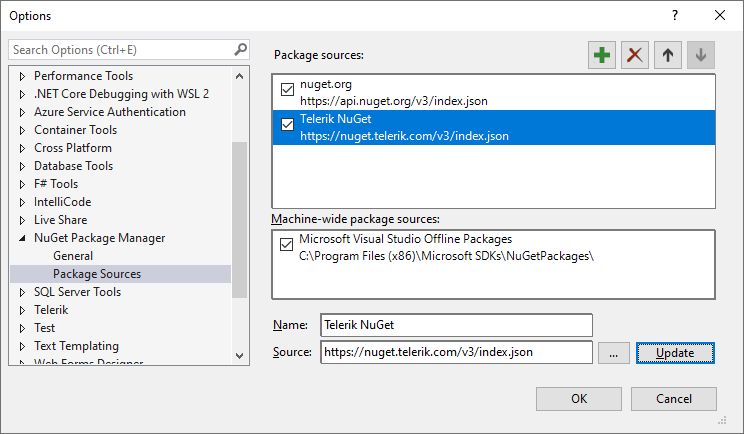
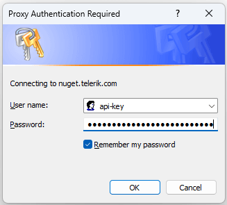
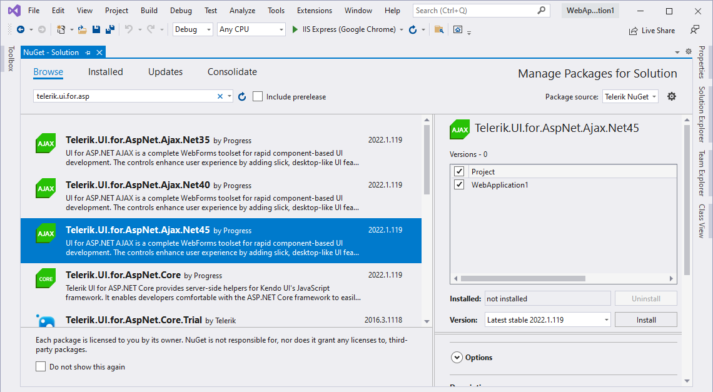
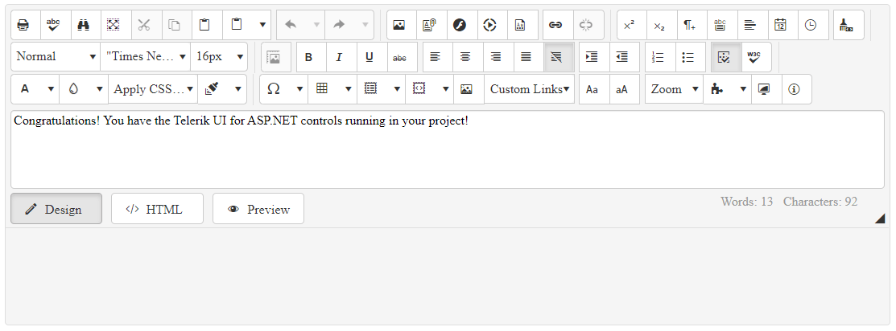
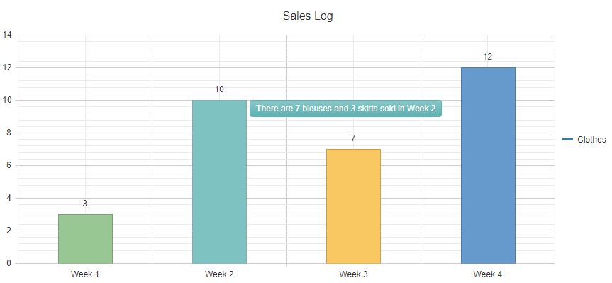
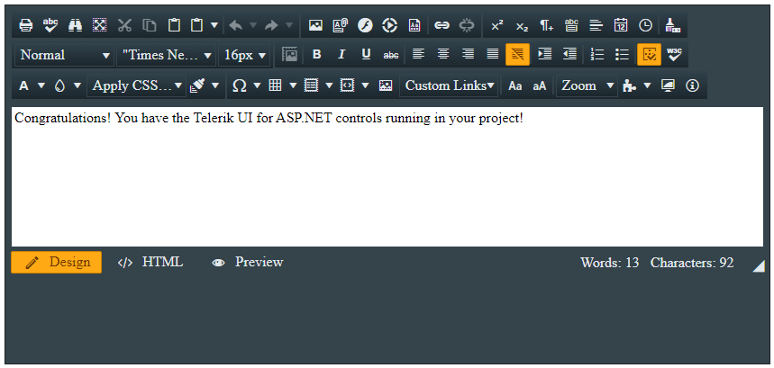

# Installing Telerik UI for ASP.NET AJAX from NuGet Feed


[NuGet](https://www.nuget.org/) is a popular .NET package manager. Progress maintains the Telerik NuGet Feed for registered users and you can include the Telerik UI for ASP.NET AJAX suite in your project as well as update to the latest available version from there. Installing the Telerik UI for ASP.NET AJAX library with NuGet works both for Windows and MacOS machines.

>The [legacy Telerik NuGet server](https://nuget.telerik.com/nuget) is now deprecated. Make sure to switch to the [new Telerik NuGet server](https://nuget.telerik.com/v3/index.json), which is faster, lighter, and reduces the number of requests from your NuGet client.

This tutorial describes how to get up and running with the Telerik UI for ASP.NET AJAX library by downloading and installing the controls with NuGet.

* First, you will add the Telerik NuGet feed to Visual Studio and install the Telerik UI for ASP.NET AJAX library.
* Next, you'll create your ASP.NET AJAX application and add the Editor control to it.
* Then, you will dive deeper by defining the HtmlChart control and binding it to sample data.
* Finally, you will add some styling to the controls.

>tip What about a free Telerik UI onboarding course? Learn how to take advantage of the [Telerik Virtual Classroom](https://learn.telerik.com/learn).

## Prerequisites

The following prerequisites are required for accomplishing the scenario in this tutorial. For more information on the third-party tooling versions supported by Telerik UI for ASP.NET AJAX, refer to the [list with system requirements](https://www.telerik.com/aspnet-ajax/tech-sheets/system-requirements).

1. [Install Visual Studio 2019 or later](https://visualstudio.microsoft.com/downloads/).

1. [Install .NET Framework 4.6.2 or later](https://dotnet.microsoft.com/en-us/download).

1. [Install the ASP.NET Web Forms application](https://docs.microsoft.com/en-us/aspnet/web-forms/) on your development or production machine. ASP.NET Web Forms is available in the .NET 4.0-4.8.1 installations.

1. If a new user, [create a Telerik account](https://www.telerik.com/account/).

## Install Telerik UI for ASP.NET AJAX

- [Step 1: Generate NuGet API Key](#step-1-generate-nuget-api-key)
- [Step 2: Add the Telerik NuGet Feed to Visual Studio](#step-2-add-the-telerik-nuget-feed-to-visual-studio)
- [Step 3: Install Telerik UI for ASP.NET AJAX](#step-3-install-telerik-ui-for-asp-net-ajax)
- [Step 4: Setup Your License Key](#step-4-setup-your-license-key)
- [Step 5: Add the Editor to Your Project](#step-5-add-the-editor-to-your-project)
- [Step 6: Add the HtmlChart to Your Project](#step-6-add-the-htmlchart-to-your-project)
- [Step 7: Style the Controls](#step-7-style-the-controls)

### Step 1: Generate NuGet API Key

As the Telerik NuGet server requires authentication, the first step is to obtain an API key that you will use instead of a password. Using an API key instead of a password is a more secure approach.

1. Go to the [API Keys](https://www.telerik.com/account/downloads/api-keys) page in your Telerik account.
1. Click **Generate New Key +**.
1. In the **Key Note** field, add a note that describes the API key.
1. Click **Generate Key**.
1. Select **Copy and Close**. Once you close the window, you can no longer copy the generated key. For security reasons, the **API Keys** page displays only a portion of the key.
1. Store the generated NuGet API key as you will need it in the next steps. Whenever you need to authenticate your system with the Telerik NuGet server, use `api-key` as the username and your generated API key as the password.

### Step 2: Add the Telerik NuGet Feed to Visual Studio

Adding the Telerik NuGet feed to Visual Studio allows you to quickly install the required Telerik packages to your project.
To configure the Telerik NuGet Feed in Visual Studio:

1. Open Visual Studio and go to **Tools** > **NuGet Package Manager** > **Package Manager Settings**.

1. Select **Package Sources** and then click the **+** button to add a new package source.

1. Enter a **Name** for the new package source, for example, **Telerik NuGet**.

1. Add the `https://nuget.telerik.com/v3/index.json` URL as a **Source**. 

1. Click **Update** and then **OK**. 

	>caption The Visual Studio NuGet package manager and the Telerik NuGet feed

	

### Step 3: Install Telerik UI for ASP.NET AJAX

Now that you have successfully added the Telerik NuGet feed as a package source, you need to authenticate your local NuGet instance, display the available packages, and install Telerik UI for ASP.NET AJAX:

1. Create a new ASP.NET WebForms project or open an existing one.

1. Go to **Tools** > **NuGet Package Manager** > **Manage NuGet Packages for Solution...**.

1. Select the Telerik NuGet **Package source** from the drop-down list on the left.

1. Select the **Browse** tab to see the available packages.

1. Enter your NuGet API key authentication in the Windows Authentication dialog. Use `api-key` as the username and your generated API key as the password.

	>caption Enter your API key authentication to access the Telerik NuGet feed

	

1. Select the desired Telerik UI for ASP.NET AJAX package and click **Install**. To select the correct package version for your project, the .NET version of your project must correspond to the `.Net<version>` portion of the package name. For example, the correct package for `.NET Framework 4.6.2 up to 4.8.1` projects is `Telerik.UI.for.AspNet.Ajax.Net462`.

	>caption Add the Telerik UI for ASP.NET AJAX package to the solution

	
	
	
>note Unlike the Telerik UI for ASP.NET AJAX MSI package installation, the NuGet package does not automatically add the UI components to the Visual Studio toolbox. To add them manually, refer to the article on [adding the Telerik controls to the Visual Studio toolbox]().
>
> Additionally, the NuGet does not install the [Visual Studio Extensions for Telerik® UI for ASP.NET AJAX](), which are valuable tools for WebForms developers working with the Telerik ASP.NET Web Forms components. However, these extensions can be downloaded and installed as a separate product from the [Visual Studio Gallery](https://marketplace.visualstudio.com/items?itemName=TelerikInc.TelerikASPNETAJAXVSExtensions).

### Step 4: Setup Your License Key

>note Starting with **2025 Q1**, Telerik UI for ASP.NET AJAX requires activation through a License Key. The `Telerik.Web.UI.dll` assembly now depends on `Telerik.Licensing.Runtime.dll`, available via NuGet ([https://www.nuget.org/packages/Telerik.Licensing](https://www.nuget.org/packages/Telerik.Licensing)) or the Telerik UI for ASP.NET AJAX installations. Previous versions do not require a license key.

The [Telerik License Key]() article provides detailed instructions and tips on installing and updating your Telerik license key in different scenarios.

### Step 5: Add the Editor to Your Project

The Web Forms Site created through the Telerik project templates includes all basic references and registrations required by the Telerik UI for ASP.NET AJAX controls, including a [ScriptManager control](), which is required by all AJAX controls. That's why you can add the [Editor](https://demos.telerik.com/aspnet-ajax/editor/examples/overview/defaultcs.aspx) to the page in a simple way as demonstrated in this step.

> Alternatively, you can add the Editor to your project by dragging it directly from the VS toolbox. For more information, refer to the article on [adding the Telerik controls to the Visual Studio toolbox]().

1. Open `Default.aspx` and declare `RadEditor` right after `RadScriptManager`:

   ```ASPX
   <telerik:RadScriptManager ID="RadScriptManager1" runat="server"></telerik:RadScriptManager>

   <telerik:RadEditor runat="server" ID="RadEditor1" </telerik:RadEditor>
   ```
1. Set the `RenderMode` and `Content` properties of the Editor:

   ```ASPX
   <telerik:RadScriptManager ID="RadScriptManager1" runat="server"></telerik:RadScriptManager>

   <telerik:RadEditor runat="server" ID="RadEditor1" RenderMode="Lightweight">
       <Content>             
           Congratulations! You have the Telerik UI for ASP.NET controls running in your project!         
       </Content>
   </telerik:RadEditor>
   ```

1. Run your page by pressing `F5`.

>caption Add the Editor to the page


### Step 6: Add the HtmlChart to Your Project

Let's dive a little bit deeper in the configuration of the controls from the UI for ASP.NET AJAX suite. By following the steps below, you will create a data-bound [HtmlChart](). You will also add a handy tooltip that shows the values from a custom data field.

The sample uses a `DataTable`, but you can bind the HtmlChart to a [preferred data source type](). The page already contains a [ScriptManager control](#add-radeditor-to-the-application), so you are ready to declare the HtmlChart right after the Editor control that you added in the previous step:

1. In `Default.aspx`, define an HtmlChart with `ID="RadHtmlChart1"`:

    ```ASPX
    <telerik:RadHtmlChart ID="RadHtmlChart1" runat="server">
    </telerik:RadHtmlChart>
    ```

1. Add a `ChartTitle` to the created HtmlChart:

    ```ASPX
    <telerik:RadHtmlChart ID="RadHtmlChart1" runat="server">
        <ChartTitle Text="Sales Log"></ChartTitle>
    </telerik:RadHtmlChart>
    ```

1. Add `ColumnSeries` to the `PlotArea.Series` collection of the control:

    ```ASPX
    <telerik:RadHtmlChart ID="RadHtmlChart1" runat="server">
        <ChartTitle Text="Sales Log"></ChartTitle>
        <PlotArea>
            <Series>
                <telerik:ColumnSeries Name="Clothes"></telerik:ColumnSeries>
            </Series>
        </PlotArea>
    </telerik:RadHtmlChart>
    ```

1. In the code-behind of the page, create a `GetData()` method. This method returns the sample data that you will bind to the chart:

    ````C#
    private DataTable GetData()
        {
            DataTable dt = new DataTable();

            dt.Columns.Add("labels");
            dt.Columns.Add("values");
            dt.Columns.Add("colors");
            dt.Columns.Add("description");

            dt.Rows.Add("Week 1", 3, "#99C794", " 1 blouse and 2 trousers");
            dt.Rows.Add("Week 2", 10, "#5FB3B3", "7 blouses and 3 skirts");
            dt.Rows.Add("Week 3", 7, "#FAC863", "7 skirts");
            dt.Rows.Add("Week 4", 12, "#6699CC", "5 blouses, 5 trousers and 2 skirts");

            return dt;
        }
    ````
    ````VB
    Private Function GetData() As DataTable
        Dim dt As DataTable = New DataTable()

        dt.Columns.Add("labels")
        dt.Columns.Add("values")
        dt.Columns.Add("colors")
        dt.Columns.Add("description")

        dt.Rows.Add("Week 1", 3, "#99C794", " 1 blouse and 2 trousers")
        dt.Rows.Add("Week 2", 10, "#5FB3B3", "7 blouses and 3 skirts")
        dt.Rows.Add("Week 3", 7, "#FAC863", "7 skirts")
        dt.Rows.Add("Week 4", 12, "#6699CC", "5 blouses, 5 trousers and 2 skirts")

        Return dt
    End Function
    ````

1. Configure the data source of the chart to use the created sample data:

    ````C#
    protected void Page_Load(object sender, EventArgs e)
    {
        if (!IsPostBack)
        {
            RadHtmlChart1.DataSource = GetData();
        }
    }
    ````
    ````VB
    Protected Sub Page_Load(ByVal sender As Object, ByVal e As EventArgs) Handles Me.Load
        If Not IsPostBack Then
            RadHtmlChart1.DataSource = GetData()
        End If
    End Sub
    ````

1. Set the `colors` and `values` field names to the Series `DataFieldY` and `ColorField` properties:

    ```ASPX
    <telerik:RadHtmlChart ID="RadHtmlChart1" runat="server">
        <ChartTitle Text="Sales Log"></ChartTitle>
        <PlotArea>
            <Series>
                <telerik:ColumnSeries Name="Clothes" DataFieldY="values" ColorField="colors"></telerik:ColumnSeries>
            </Series>
        </PlotArea>
    </telerik:RadHtmlChart>
    ```

1. Set the `labels` field name to the `PlotArea.XAxis.DataLabelsField` value:

    ```ASPX
    <telerik:RadHtmlChart ID="RadHtmlChart1" runat="server">
        <ChartTitle Text="Sales Log"></ChartTitle>
        <PlotArea>
            <Series>
                <telerik:ColumnSeries Name="Clothes" DataFieldY="values" ColorField="colors"></telerik:ColumnSeries>
            </Series>
            <XAxis DataLabelsField="labels"></XAxis>
        </PlotArea>
    </telerik:RadHtmlChart>
    ```

1. Define a `TooltipsAppearance` nested tag in the series declaration. Then define a [custom Tooltip template]() in it. All fields from the passed data source are available through the `dataItem` object of the template:

    ```ASPX
    <telerik:RadHtmlChart ID="RadHtmlChart1" runat="server">
        <ChartTitle Text="Sales Log"></ChartTitle>
        <PlotArea>
            <Series>
                <telerik:ColumnSeries Name="Clothes" DataFieldY="values" ColorField="colors">
                    <TooltipsAppearance>
                        <ClientTemplate>
                            There are #=dataItem.description# sold in #=category#
                        </ClientTemplate>
                    </TooltipsAppearance>
                </telerik:ColumnSeries>
            </Series>
            <XAxis DataLabelsField="labels"></XAxis>
        </PlotArea>
    </telerik:RadHtmlChart>
    ```

1. Run the page by pressing `F5`. You are expected to see something similar to the following image:

>caption Bound HtmlChart with a custom Tooltip template


### Step 7: Style the Controls

Telerik UI for ASP.NET AJAX provides more than [20 predefined skins]() that allow you to change the look and feel of each component. To use the desired skin, set the skin name as the `Skin` property value of the control:

```ASPX
<telerik:RadEditor runat="server" ID="RadEditor2" Skin="Glow" RenderMode="Lightweight">
    <Content>             
        Congratulations! You have the Telerik UI for ASP.NET controls running in your project!     
    </Content>
</telerik:RadEditor>
```

>caption Apply the Glow skin to the Editor


That was it! Now you are ready to dive more deeply into Telerik UI for ASP.NET AJAX and take full advantage of its slick functionalities!

## Next Steps

* [System Requirements](https://www.telerik.com/aspnet-ajax/tech-sheets/system-requirements)
* [Included Assemblies]()
* [Adding Telerik ASP.NET AJAX Controls to a Page]()
