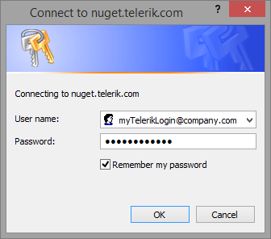

# Installing the Telerik Controls from a NuGet Package

This article explains how to use the NuGet feed and packages provided by Telerik to get the Telerik® UI for ASP.NET AJAX controls in your project.

This feed is available as of Q3 2015 SP1 (ver. 2015.3.1111).

This article contains the following sections:

* [How to use the Telerik NuGet feed in Visual Studio](#telerik-nuget-feed-in-visual-studio)
* [How to download a .nupkg file to create local feeds](#downloading-a-nuget-package)
* [Telerik NuGet feed and automated builds](#automated-builds)
* [Troubleshooting](#troubleshooting)

>caution  **Prerequisite** 
>In order to have the Telerik® UI for ASP.NET AJAX running, you will need to have [ASP.NET AJAX](http://www.asp.net/AJAX/Documentation/Live/InstallingASPNETAJAX.aspx) installed on your development/production machine.

## Telerik NuGet Feed in Visual Studio

Telerik provides a NuGet feed that you can use in Visual Studio by following these steps:

1. Open Visual Studio.

1. Go to **Tools** > **NuGet Package Manager** > **Package Manager Settings**, select **Package Manager Sources** and then click the **+** button to add a feed.

1. Add a feed with the following URL: **https://nuget.telerik.com/nuget** and click **OK**.

	>caption Figure 1: Visual Studio NuGet Package Manager and Telerik NuGet Feed

	

1. Create or load your WebForms project.

1. Go to **Tools** > **NuGet Package Manager** > **Manage NuGet Packages for solution**.

1. Choose the **Online** / **Browse** list of packages (depending on your VS version).

1. Enter your Telerik credentials in the Windows Authentication dialog (e.g., user: *my.name@my.company.com* and password: *myPassPhraseForTelerikDotCom*).

	>tip You can enter your credentials only once by selecting the Remember my password checkbox.

	>caption Figure 2: Enter your Telerik.com credentials to access the Telerik NuGet feed

	

1. Select the Telerik® UI for ASP.NET AJAX package, e.g., **Telerik.UI.for.AspNet.Ajax.Net45**) and click **Install**. The package name is built in the following format: `Telerik.UI.for.AspNet.Ajax.Net<.NET version of your project>` and you should make sure to select the desired Telerik version.

	>tip Search for "telerik.ui.for" to narrow down the list of results and find the package easily.

	>caption Figure 3: Adding the Telerik® UI for ASP.NET AJAX package to the solution

	

## Downloading a NuGet Package

You can download a *.nupkg* file to [build a private feed](http://www.telerik.com/blogs/power-your-projects-with-telerik---now-with-the-convenience-of-nuget) for your company by following the steps below.

>important Such a feed must be private (i.e., not available to the general Internet) and the standard developer-seat [licensing model]() applies (i.e., the developers working with the controls must have active licenses). If you have questions on the licensing scheme, send them to telerik-sales@progress.com.

1. Navigate to [Your Account](https://www.telerik.com/account/).

1. Go to the [Downloads page of UI for ASP.NET AJAX](https://www.telerik.com/account/product-download?product=RCAJAX).

1. Click on the *.nupkg* files you require (e.g., *Telerik.UI.for.AspNet.Ajax.Net45.2016.3.1027.nupkg*) to download them. The file name is built in the following format: `Telerik.UI.for.AspNet.Ajax.Net<.NET version of your project>.<Telerik controls version>.nupkg`.

1. Configure your server and projects to use the feed.

 
## Automated Builds

If you are using the Telerik NuGet feed on an automated build environment, you can provide your own credentials to the build PC so that it can connect to the feed and download the package.

You can read more about adding credentials via the NuGet.config in the following page: [https://docs.microsoft.com/en-us/nuget/schema/nuget-config-file#packagesourcecredentials](https://docs.microsoft.com/en-us/nuget/schema/nuget-config-file#packagesourcecredentials).

You must protect your credentials and ensure they are used only by you and not by other developers, according to the [license-per-developer policy](http://www.telerik.com/purchase/license-agreement/aspnet-ajax). For example, take your encrypted password from your local NuGet.config file and use it on the build PC.

## Troubleshooting

In R1 2018, the `nuget.exe` version we use was updated from `2.8` to `4.3`. This is the executable file used to generate and read the `.nupkg` files.

Due to this update, you may get the error below when using Visual Studio 2012 that uses the NuGet Package Manager version 2.0. The **solution is to upgrade the NuGet Package Manager to version 2.8**.

> The schema version of `'<namespace>'` is incompatible with version 2.0.30625.9003 of NuGet. Please upgrade NuGet to the latest version.

