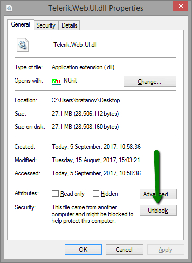

# Troubleshooting Upgrade Issues

This article provides solutions for issues that you may encounter during an upgrade of the Telerik® UI for ASP.NET AJAX controls.

If you have difficulties installing the controls, see the [Installation Troubleshooting]() article.

## Referencing the Telerik Assemblies from the GAC

When referencing assemblies from the GAC, the way those references are added to VS and the way the assemblies are placed in the GAC are slightly different than the common BIN-deployment scenario. For example, you need to add the Telerik assemblies to the GAC manually and use fully qualified assembly names in the [handler registrations in the web.config](). See [Using the Global Assembly Cache]() for more information.

## I Still Get the Old Version

Sometimes the .NET Framework caches the old Telerik.Web.UI.dll and therefore the update may seem to have failed. Try the following to ensure that no caches remain:

* Terminate the IIS process (from the Windows Task Manager) and close Visual Studio.

* Clean up the Temporary ASP.NET Files from *`<sysdrive>:\Windows\Microsoft.NET\Framework[64]\<vernum>\Temporary ASP.NET Files`*.

* Delete your browser cache. For example, these are the steps for IE: Tools -> Internet Options -> Delete Files.

* Clean up the Windows WebSite Cache from *`<sysdrive>:\Users\<UserName>\AppData\Local\Microsoft\WebsiteCache*. The location of this cache may vary depending on the operating system.

* Clean up the Visual Studio Backup from *`<sysdrive>:\Users\<UserName>\Documents\Visual Studio <vsVersion>\Backup Files`*. This location depends on your VS settings and installation.

* Clean up the Project Assemblies cache from *`<sysdrive>:\Users\<UserName>\AppData\Local\Microsoft\Visual Studio\<vsVersion>\ProjectAssemblies`*. The location of this cache may vary depending on the operating system.

## I Still Get the Copyright Message

The Developer versions of the Telerik controls do not throw copyright messages. The following message appears only when the Web Application/Web Site uses the trial version of Telerik.Web.UI.dll:

>Thank you for using the Trial Version of Telerik® UI for ASP.NET AJAX to build more powerful applications faster. [Purchase the Commercial Version now](https://www.telerik.com/purchase/individual/aspnet-ajax.aspx?utm_source=trial&utm_medium=web&utm_campaign=Ajax) to get access to all product updates and the Telerik expert support.

To remove the copyright message:

1. Make sure you have downloaded the fully licensed file from [Your Account](https://www.telerik.com/account/). You will recognize it by the *Dev* abbreviation in the file name, whereas trial version files have *Trial* in the file name.

1. [Upgrade your project manually](#manual-upgrade) to ensure the correct assemblies are referenced.

You can see the file information of a trial version of the Telerik.Web.UI.dll assembly in **Figure 1**. Alternatively, you can see the same information by double-clicking the assembly in Visual Studio and exploring its properties as shown in **Figure 2**.

>caption Figure 1: The Properties dialog of a trial Telerik.Web.UI.dll file shows a "Trial Version" text.

>caption Figure 2: The Properties dialog of a Dev Telerik.Web.UI.dll file in Visual Studio do not have the Trial keyword.

## Newtonsoft.Json is Built by a Higher Version Than the Currently Targeted Framework

If your project runs on .NET 4.0, you may get an error similar to the following:

>The primary reference "**Telerik.Web.UI**, Version=2015.3.930.40, Culture=neutral, PublicKeyToken=121fae78165ba3d4, processorArchitecture=MSIL" **could not be resolved because it has an indirect dependency on the assembly** "**Newtonsoft.Json**, Version=6.0.0.0, Culture=neutral, PublicKeyToken=30ad4fe6b2a6aeed" **which was built against the ".NETFramework,Version=v4.5" framework. This is a higher version than the currently targeted framework ".NETFramework,Version=v4.0"**.

The issue is **caused by** the **Microsoft Windows Azure .NET SDK** as explained by Damien White in his [DLL Hell Strikes Again](http://blogs.visoftinc.com/2014/08/10/dll-hell-strikes-again/) blog post:

>The root cause is with Azure SDK 2.3. The SDK install drops a .NET 4.5-targeted Newtonsoft.Json.dll in the C:\Program Files\Microsoft SDKs\Windows Azure.NET SDK\v2.3\ref folder. Unfortunately, this folder is registered as a global reference folder even for frameworks prior to .NET 4.5.

There are several ways to **fix** the issue:

* If possible for your project, **upgrade to .NET 4.5**.

* **Uninstall** the **Microsoft Windows Azure .NET SDK** if you do not need it.

* Include a **NuGet** package with the proper **Newtonsoft.Json** assembly version in your project so a local reference is used.

* **Remove the Newtonsoft.Json.dll** file **from** the `Program Files\Microsoft SDKs\Windows Azure.NET SDK\v2.3\ref\` folder as suggested in [the workarounds in this item on Microsoft Connect](https://connect.microsoft.com/VisualStudio/feedback/details/850425/windows-azure-vs-tools-breaking-msbuild-for-web-projects).

* According to client reports, in some cases [Cleaning the ASP.NET Temporary Files and the .NET temporary files](https://weblogs.asp.net/psheriff/clean-up-after-visual-studio) resolves the problem as well.

* Add a `bindingRedirect` element to your `web.config` file and use the version you need:

	**web.config**

		<dependentAssembly>
		    <assemblyIdentity name="Newtonsoft.Json" publicKeyToken="30ad4fe6b2a6aeed" />
		    <bindingRedirect oldVersion="1.0.0.0-9.0.0.0" newVersion="9.0.0.0" />
		</dependentAssembly>

	If a binding redirect does not work (e.g., in a build environment), the following approach has been reported by clients to resolve the problem, as seen on the [Could not load file or assembly… NuGet Assembly Redirects](http://blog.myget.org/post/2014/11/27/Could-not-load-file-or-assembly-NuGet-Assembly-Redirects.aspx) blog post:

	1. From any .config file, remove the `<assemblyBinding>` element and its child elements. In other words—strip your app from assembly binding redirects.

	1. Open the Package Manager Console in Visual Studio. This can be done from the View > Other Windows > Package Manager Console.

	1. Execute the following command: `Get-Project -All | Add-BindingRedirect`

## Could Not Load File or Assembly 'Telerik.Web.UI' After Upgrade

The most common error looks like this:

>**Could not load file or assembly** 'Telerik.Web.UI, Version=2013.1.417.40, Culture=neutral, PublicKeyToken=121fae78165ba3d4' or one of its dependencies. **The located assembly's manifest definition does not match the assembly reference**. (Exception from **HRESULT: 0x80131040**)

or

>**Could not load file or assembly** 'Telerik.Web.UI, Version=2013.1.417.40, Culture=neutral, PublicKeyToken=121fae78165ba3d4' or one of its dependencies. **Operation is not supported**. (Exception from **HRESULT: 0x80131515**)

where the Version value is usually the old version you are upgrading from.

The sections below explain how to solve both errors.

### The located assembly's manifest definition does not match the assembly reference HRESULT: 0x80131040

The **HRESULT: 0x80131040** error means that the reference to the Telerik.Web.UI assembly is wrong in the project. Here are several **common reasons for this problem and their solutions**:

* The reference in the Visual Studio project itself points to the old version (e.g., to the installation folder). To resolve this, update the project references to point to the BIN and ensure the correct assemblies are there.

* There is a `Register` directive with a fully qualified assembly name somewhere in your project that points to an old version (e.g., on a master page, or a user control, or in the web.config). There are several ways to fix it:

	* The best resolution is to find and remove the old version reference. It is best to avoid fully qualified assembly names as this facilitates future upgrades. Usually, a `Register` directive should look like this:

		**ASP.NET**

			<%@ Register Assembly="Telerik.Web.UI" Namespace="Telerik.Web.UI" TagPrefix="telerik" %>

	* Update the `Register` directive to match the current version. You will have to repeat this process every time you upgrade.

	* Add a `bindingRedirect` element in your web.config to point all references to the new version. You will need to update it every time you upgrade.

		**web.config**

			<configuration>
				<runtime>
					<dependentAssembly>
					    <assemblyIdentity name="Telerik.Web.UI" publicKeyToken="121fae78165ba3d4" />
					    <bindingRedirect oldVersion="1.0.0.0-2020.1.219.45" newVersion="2020.1.219.45" />
					</dependentAssembly>
				</runtime>
			</configuration>

* There is an explicit reference to a concrete Telerik controls version in another project (e.g., a data access layer, a second web app in the current solution, some custom class or custom controls assembly). In these cases you will need to find the reference and update it.

### Operation is not supported HRESULT: 0x80131515

The **HRESULT: 0x80131515** error usually means that the file was downloaded from the Internet and Windows has blocked it. In such cases you need to simply do the following:

1. In **Windows Explorer**, **right-click** the file.
1. Select **Properties**
1. Click the **Unblock** button.
1. **Clear** the **read-only** attribute.

>caption How to Unblock a file if you get the HRESULT: 0x80131515 error

Note that the Unblock button is a Windows feature and may not be available. In this case, see [Errors caused by the Licenses.licx file](#errors-caused-by-the-licenses.licx-file).

### Errors caused by the Licenses.licx file

Another reason for the **Operation is not supported HRESULT: 0x80131515** and **Exception from HRESULT: 0x80004003 (E_POINTER))** errors may be the licenses.licx file. You can delete its content, save and rebuild the app to fix the error as suggest on: [How to fix License File related errors](https://www.telerik.com/support/kb/aspnet-ajax/details/how-to-fix-license-file-related-errors).

If you experience any troubles with the upgrade process, do not hesitate to ask for assistance in the Telerik Ticketing System or the [AJAX forums](https://www.telerik.com/forums/aspnet-ajax).

## See Also

 * [Which File Do I Need to Install?]()

 * [Included Assemblies]()

 * [web.config Settings Overview]()

 * [DLL Hell Strikes Again Blog Post by Damien White](http://blogs.visoftinc.com/2014/08/10/dll-hell-strikes-again/)
 
 * [How to fix License File related errors](https://www.telerik.com/support/kb/aspnet-ajax/details/how-to-fix-license-file-related-errors)
 