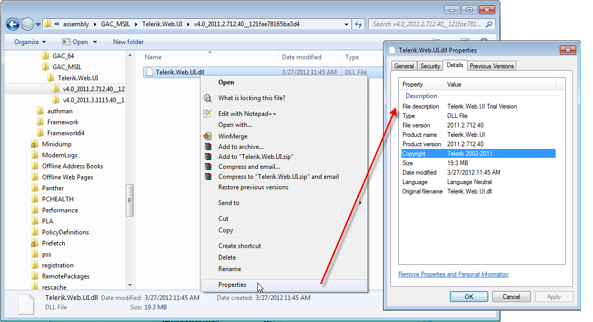
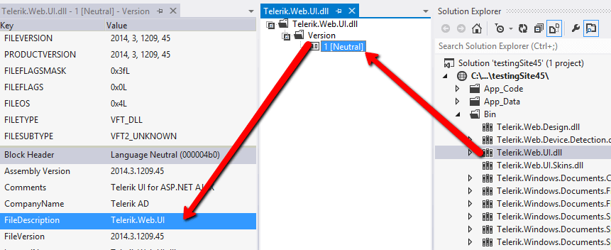

# Upgrading a Trial to a Developer License or to a Newer Version

This article explains how to upgrade the version of the Telerik UI for ASP.NET AJAX control and how to switch from a Trial to a Developer license.

You can find concrete information about your case in the distinct sections of this article:

* [Upgrade to a Newer Version of Telerik UI for ASP.NET AJAX](#upgrade-to-a-newer-version-of-telerik-ui-for-aspnet-ajax)

	* [Automatically](#automatic-upgrade)
	
	* [Manually](#manual-upgrade)

* [Upgrade From Trial to Licensed Version of Telerik UI for ASP.NET AJAX](#upgrade-from-trial-to-licensed-version-of-telerik-ui-for-aspnet-ajax)

* [Upgrading Troubleshooting](#upgrading-troubleshooting)

	* [Installation Issues](#installation-issues)
	
	* [Referencing the Telerik Assemblies from the GAC](#referencing-the-telerik-assemblies-from-the-gac)
	
	* [I Still Get the Old Version](#i-still-get-the-old-version)
	
	* [I Still Get the Copyright Message](#i-still-get-the-copyright-message)
	
	* [Newtonsoft.Json is Built by a Higher Version Than the Currently Targeted Framework](#newtonsoftjson-is-built-by-a-higher-version-than-the-currently-targeted-framework)

	* [Could not load file or assembly 'Telerik.Web.UI' After Upgrade](#could-not-load-file-or-assembly-telerikwebui-after-upgrade)

## Upgrade to a Newer Version of Telerik UI for ASP.NET AJAX

**To upgrade the Telerik controls**, you only need to **replace the [Telerik assemblies]() project references** with their newer versions and update their references. The instructions below assume you have already [installed]() the new version.

There are two ways to perform an upgrade:

### Automatic Upgrade

You can utilize the AJAX VS Extensions wizards:

1. [Automatic Latest Version Retrieval Wizard]()

1. [Upgrade Wizard]()

### Manual Upgrade

You simply need to replace the assembly references with the new ones. Here is a list of steps that ensures a safe upgrade:

1. Backup your project (a simple copy to another folder is usually enough, and using a source control system makes this redundant).

1. **Delete the old Telerik.Web.UI.* references** from the project and close it. This includes the	[Skins and Design assemblies]().

1. **Open the Bin folder** of your project in Windows Explorer and **delete the old Telerik.Web.UI.* assemblies**.

1. **Copy the new assemblies** from the new installation's Bin40 folder (for .NET 4.0; for .NET 3.5 you need Bin35 and Bin45 for .NET 4.5). If you are using a [hotfix](), go to the folder where you unzipped it.

1. **Paste the new assemblies in the Bin folder** of your project in Windows Explorer.

1. **Add references to the Telerik assemblies in the project** in Visual Studio.

1. Make sure you have all the [necessary web.config registrations]()

As with any ASP.NET Project, it is often helpful to clear the ASP Temporary files and the browser cache.

In the same manner (copy and replace), you may also want to upgrade any [other assemblies]() you are using, as well as localization files (~/App_GlobalResources), dialogs (RadImageEditor, RadEditor), [TypeScript definitions](), etc. Make sure to save any modifications you have beforehand to avoid losing your work.

## Upgrade From Trial to Licensed Version of Telerik UI for ASP.NET AJAX

The difference between the trial and licensed version of the Telerik controls is built-in the assemblies themselves. You do not need license keys or activations.

Once you have a licensed package, simply **follow the steps from the [Upgrade to a Newer Version of Telerik UI for ASP.NET AJAX section](#upgrade-to-a-newer-version-of-telerik-ui-for-aspnet-ajax) to delete the trial assemblies and replace them with the developer versions**.

## Upgrading Troubleshooting

### Installation Issues

If you are having difficulties with installing the controls, examine the [Installation Troubleshooting]() article. In the meantime, you can download the [hotfix archive]() and	[upgrade the controls manually](#manual-upgrade).

### Referencing the Telerik Assemblies from the GAC

When referencing assemblies from the GAC, the way those references are added to VS and the way the assemblies are placed in the GAC are slightly different than the common BIN-deployment scenario. For example, you will need to add the Telerik assemblies to the GAC manually and use fully qualified assembly names in the [handler registrations in the web.config](). You can read more about handling assemblies in the GAC and their references in the [Using the Global Assembly Cache]() help article.

### I Still Get the Old Version

Sometimes the .NET Framework caches the old Telerik.Web.UI.dll and therefore the update may seem to have failed. Try the following to ensure that no caches remain:

* Terminate the IIS process (from the Windows Task Manager) and close Visual Studio.

* Clean up the Temporary ASP.NET Files from *`<sysdrive>:\Windows\Microsoft.NET\Framework[64]\<vernum>\Temporary ASP.NET Files`*.

* Delete your browser cache. For example, these are the steps for IE: Tools -> Internet Options -> Delete Files.

* Clean up the Windows WebSite Cache from *`<sysdrive>:\Users\<UserName>\AppData\Local\Microsoft\WebsiteCache*.	The location of this cache may vary from one operating system to the next.

* Clean up the Visual Studio Backup from *`<sysdrive>:\Users\<UserName>\Documents\Visual Studio <vsVersion>\Backup Files`*. This location depends on your VS settings and installation.

* Clean up the Project Assemblies cache from *`<sysdrive>:\Users\<UserName>\AppData\Local\Microsoft\Visual Studio\<vsVersion>\ProjectAssemblies`*. The location of this cache may vary from one operating system to the next.

### I Still Get the Copyright Message

The copyright message appears only when the Web Application/Web Site uses the trial version of Telerik.Web.UI.dll. The Developer versions of Telerik's controls do not throw copyright messages.

To remove it, make sure you have downloaded the proper, Developer "DLL and Scripts only" file. You will recognize it by the *Dev* abbreviation in the file name. You will find more details on determining which dlls are in use in this blog post.

You can see how the file information of a trial version of the Telerik.Web.UI.dll assembly in **Figure 1**. Alternatively, you can see the same information by double-clicking the assembly in VS and exploring its properties as shown in **Figure 2**.
>caption Figure 1: The Properties dialog of a trial Telerik.Web.UI.dll file shows a "Trial Version" text.

>caption Figure 2: The Properties dialog of a Dev Telerik.Web.UI.dll file in Visual Studio do not have the Trial keyword.

### Newtonsoft.Json is Built by a Higher Version Than the Currently Targeted Framework

If your project runs on .NET 4.0, you may get an error similar to the following:

	
>The primary reference "**Telerik.Web.UI**, Version=2015.3.930.40, Culture=neutral, PublicKeyToken=121fae78165ba3d4, processorArchitecture=MSIL" **could not be resolved because it has an indirect dependency on the assembly** "**Newtonsoft.Json**, Version=6.0.0.0, Culture=neutral, PublicKeyToken=30ad4fe6b2a6aeed" **which was built against the ".NETFramework,Version=v4.5" framework. This is a higher version than the currently targeted framework ".NETFramework,Version=v4.0"**.

The issue is **caused by** the **Microsoft Windows Azure .NET SDK** as explained by Damien White in his [DLL Hell Strikes Again](http://blogs.visoftinc.com/2014/08/10/dll-hell-strikes-again/) blog post:

>The root cause is with Azure SDK 2.3. The SDK install drops a .NET 4.5-targeted Newtonsoft.Json.dll in the C:\Program Files\Microsoft SDKs\Windows Azure.NET SDK\v2.3\ref folder. Unfortunately, this folder is registered as a global reference folder even for frameworks prior to .NET 4.5.

There are several ways to **fix** the issue:

* If possible for your project, **upgrade to .NET 4.5**

* **Uninstall** the **Microsoft Windows Azure .NET SDK** if you do not need it

* Inlcude a **NuGet** package for the **Newtonsoft.Json** assembly in your project with the proper version so a local reference is used

* **Remove the Newtonsoft.Json.dll** file **from** the `Program Files\Microsoft SDKs\Windows Azure.NET SDK\v2.3\ref\` folder as suggested in [the workarounds in this item on Microsoft Connect](https://connect.microsoft.com/VisualStudio/feedback/details/850425/windows-azure-vs-tools-breaking-msbuild-for-web-projects).

### Could not load file or assembly 'Telerik.Web.UI' After Upgrade

The most common error looks like this:

>Could not load file or assembly 'Telerik.Web.UI, Version=2013.1.417.40, Culture=neutral, PublicKeyToken=121fae78165ba3d4' or one of its dependencies. The located assembly's manifest definition does not match the assembly reference. (Exception from HRESULT: 0x80131040)

where the Version value is usually the old version you are upgrading from.

It means that the reference to the Telerik.Web.UI assembly is wrong in the project. Here are several **common reasons for this problem and their solutions**:

* The reference in the Visual Studio project itself points to the old version (e.g., to the installation folder). To resolve this, update the project references to point to the BIN and ensure the correct assemblies are there.

* There is a `Register` directive with a fully qualified assembly name somewhere in your project that points to an old version (e.g., on a master page, or a user control, or in the web.config). There are several ways to fix it:

	* The best resolution is to find and remove the old version reference. It is best to avoid fully qualified assembly names as this facilitates future upgrades. Usually, a `Registger` directive should look like this:

		**ASP.NET**

			<%@ Register Assembly="Telerik.Web.UI" Namespace="Telerik.Web.UI" TagPrefix="telerik" %>

	* Update the `Register` directive to match the current version. You will have to repeat this process every time you upgrade.

	* Add a `bindingRedirect` element in your web.config to point all references to the new version. You will need to update it every time you upgrade.

		**web.config**

			<configuration>
				<runtime>
					<dependentAssembly>
					    <assemblyIdentity name="Telerik.Web.UI" publicKeyToken="121fae78165ba3d4" />
					    <bindingRedirect oldVersion="1.0.0.0-2015.3.900.40" newVersion="2015.3.930.40" />
					</dependentAssembly>
				</runtime>
			</configuration>

* There is an explicit reference to a concrete Telerik controls version in another project (e.g., a data access layer, a second web app in the current solution, some custom class or custom controls assembly). In this case you will need to find the reference and update it.

## See Also

 * [Which File Do I Need to Install?]()

 * [Included Assemblies]()

 * [web.config Settings Overview]()

 * [DLL Hell Strikes Again Blog Post by Damien White](http://blogs.visoftinc.com/2014/08/10/dll-hell-strikes-again/)
