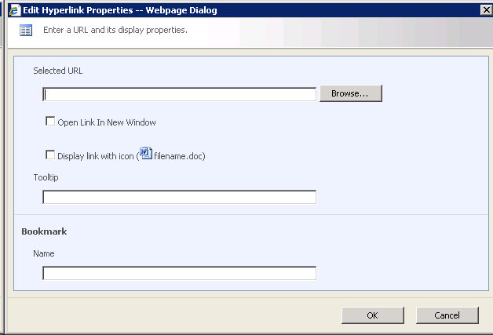
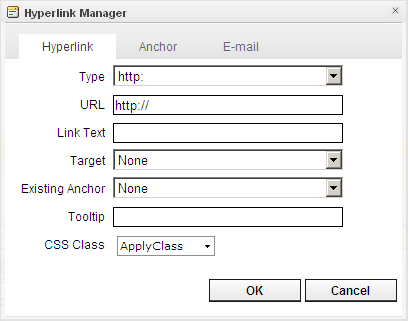

# What is the difference between the internal editor dialogs and MOSS dialogs

The default rich text editor in MOSS 2007 uses the asset picker dialog to insert images and links in the content. Although RadEditor has its own internal dialogs for inserting links and images, it can also use the asset picker from the original rich text editor. You can actually choose whether to use the internal RadEditor dialogs or the asset picker dialog using the editor's tools file.

The asset picker dialog (tool name - MOSSLinkManager)

The built-in RadEditor link dialog (tool name - LinkManager)

Both dialogs have their benefits and drawbacks:

* the asset picker dialog has known compatibility issues with the Firefox browser. Microsoftaddress these problems in the service pack 1 release for MOSS 2007, however some users have reported problems with the Safari browser in MOSS 2007 SP1. If you decide to use this dialog with Firefox, be sure to apply the SP release.

* the asset picker dialog for images does not have thumbnail features (create thumbnail, insert thumbnail with link to original image, etc.)

* the built in editor dialog for inserting links has no "Browse" button, so you cannot navigate the site collection and select a link - all links need to be pasted in the URL field manually.

* the built in editor dialog for inserting images does not include a link to the "Site Collection Images". If you want to include this library, you need to define the folders for the image dialog manually (through the RadEditor configuration file).

Here are the corresponding tool names:
  

|  **Built in dialog**  |  **Asset Picker**  |
| ------ | ------ |
|LinkManager|MOSSLinkManager|
|ImageManager|MOSSImageManager|
