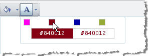

# Colors




The RadEditor **Colors** dropdown displays a predefined set of colors by default and displays for the Font and Fill color drop downs. All colors are held in the **Colors** collection. You can predefine the colors in the Colors collection by modifying the **ToolsFile.xml / ListToolsFile.xml** files, located in the following folder:

_/Program Files/Common Files/Microsoft Shared/web server extensions/wpresources/RadEditorSharePoint/6.x.x.0__1f131a624888eeed/Resources/_

**For example:**

````XML
<root>  
    <tools name="MainToolbar" enabled="true">    
        <tool name="BackColor" />    
        <tool name="ForeColor" />  
    </tools>  
    <colors>   
        <color Title ="My color" value="#FF00EE" />   
        <color value="#840012" />    
        <color value="#0000AA" />    
        <color value="#95AA34" />  
    </colors>
</root>
````


**Here is the default set of colors:**

"","#ffcccc","#ffcc99","#ffff99","#ffffcc","#99ff99","#99ffff","#ccffff","#ccccff","#ffccff","#cccccc","#ff6666","#ff9966",

"#ffff66","#ffff33","#66ff99","#33ffff","#66ffff","#9999ff","#ff99ff","#c0c0c0","#ff0000","#ff9900","#ffcc66","#ffff00",

"#33ff33","#66cccc","#33ccff","#6666cc","#cc66cc","#999999","#cc0000","#FF6600","#FFCC33","#FFCC00","#33CC00",

"#3366FF","#00CCCC","#6633FF","#CC33CC","#666666","#990000","#cc6600","#cc9933","#999900","#009900","#339999",

"#3333ff","#6600cc","#993399","#333333","#660000","#993300","#996633","#666600","#006600","#336666","#000099",

"#333399","#663366","#000000","#330000","#663300","#663333","#333300","#003300","#003333","#000066","#330099","#330033"
