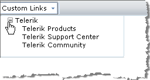

# Custom Links



The RadEditor Custom Links dropdown is a convenient tool for inserting pre-defined hyperlinks. These usually be one of two link types:

* Internal site links (i.e. links to other pages of the web-site). You can preload the Custom Links treeview with the complete structure of your site so that the end-users would just need to select a page from the dropdown (e.g."About-us -> History").

* Frequently used external links (e.g. Google).

Custom links are kept in the **Links** collection. You easily predefine the Links Collection by modifying the **ToolsFile.xml / ListToolsFile.xml** files, located in the following folder:

_/Program Files/Common Files/Microsoft Shared/web server extensions/wpresources/RadEditorSharePoint/6.x.x.0__1f131a624888eeed/Resources/_

**For example:**

````XML
<root>
 <tools name="MainToolbar" enabled="true">
   <tool name="InsertCustomLink" />
 </tools>
 <links>
   <link name="Telerik" href="https://www.telerik.com">
     <link name="Products" href="https://www.telerik.com/products">
       <link name="Telerik® UI for ASP.NET AJAX suite" href="https://www.telerik.com/radcontrols" />
       <link name="Telerik RadNavigation suite" href="https://www.telerik.com/radnavigation" />
       <link name="Telerik RadEditor" href="https://www.telerik.com/radeditor">
         <link name="QSF" href="https://www.telerik.com/Telerik RadEditor"/>
       </link>
     </link>
     <link name="Purchase" href="https://www.telerik.com/purchase" />
     <link name="Support" href="https://www.telerik.com/support" />
     <link name="Client.Net" href="https://www.telerik.com/clientnet" />
   </link>
 </links>
</root>
````


