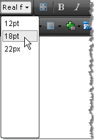

# Real Font Sizes

>caution Telerik Web Parts for SharePoint 2010 last build was R1 2023 SP2 and is discontinued since then.



The Real Font Sizes dropdown displays a predefined set of font sizes in pixels and points. The dropdown is populated from the RealFontSizes Collection. You can predefine the Real Font Sizes in the RealFontSizes Collection by modifying the **ToolsFile.xml / ListToolsFile.xml** files, located in the following folder:

_/Program Files/Common Files/Microsoft Shared/web server extensions/wpresources/RadEditorSharePoint/6.x.x.0__1f131a624888eeed/Resources/_

**For example:**

````XML
<root>  
    <tools name="MainToolbar" enabled="true">    
        <tool name="RealFontSize" />  
    </tools>  
    <realFontSizes>    
        <item value="12pt"></item>    
        <item value="18pt"></item>    
        <item value="22px"></item>  
    </realFontSizes>
</root>
````

