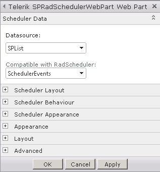
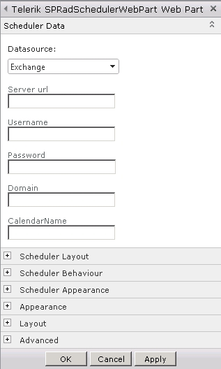
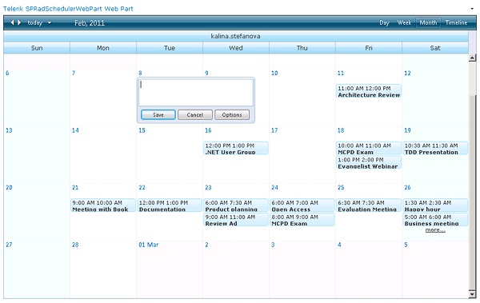

# Displaying and Editing SPRadScheduler Appointments

User can populate the SPRadScheduler with data via two types of data sources: SharePoint List or Exchange Calendar.

If a SPList type of data source has been chosen – the available lists compatible with SPRadScheduler are displayed.

>caution Please note that SPRadScheduler requires a specific sort of data-binding so that it can store and retrieve the information it displays about appointments.In order to be compatible with the scheduler a SPList must include: ID,Title,Start, End, RecurrenceRule, RecurrenceParentID fields for each appointment.

In case the user decides to use an Exchange Calendar to populate the control – they are asked to enter the necessary server URL, domain and credentials.

Upon the selection of a data source the web part will make a post back in order to retrieve the necessary data and display the appointments. Afterwards, the user can insert a new appointment or edit the appointments easily by double-clicking a control cell or using the Context Menu after right-click.

