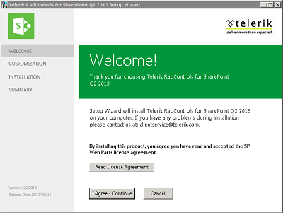
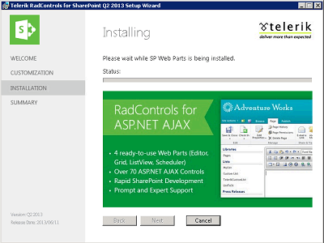
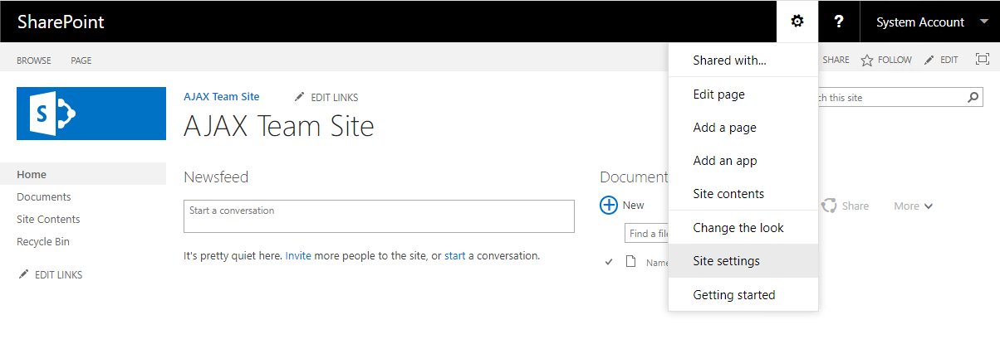
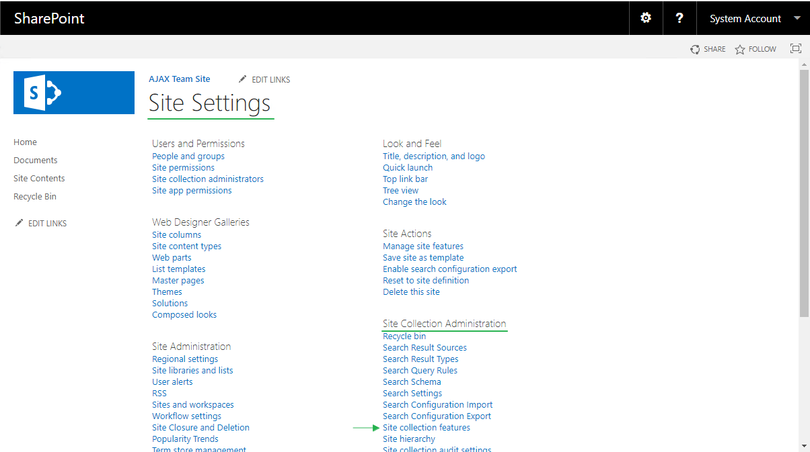
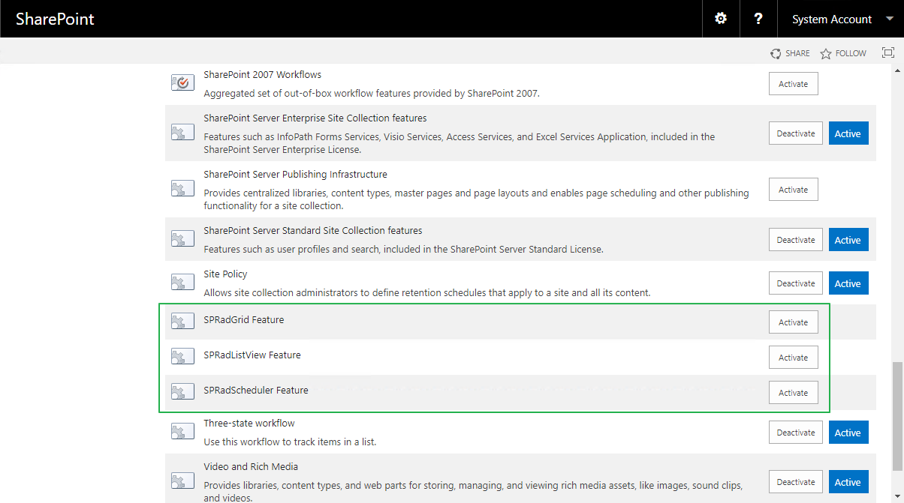

# Installing Telerik Web Parts for SharePoint

Telerik Web Parts for SharePoint 2013 come in a common Windows SharePoint (WSP) solution that contain all the necessary files and deployment information for the Web Parts to be successfully installed on your SharePoint application.

Once downloaded, the package contains the WSP Solution file (.wsp) as well as an MSI Installer. 

The installation can be done in two different ways
- [Automatically](#automatic-installation-upgrade-removal)
- [Manually](#manual-installation-upgrade-removal)

## Automatic Installation, Upgrade, Removal

This process will allow you to install the Telerik Web Part with just a few clicks.

### Install

To Install the Telerik WebParts automatically, run the "Telerik_Web_Parts_For_Sharepoint2013_X_X_X_Dev/Trial.msi" installer.





>important The installer for SharePoint 2013 will only run on Servers that have Microsoft SharePoint 2013 or Microsoft SharePoint 2013 Foundation installed. In order to Deploy Telerik WebParts for SharePoint 2016 and later, deploy the WSP files manually by following the instructions from the [Manual Installation, Upgrade and Removal](#manual-installation-upgrade-and-removal) section.

### Enable

After completing the installation, the Telerik Web Parts are deployed as a site collection features which need to be Activated additionally:
- SPRadGrid
- SpRadListView
- SpRadScheduler

To enable the Telerik Web Parts Features go to **Site settings**



On the Site settings Page, under the **Site Collection Administration** section, go to **Site Collection Features**



On the Site Collection Features Page, find the Telerik RadControls Features and **Activate** them



For additional information about Enabling Features, visit the [Enable publishing features](https://support.office.com/en-us/article/Enable-publishing-features-479677a6-8b33-4ac7-907d-071c1c7e4518).

Verify that the Telerik Web Parts Features are *Enabled*. Go to **Site Settings**, and under the **Site Collections Administration** section go to **Site Collection Features**. On the page, find the Telerik Web Parts features and double-check their status. The **Active** status should be visible next to each feature.


### Upgrade/Remove

Once installed and deployed, the Telerik Web Parts can be easily Upgraded/Removed with the MSI installer. The latter automatically detects if the controls have already been deployed and will give you the option to either Repair (Upgrade) or Remove them.

>important Upgrading the RadControlsSP will update the SafeControl records in the web.config, but not the WebResource handler. 

To complete the upgrade, find the WebResource handler in the `<handlers></handlers>` section in SharePoint's web.config and update the Telerik version

````XML
<handlers>
	<add name="Telerik.Web.UI.WebResource.axd_*" path="Telerik.Web.UI.WebResource.axd" verb="*" type="Telerik.Web.UI.WebResource, Telerik.Web.UI, Version=X.X.X.X, Culture=neutral, PublicKeyToken=121fae78165ba3d4" preCondition="integratedMode" />
</handlers>
````

## Manual Installation, Upgrade, Removal

If MSI installers are not an option, or you want to install the Telerik Web Parts for SharePoint 2016 or later, you can easily do so using a few SharePoint Management Shell cmd-lets.

### Install

````PowerShell
Add-SPSolution -LiteralPath "DriveLetter:\Full\Path\To\RadControlsSP.wsp"
Install-SPSolution -Identity RadControlsSP.wsp -AllWebApplications -GACDeployment -Force
````

### Enable

````PowerShell
Enable-SPFeature TelerikSPRadGridWebPart_SPRadGridFeature -Url "<url of your SP site>"
Enable-SPFeature TelerikSPRadGridWebPart_SPRadListViewFeature -Url "<url of your SP site>"
Enable-SPFeature TelerikSPRadGridWebPart_SPRadSchedulerFeature -Url "<url of your SP site>"
````

Verify that the Telerik Web Parts Features are *Enabled*. Go to **Site Settings**, and under the **Site Collections Administration** section go to **Site Collection Features**. On the page, find the Telerik Web Parts features and double-check their status. The **Active** status should be visible next to each feature.


### Upgrade

````PowerShell
Update-SPSolution –Identity RadControlsSP.wsp –LiteralPath "DriveLetter:\Full\Path\To\New\Version\Of\RadControlsSP.wsp" –GACDeployment
````

>important Upgrading the RadControlsSP will update the SafeControl records in the web.config, but not the WebResource handler. 

To complete the upgrade, find the WebResource handler in the `<handlers></handlers>` section in SharePoint's web.config and update the Telerik version

````XML
<handlers>
	<add name="Telerik.Web.UI.WebResource.axd_*" path="Telerik.Web.UI.WebResource.axd" verb="*" type="Telerik.Web.UI.WebResource, Telerik.Web.UI, Version=X.X.X.X, Culture=neutral, PublicKeyToken=121fae78165ba3d4" preCondition="integratedMode" />
</handlers>
````

### Remove

To remove a Telerik Web Parts Features, disable them first.

````PowerShell
Disable-SPFeature TelerikSPRadGridWebPart_SPRadGridFeature -Url "<url of your SP site>"
Disable-SPFeature TelerikSPRadGridWebPart_SPRadListViewFeature -Url "<url of your SP site>"
Disable-SPFeature TelerikSPRadGridWebPart_SPRadSchedulerFeature -Url "<url of your SP site>"
````

Once disabled, you can uninstall and remove the RadControlsSP.wsp Solution

````PowerShell
Uninstall-SPSolution -Identity RadControlsSP.wsp –AllWebApplications
Remove-SPSolution -Identity RadControlsSP.wsp
````

## Behind the scenes

>note Whether installing Automatically or Manually, behind the scene this process runs the SharePoint PowerShell deployment commands that automatically deploy the necessary dlls to the **GAC**, register the corresponding assemblies as **SafeControls**, add the required WebResource **handler** and add the solution to the SharePoint application. 

During the installation:

- the following Assemblies are deployed to the GAC:
  - Telerik.Web.UI.dll
  - Telerik.Ajax.SharePoint.dll
  - RadEditorSharePoint.dll

- the following entries are added to the `<SafeControls></SafeControls>` section of the SharePoint's web.config file:

````XML
<SafeControl Assembly="Telerik.Web.UI, Version=X.X.X.X, Culture=neutral, PublicKeyToken=121fae78165ba3d4" Namespace="Telerik.Web.UI" TypeName="*" Safe="True" />
<SafeControl Assembly="Telerik.Web.UI, Version=X.X.X.X, Culture=neutral, PublicKeyToken=121fae78165ba3d4" Namespace="Telerik.Web.UI.Editor" TypeName="*" Safe="True" />
<SafeControl Assembly="Telerik.Web.UI, Version=X.X.X.X, Culture=neutral, PublicKeyToken=121fae78165ba3d4" Namespace="Telerik.Web.UI.Widgets" TypeName="*" Safe="True" />
<SafeControl Assembly="Telerik.Web.UI, Version=X.X.X.X, Culture=neutral, PublicKeyToken=121fae78165ba3d4" Namespace="Telerik.Web.Design" TypeName="*" Safe="True" />
<SafeControl Assembly="Telerik.Web.UI.Skins, Version=X.X.X.X, Culture=neutral, PublicKeyToken=121fae78165ba3d4" Namespace="Telerik.Web.UI" TypeName="*" Safe="True" />
<SafeControl Assembly="RadEditorSharePoint, Version=6.0.0.0, Culture=neutral, PublicKeyToken=1f131a624888eeed" Namespace="Telerik.SharePoint" TypeName="*" Safe="True" />
<SafeControl Assembly="RadEditorSharePoint, Version=6.0.0.0, Culture=neutral, PublicKeyToken=1f131a624888eeed" Namespace="Telerik.SharePoint.FieldEditor" TypeName="*" Safe="True" />
<SafeControl Assembly="Telerik.Ajax.SharePoint, Version=X.X.X.X, Culture=neutral, PublicKeyToken=aa9e5f693af67c7b" Namespace="Telerik.Ajax.SharePoint" TypeName="*" Safe="True" />
````

- the following entry is added to the `<handlers></handlers>` section of the SharePoint's web.config file:

````XML
<add name="Telerik.Web.UI.WebResource.axd_*" path="Telerik.Web.UI.WebResource.axd" verb="*" type="Telerik.Web.UI.WebResource, Telerik.Web.UI, Version=X.X.X.X, Culture=neutral, PublicKeyToken=121fae78165ba3d4" preCondition="integratedMode" />
````
 
