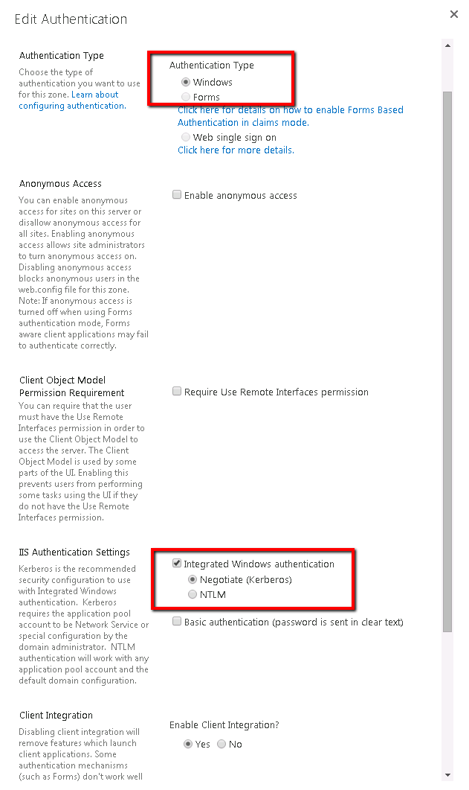
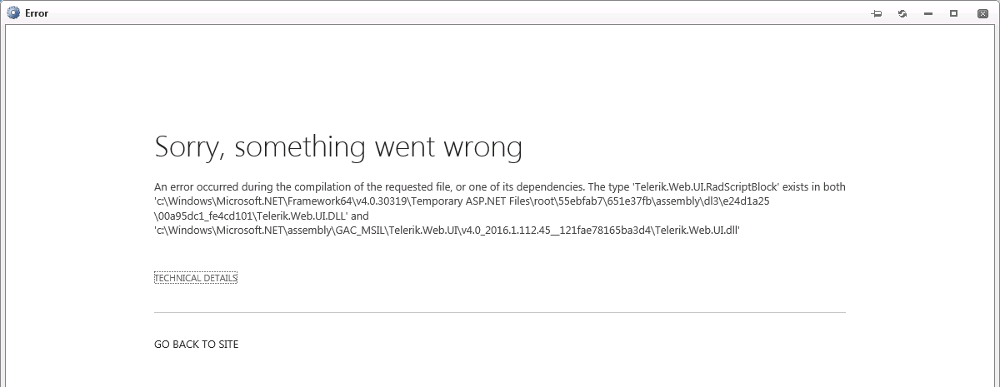

# WebPart Designer Troubleshooting


## Error HTTP 403 Forbidden

If you see this error in **SharePoint 2013** make sure that the settings in your environment match the settings below.


* Make sure that **Forms Authentication** is disabled on application level. The IIS settings in this case should look like the following:


* Disable **ClaimsBasedAuthentication** as shown in the code snippet below in PowerShell. 
    ````PowerShell
$webApp = Get-SPWebApplication "http://webapplicationurl"
$webApp.UseClaimsAuthentication = 0;
$webApp.Update()
````


    After the code executes then **Authentication Type** should be set to **Windows**. You can verify this by opening **Central Administration** -> **Application Management** -> **Manage web applications** select the **Sharepoint-80** main application and click on **Authentication Providers**. It should say **Default - Windows** as shown below: 
    
    


* Ensure that the **Negotiate (Kerberos)** option is selected for **Integrated Windows Authentication**.

    


* Check the **web.config** file in (C:\inetpub\wwwroot\wss\VirtualDirectories\80) and make sure it has the following settings there. Note that **authentication** mode is set to **Windows**.  
````XML
<system.web>
    <httpHandlers />
    <customErrors mode="Off" />
    <httpRuntime maxRequestLength="51200" requestValidationMode="2.0" />
    <authentication mode="Windows">
      <forms loginUrl="/_login/default.aspx" />
    </authentication>
    <identity impersonate="true" />
    <authorization>
      <allow users="*" />
    </authorization>
    <httpModules>
    </httpModules>
	
	. . .
	
</system.web>
````


* Ensure that the correct version of Telerik assemblies is referenced in the **web.config** 

* Make sure that the IIS worker processes have full access to the **GridWebPartDesigner.aspx** and **gridbindingservice.svc** files.


* Restart IIS and browser and try loading the designer again


## Other issues


Below you can see suggestions that can help resolve other common issues with the WebPart Designer.


* Use the .msi installer to install the controls. This way any additional resources that are required by the designer will be added automatically

* If you are using Internet Explorer, ensure that **Compatibility Mode** is **Disabled**

* Ensure that only **one version** of the **Telerik.Web.UI** assembly is referenced throughout the whole Sharepoint application. Also in **GAC**, **IIS Sharepoint Bin**(*C:\inetpub\wwwroot\wss\VirtualDirectories\80*) folder and the **web.config**

* If you are adding **RadGrid** or **RadListView** controls open the *C:\Program Files\Common Files\Microsoft Shared\Web Server Extensions\15\TEMPLATE\LAYOUTS\Telerik.Ajax.SharePoint* folder and ensure that the correct version is referenced in the **GridWebPartDesigner.aspx** / **ListViewWebPartDesigner.aspx** files

* Open the *C:\Program Files\Common Files\Microsoft Shared\Web Server Extensions\15\ISAPI\Telerik.Ajax.SharePoint* folder and ensure that the correct version of the controls is referenced in the **gridbindingservice.svc** file

* Check the **vti_bin** folder in the Sharepoint IIS web site and confirm that it has anonymous authentication enabled  


* After the designer is opened check the browser console and the Sharepoint logs for any errors

* Inspect the HTML content of the designer and ensure that all inner controls are loaded as expected

* Examine the files in the *C:\Program Files\Common Files\Microsoft Shared\Web Server Extensions\15\TEMPLATE\LAYOUTS\Telerik.Ajax.SharePoint* folder and ensure that the correct version of the **Telerik.Web.UI.dll** is registered

* Ensure that the Sharepoint administrator and the IIS processes have permission to access the **SPRadGridWebPartDesignerService.asmx** file located in the *C:\Program Files\Common Files\Microsoft Shared\Web Server Extensions\15\ISAPI* folder

* Enable Network traffic capturing in the browser console and check it the requests made to the server are successful when opening the designer

* Disable Forms Authentication in the IIS settings of the current Sharepoint site

* If you are seeing the following error make sure that **Telerik.Web.UI.dll** is present only in one of the folders (either GAC or the Bin folder)



