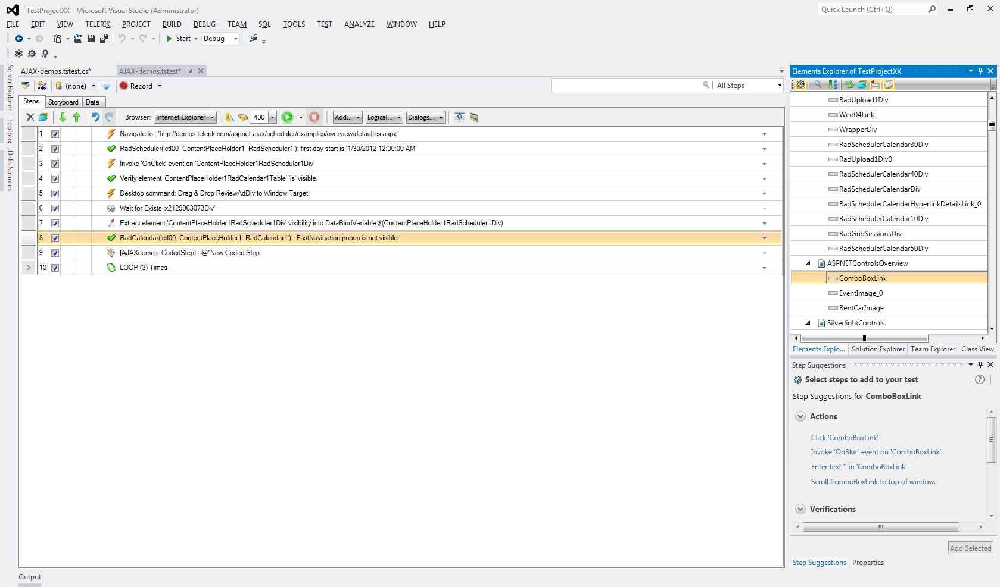

# Overview 

Test Studio's plugin for Visual Studio enables developers and testers comfortable writing code to work in the environment where they're most productive. Telerik's testing plugin features a robust built-in recorder that outputs functional tests in code, which you can directly customize or extend in Visual Studio. [Build tests](https://docs.telerik.com/devtools/teststudiodev/quickstart) for advanced AJAX-powered applications - test dynamic pages, AJAX requests and operations, JavaScript calls and more.

>caption A screenshot of a Test Studio UI sample test:

Highlights:

* [Cross-browser testing](https://docs.telerik.com/devtools/teststudiodev/features/test-execution/quick-execution)

* [Continuous integration with Build Server](https://docs.telerik.com/teststudio/advanced-topics/build-server/azure-devops)

* Robust recorder that outputs tests as C# or VB.NET code

* Built-in rich testing framework

* Source control system integration

* Generate Test Studio tests for nUnit, MbUnit, xUnit or MSUnit

* [Native support for testing controls from the Telerik® UI for ASP.NET AJAX]()

* Standalone app for QAs that's compatible with the Visual Studio plugin

## See Also

 * [Visual Studio plugin](https://www.telerik.com/teststudio/visual-studio-testing-plugin-benefits)

 * [Testing AJAX applications with Test Studio](https://www.telerik.com/teststudio/ajax-testing)

 * [Download a free 30-day trial](https://www.telerik.com/download/teststudio)
