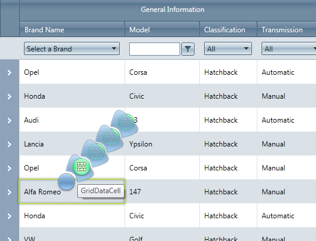
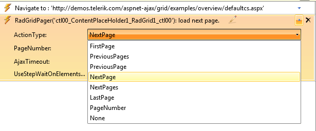
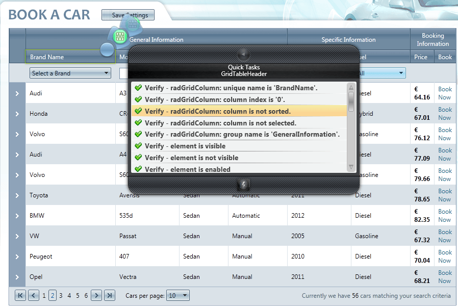

# Test Studio Translators for Telerik® UI for ASP.NET AJAX 

## Overview

The party that best understands the internals of a component is the party that built it. Telerik Test Studio Translators are extensions that expose internal elements and properties of Telerik controls for automation and verification by Test Studio. First, the translator displays the different elements of the control using Test Studio Hover-Over Highlighting. Selecting one of these elements allows automating against that element from the [Elements Menu](https://docs.telerik.com/teststudio/features/recorder/overview) and [Elements Explorer](https://docs.telerik.com/teststudio/features/elements-explorer/overview). These tools will expose special properties and actions of these elements of the control, so that tests can take full advantage of the power of Telerik controls.

* Test Studio includes translators for the full set of Telerik controls, including RadGrid, RadCombobox, and RadInput controls

* Test Studio was built with extensibility in mind, so as additional controls become available, new translators can be plugged in

* Telerik is committed to maintaining translators in step with Telerik controls changes, so you can expect the translators to always be up-to-date

## Using Telerik controls Translators

As your mouse hovers over the Telerik controls in the Test Studio recording browser, a blue nub will fan out with one or more flippers to indicate progressively more specific translators.

As you mouse over these flippers, colored borders appear around a translated element, indicating how elements are contained within one another. The translators for a RadGrid cell are shown in this example. The nubs, from left to right, represent:

* Base Element

* GridDataCell

* GridDataItem

* GridTableView

* RadGrid

As the mouse passes over translated elements, tooltip text appears with the identity of a specific element.The light green highlighting shows the shape of that element’s container.

Clicking one of these flippers opens the Elements Menu for the translated element. Clicking the [Quick Tasks](https://docs.telerik.com/teststudio/features/recorder/verifications/quick-verification) option displays common tasks for the specific element. The screenshot below shows verification and wait tasks for a particular grid cell. This allows a level of transparency and detail custom-fit to this control.

Telerik controls translators have a base group of intrinsic translators that are used whenever a more specific translator is not available.These translators are listed in the Test Studio [Project Settings](https://docs.telerik.com/teststudio/features/project-settings/translators) dialog.

## The Translator Advantage

Test Studio translators allow more control and flexibility in testing Telerik® UI for ASP.NET AJAX, and make testing these controls faster and easier. Because the translator exposes variables and actions specific to the control, you can save time in building verifications and reduce the number of steps to automate complex actions. For example, clicking the ‘Next Page’ button on a RadGrid records a special ‘load next page’ step. If you want to alter this step to load a different page, you can do so from a menu in the Steps Pane.

You can also perform verifications against properties that are not reflected directly in the DOM, like whether or not the RadGrid contents are sorted by a particular column.

These are just two of the many scenarios where translators make testing controls easier. Using [Telerik® UI for ASP.NET AJAX translators for Test Studio](https://docs.telerik.com/teststudio/getting-started/test-recording/translators), you can gain more control over actions and verifications while spending less time building and maintaining your tests.
