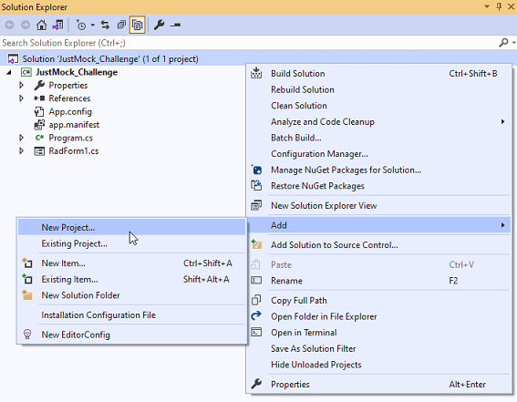
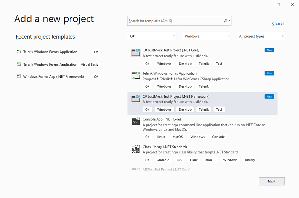
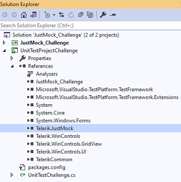
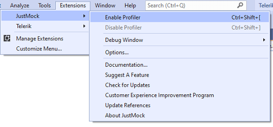

# Unit Testing with JustMock

[Telerik JustMock is an easy to use tool](https://www.telerik.com/products/mocking.aspx) designed to help you create better unit tests, faster than ever. JustMock makes it easier for you to create mock objects and set expectations independently of external dependencies like databases, web service calls, or proprietary code.

To read more please visit the [documentation of product](https://docs.telerik.com/devtools/justmock/introduction).

## What Is Mocking and Why Do I Need It?

Mocking is a concept in unit testing where real objects are substituted with fake objects that simulate the behavior of the real ones. That way a test can focus on the code being tested and not on the behavior or state of external dependencies.

Here is a good example of where you could use mocking:

If you have a data repository class that runs business logic and then saves information to a database, you want your unit test to focus on the business logic and not on the database. Mocking the “save” calls to your database ensures your tests run quickly and do not depend on the availability or state of your database. When you’re ready to make sure the “save” calls are working, then you’re moving on to integration testing. Unit tests should not cross system boundaries, but integration tests are allowed to cross boundaries and make sure everything works together (your code, your database, your web services, etc.).

## How is JustMock Useful for Me?

You could create and maintain the mock objects by yourself, but this is time consuming and unproductive approach. Telerik JustMock allows you to focus on the logic that matters and needs to be verified and lets you forget about the details. The mock objects will be created automatically in memory when the tests run based on few lines of code in the unit test. There are no “physical” mock objects that have to be maintained as your project changes.

## What Can Be Mocked?

JustMock allows you to mock literally everything from `interfaces`, `virtual` and `abstract methods` and `properties` to `sealed classes`, `non-virtual methods` and `properties`, `static` (`classes`, `methods` and `properties`), `extension methods`,  `LINQ queries`, `Delegates`, `Generics`, `Local Functions`, `Database calls`, even members from `mscorlib` like `DateTime`, `File`, `FileInfo`, and many more. All these can be mocked without a single change of your production code.

For the full list of what is supported please visit the [Telerik JustMock](https://www.telerik.com/products/mocking.aspx) product overview page.

## How Can I Use JustMock in ASP.NET AJAX application?

As you are already guessing, JustMock is especially useful when unit testing your business logic. When it comes to testing a WebForms applications things can get quite tricky and framework-specific. Yet, the framework has been out there for pretty long time therefore a lot of information can be found about the specifics in testing such an application.

In this article we will demonstrate how you can leverage a couple of JustMock functionalities to unit test pieces of the server-side logic of your ASP.NET AJAX application.

For the purpose of this article we will use one of the most popular Telerik Ajax controls - the [RadGrid](https://demos.telerik.com/aspnet-ajax/grid/examples/overview/defaultcs.aspx).

To make the tests clear and straightforward we will separate the concerns in advance and we will use a [programmatically generated RadGrid]() with and a helper class that holds all our custom server-side logic. 

Here is how our setup would look like:

`GridHelper.cs` - external class holding all the logic for generating the RadGrid and its further processing

````C#
public class GridHelper
{
    private RadGrid _grid;
    public RadGrid Grid
    {
        get
        {
            if (_grid == null)
            {
                this.GenerateGridStructure();
            }
            return _grid;
        }
        private set { _grid = value; }
    }

    public void GenerateGridStructure()
    {
        var grid = new RadGrid();
        grid.ID = "RadGrid1";
        grid.Skin = "Vista";
        grid.Width = Unit.Percentage(100);
        grid.PageSize = 15;
        grid.AllowPaging = true;
        grid.PagerStyle.Mode = GridPagerMode.NextPrevAndNumeric;
        grid.AutoGenerateColumns = false;
        grid.AllowMultiRowSelection = true;
        //Add table  
        grid.MasterTableView.Width = Unit.Percentage(100);
        grid.MasterTableView.DataKeyNames = new string[] { "OrderID" };

        GridBoundColumn boundColumn = new GridBoundColumn();
        boundColumn.DataField = "OrderID";
        boundColumn.HeaderText = "Order ID";
        grid.MasterTableView.Columns.Add(boundColumn);

        GridDateTimeColumn dateTimeColumn = new GridDateTimeColumn();
        dateTimeColumn.DataField = "OrderDate";
        dateTimeColumn.HeaderText = "Order Date";
        dateTimeColumn.DataFormatString = "{0:d}";
        grid.MasterTableView.Columns.Add(dateTimeColumn);

        GridNumericColumn numericColumn = new GridNumericColumn();
        numericColumn.DataField = "Freight";
        numericColumn.HeaderText = "Freight";
        grid.MasterTableView.Columns.Add(numericColumn);

        boundColumn = new GridBoundColumn();
        boundColumn.DataField = "ShipName";
        boundColumn.HeaderText = "Ship Name";
        grid.MasterTableView.Columns.Add(boundColumn);

        boundColumn = new GridBoundColumn();
        boundColumn.DataField = "ShipCountry";
        boundColumn.HeaderText = "Ship Country";
        grid.MasterTableView.Columns.Add(boundColumn);

        this.Grid = grid;
    }

    //method for executing data binding logic
    public void ExecuteGridNeedDataSource()
    {
        Grid.DataSource = GetData();
    }

    //get sample data
    public DataTable GetData()
    {
        DataTable dt = new DataTable();

        dt.Columns.Add(new DataColumn("OrderID", typeof(int)));
        dt.Columns.Add(new DataColumn("OrderDate", typeof(DateTime)));
        dt.Columns.Add(new DataColumn("Freight", typeof(decimal)));
        dt.Columns.Add(new DataColumn("ShipName", typeof(string)));
        dt.Columns.Add(new DataColumn("ShipCountry", typeof(string)));

        dt.PrimaryKey = new DataColumn[] { dt.Columns["OrderID"] };

        var today = DateTime.Now;

        dt.Rows.Add(10248, today.AddDays(-9), 32.38, "Vinsetalcools Chevalier", "France");
        dt.Rows.Add(10249, today.AddDays(-8), 11.61, "Toms Spezialitäten", "Germany");
        dt.Rows.Add(10250, today.AddDays(-7), 65.83, "Hanari Carnes", "Brazil");
        dt.Rows.Add(10251, today.AddDays(-6), 41.34, "Victuailles en stock", "France");
        dt.Rows.Add(10252, today.AddDays(-5), 51.30, "Suprêmes délices", "Belgium");
        dt.Rows.Add(10253, today.AddDays(-4), 58.17, "Hanari Carnes", "Brazil");
        dt.Rows.Add(10254, today.AddDays(-3), 22.98, "Chop-suey Chinese", "Switzerland");
        dt.Rows.Add(10255, today.AddDays(-2), 148.33, "Richter Supermarkt", "Switzerland");
        dt.Rows.Add(10256, today.AddDays(-1), 13.97, "Wellington Importadora", "Brazil");
        dt.Rows.Add(10257, today, 81.91, "HILARION-Abastos", "Venezuela");

        return dt;
    }

    //method for executing custom logic in RadGrid's PreRender event
    public void ExecuteGridPreRender()
    {
        SelectExpiringOrdersByShipCountry("Brazil");
    }

    public void SelectExpiringOrdersByShipCountry(string shipCountry)
    {
        foreach (GridDataItem item in Grid.Items)
        {
            if (item["ShipCountry"].Text == shipCountry)
            {
                if (IsOrderExpiring(item))
                    item.Selected = true;
            }
        }
    }

    public bool IsOrderExpiring(GridDataItem item)
    {
        bool isExpiring = false;
        if (DateTime.Now.Date - DateTime.Parse(item["OrderDate"].Text.ToString()).Date >= new TimeSpan(3, 0, 0, 0))
        {
            isExpiring = true;
        }
        return isExpiring;
    }
}
````

`Default.aspx` - ASPX page containing the RadGrid and using the logic that we will test

````ASPX
<telerik:RadScriptManager ID="RadScriptManager1" runat="server"></telerik:RadScriptManager>
<asp:Label ID="Label1" runat="server" />
<asp:PlaceHolder ID="PlaceHolder1" runat="server" />
````
````C#
GridHelper gridHelper;
protected void Page_Init(object sender, EventArgs e)
{
    gridHelper = new GridHelper();
    var grid = gridHelper.Grid;
    grid.NeedDataSource += Grid_NeedDataSource;
    grid.PreRender += Grid_PreRender;

    PlaceHolder1.Controls.Add(grid);

    Label1.Text = $"Orders made on {DateTime.Now.AddDays(-3).ToShortDateString()} and earlier are considered as expiring";
}

private void Grid_PreRender(object sender, EventArgs e)
{
    gridHelper.ExecuteGridPreRender();
}

private void Grid_NeedDataSource(object sender, GridNeedDataSourceEventArgs e)
{
    gridHelper.ExecuteGridNeedDataSource();
}
````

And here is the result rendered in the Browser:


The above code includes binding a RadGrid to a DataTable. The public method GetData is used to produce random Orders data that will be used for RadGrid.DataSource. It is not important what is the actual implementation of the method itself and how the data is obtained. It can connect to a database, selects a query, fill a DataTable or read a file to populate a list. On the other hand, the `SelectExpiringOrdersByShipCountry` method accepts a string parameter representing a country name and selects rows in the grid where the Order is addressed to the specific country. In addition, show more of the JustMock features we have added the `IsOrderExpiring` method which we use to add a condition for the selected items based on the OrderDate of each order. In short all Orders to the specified country that are ordered more than 3 days ago (considered as expiring) will be selected in the RadGrid 

For the purpose of the unit testing, you don't want to bother about the data and consume time for preparing appropriate dummy data. You just need a grid filled with data and focus on the logic you have to test, e.g. check whether the correct rows will be selected after calling the `SelectExpiringOrdersByShipCountry` method. Here comes the benefit of JustMock.

## JustMock Integration in your ASP.NET AJAX Project

It is possible either to create a brand new JustMock Test Project or add a reference of Telerik.JustMock.Dll to an existing unit test project: Add Telerik JustMock to Your Test Project

 * Add a JustMock Test Project

 
 

 * Add a reference of Telerik.JustMock.Dll to the existing unit test project

 


 Then, make sure that the profiler is enabled:

 * JustMock Profiler

 


## Mocking

The `GetData` method returns random data representing DataTable with Orders where each order has a predefined ShipCountry and date of ordering. We want to test whether the `SelectExpiringOrdersByShipCountry` method will select the correct number of rows in **RadGrid** passing a specific Country name, e.g. select all expiring orders addressed to "Switzerland". Since we don't know what data will be returned from the `GetData` method, we don't know how many are the expiring orders that should arrive in Switzerland. So we are dependent on several things from the original code:

 - DataSource - this dependency can be eliminated by forcing the `GetData` method to return a predefined DataTable where you will know exactly how many Orders to Switzerland are in the grid. The OrderDate of each order will let us know which of the orders are expiring.

 - Parameter passed to the `SelectExpiringOrdersByShipCountry` method - in the project we test the `SelectExpiringOrdersByShipCountry` method is called with parameter "Brazil", in a real-life scenario this parameter could be a choice of the user (e.g. selection in a DropDownList) or a result of some other custom logic. Yet, we can eliminate the dependency of this parameter by mocking the method where the call to `SelectExpiringOrdersByShipCountry` is done and replace it with a call to `SelectExpiringOrdersByShipCountry` where we pass a certain ShipCountry, e.g: SelectExpiringOrdersByShipCountry("Switzerland"). This we can achieve with the help of the **[DoInstead() method](https://docs.telerik.com/devtools/justmock/basic-usage/mock/do-instead)**.

 - Result of `IsOrderExpiring()` method - this method contain its own piece of logic and we would like to remove the dependency to its result in our test. So we can mock the result of this method to test only the effect of `SelectExpiringOrdersByShipCountry` method. This can be achieved by using the **[FutureMocking with JustMock](https://docs.telerik.com/devtools/justmock/advanced-usage/future-mocking)**. In addition, we can create one test where test the `SelectExpiringOrdersByShipCountry` without the dependency on `IsOrderExpiring()`, and one test where we keep the original call to `IsOrderExpiring` so we can test its impact on the end results.

>note As we will create two tests in the same test class, we can isolate the common logic for both of them in a [TestInitialize method](https://docs.microsoft.com/en-us/previous-versions/visualstudio/visual-studio-2010/ms245572(v=vs.100)).

 To make our test code clear and readable we will follow the [Arrange/Act/Assert](https://docs.telerik.com/devtools/justmock/basic-usage/arrange-act-assert) (AAA) pattern for arranging and formatting code in Unit Test methods.

Here is how our Test set-up would look like:

````C#
[TestClass]
public class JustMockTestSelecting
{

    private Telerik.Web.UI.RadGrid radGrid;
    private GridHelper gridHelper;

    [TestInitialize]
    public void MyTestInitialize()
    {
        gridHelper = new GridHelper();
        this.radGrid = gridHelper.Grid;

        this.radGrid.NeedDataSource += RadGrid1_NeedDataSource;
        this.radGrid.PreRender += RadGrid1_PreRender;
    }


    [TestMethod]
    public void SelectExpiringOrdersByShipCountryTest()
    {
        //Arrange

        //DataSource mocking
        //  Replace the real DataSource with dummy test data
        DataTable testData = GetTestData();
        Mock.Arrange(() => gridHelper.GetData()).IgnoreInstance().Returns(testData);

        //Method mocking with DoInstead()
        //  Replace the actual implementation of ExecuteGridPreRender with mocked one 
        //  to ensure selecting specific country for the test
        Mock.Arrange(() => gridHelper.ExecuteGridPreRender())
            .DoInstead(() => { gridHelper.SelectExpiringOrdersByShipCountry("Switzerland"); });

        //Act

        //Rebind the RadGrid to raise the NeedDataSource event
        this.radGrid.Rebind();
        //Simulate triggering RadGrid's PreRender event by explicitly invoking the event handler method
        RadGrid1_PreRender(this.radGrid, new EventArgs());

        //Assert
        Assert.AreEqual(1, this.radGrid.SelectedItems.Count);
    }


    [TestMethod]
    public void SelectExpiringOrdersByShipCountryIgnoringIsOrderExpiringTest()
    {
        //Arrange

        //DataSource mocking
        //  Replace the real DataSource with dummy test data
        DataTable testData = GetTestData();
        Mock.Arrange(() => gridHelper.GetData()).IgnoreInstance().Returns(testData);

        //Method mocking with DoInstead()
        //  Replace the actual implementation of ExecuteGridPreRender with mocked one
        //  to ensure selecting specific country for the test
        Mock.Arrange(() => gridHelper.ExecuteGridPreRender())
            .DoInstead(() => { gridHelper.SelectExpiringOrdersByShipCountry("Switzerland"); });

        //Future Mocking of Methods that Depend on Other Methods
        //  Mock the IsOrderExpiring method to ensure all orders are considered as expiring for the test
        Mock.Arrange(() => gridHelper.IsOrderExpiring(Arg.IsAny<GridDataItem>())).IgnoreInstance().Returns(true);

        //Act
        
        //Rebind the RadGrid to raise the NeedDataSource event
        this.radGrid.Rebind();
        //Simulate triggering RadGrid's PreRender event by explicitly invoking the event handler method
        RadGrid1_PreRender(this.radGrid, new EventArgs());

        //Assert
        Assert.AreEqual(2, this.radGrid.SelectedItems.Count);
    }

    private void RadGrid1_NeedDataSource(object source, Telerik.Web.UI.GridNeedDataSourceEventArgs e)
    {
        gridHelper.ExecuteGridNeedDataSource();
    }

    private DataTable GetTestData()
    {
        DataTable dt = new DataTable();

        dt.Columns.Add(new DataColumn("OrderID", typeof(int)));
        dt.Columns.Add(new DataColumn("OrderDate", typeof(DateTime)));
        dt.Columns.Add(new DataColumn("Freight", typeof(decimal)));
        dt.Columns.Add(new DataColumn("ShipName", typeof(string)));
        dt.Columns.Add(new DataColumn("ShipCountry", typeof(string)));

        dt.PrimaryKey = new DataColumn[] { dt.Columns["OrderID"] };

        var today = DateTime.Now;

        dt.Rows.Add(10248, today.AddDays(-9), 32.38, "Vinsetalcools Chevalier", "France");
        dt.Rows.Add(10249, today.AddDays(-8), 11.61, "Toms Spezialitäten", "Germany");
        dt.Rows.Add(10250, today.AddDays(-7), 65.83, "Hanari Carnes", "Brazil");
        dt.Rows.Add(10251, today.AddDays(-6), 41.34, "Victuailles en stock", "France");
        dt.Rows.Add(10252, today.AddDays(-5), 51.30, "Suprêmes délices", "Belgium");
        dt.Rows.Add(10253, today.AddDays(-4), 58.17, "Hanari Carnes", "Brazil");
        dt.Rows.Add(10254, today.AddDays(-3), 22.98, "Chop-suey Chinese", "Switzerland");
        dt.Rows.Add(10255, today.AddDays(-2), 148.33, "Richter Supermarkt", "Switzerland");
        dt.Rows.Add(10256, today.AddDays(-1), 13.97, "Wellington Importadora", "Brazil");
        dt.Rows.Add(10257, today, 81.91, "HILARION-Abastos", "Venezuela");

        return dt;
    }

    private void RadGrid1_PreRender(object sender, EventArgs e)
    {
        gridHelper.ExecuteGridPreRender();
    }
}
````

With the demonstrated in this article we only hint at the possibilities that [JustMock](https://www.telerik.com/products/mocking.aspx) offers. It definitely can add a value to any testing project. Happy Mocking!

# See Also

 * [JustMock](https://www.telerik.com/products/mocking.aspx)
 * [FutureMocking with JustMock](https://docs.telerik.com/devtools/justmock/advanced-usage/future-mocking)
 * [DoInstead() method](https://docs.telerik.com/devtools/justmock/basic-usage/mock/do-instead)


