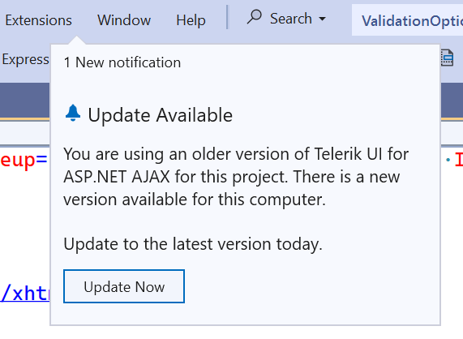
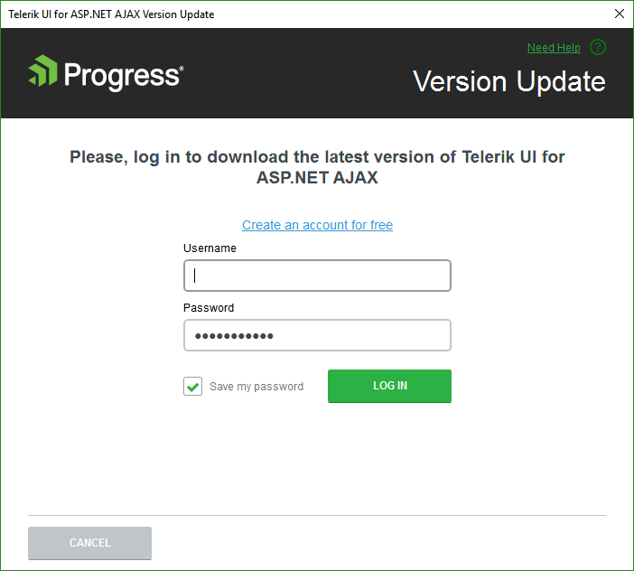
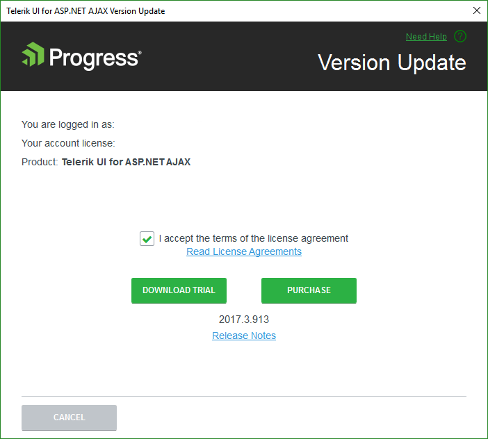
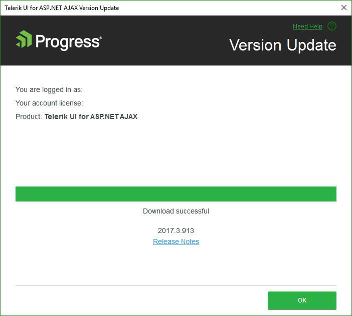

# Download New Version

This article describes how to use the Telerik Visual Studio extensions to download new versions of the Telerik controls.

The Telerik Visual Studio extensions allow you to keep your projects up-to-date in two simple steps:

1. The extensions automatically notify you about new UI for ASP.NET AJAX versions. Once a new version is available, select the **UPDATE NOW** button to download it.

1. The [Upgrade Wizard]() allows you to quickly upgrade your projects so that they use the new version of the Telerik controls.

## How it Works

Once a day, upon loading a project containing Telerik UI for ASP.NET AJAX controls, the Telerik Visual Studio extensions check for a new version. When a new version is available, you see the **Update Available** dialog:

>tip If you've disabled the notifications, you can use the [Options Dialog]() to activate them again.

When you select **UPDATE NOW**:

1. Enter your Telerik credentials in the **Version Update** window.

    

1. Select the type of Telerik controls:

   * Select **PURCHASE** if you have a subscription for the Telerik UI for ASP.NET AJAX controls.

   * Select **DOWNLOAD TRIAL** if you use the free trial.

    

    

Once the download succeeds, the latest version of Telerik® UI for ASP.NET AJAX will be available for use in the [Upgrade Wizard]() and the [New Project Wizard]().

>tip To download the latest version of the controls, you can also use the **GET LATEST** button that is available in:
>
> * The [Upgrade Wizard]().
>
> * The [Convert Project Wizard]().
>
> * The [New Project Wizard]().

## Package Content

The Telerik Visual Studio extensions download the [hotfix zip files]() that contain the latest Telerik binaries and any resources vital for the Telerik Web Application/Web Site project creation. These zip files get unpacked in the `%appdata%\Telerik\Updates` folder.

>If you find the list of the offered packages too long and you don't need the previous versions, you can close Visual Studio and use Windows Explorer to delete older distributions from the `%appdata%\Telerik\Updates` folder.
